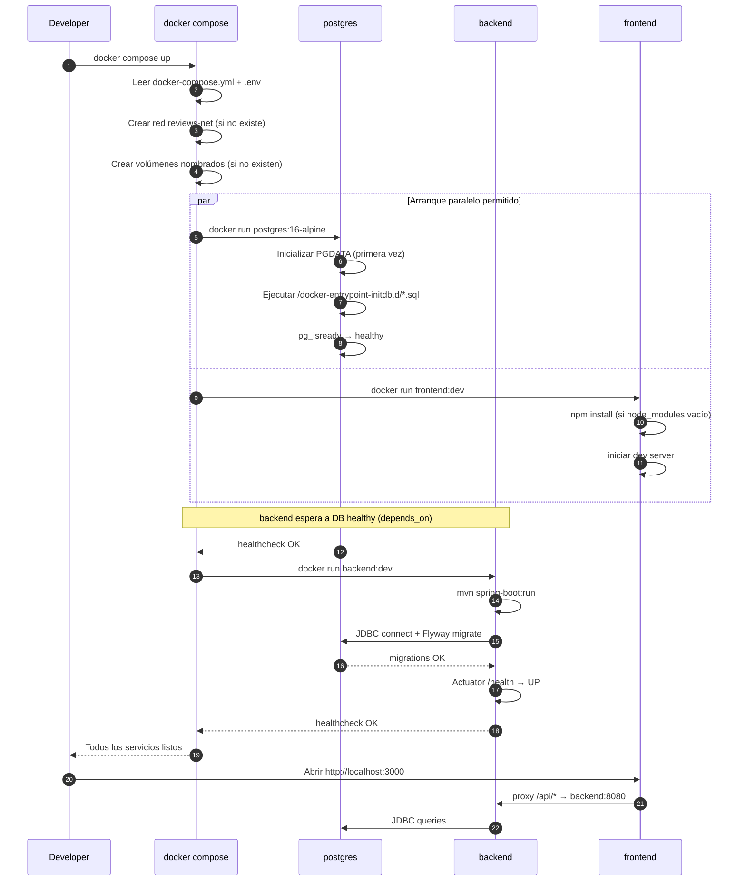
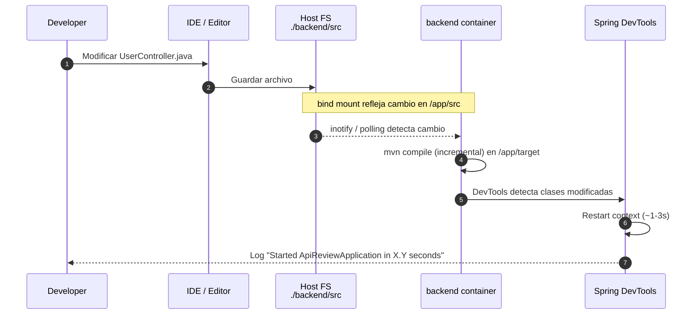
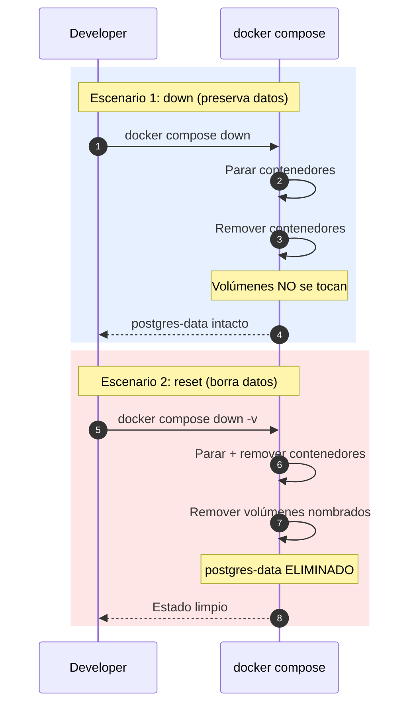

# Design Document: Local Development Environment

> ## ⚠️ Alcance vigente de este spec
>
> **Solo se implementa `Servicio_Backend` + `Servicio_Postgres`** en esta iteración. El `Servicio_Frontend` (Next.js 16 + React 19 + Turbopack + Tailwind v4) queda **diferido a un spec futuro** — decisión formalizada en `requirements.md` (Requirement 18.4) y a documentar como **ADR-0004**.
>
> Motivo: alinear el spec con el estado real del proyecto (el directorio `frontend/` está vacío) y priorizar la validación del backend con Postman u otros `Clientes_HTTP_Locales` (`curl`, HTTPie, IntelliJ HTTP Client, Bruno, Insomnia).
>
> **Convención de comentarios en este documento**:
> - Los bloques de configuración del frontend se conservan pero están **comentados/deshabilitados** con marcadores `<!-- BEGIN DEFERRED: frontend ... -->` … `<!-- END DEFERRED -->` para prosa, y con `#` al inicio de cada línea dentro de los bloques de código (YAML, Dockerfile, Makefile). Al reactivar el frontend en el spec futuro, basta con retirar esos marcadores.
> - Las propiedades de correctness, algoritmos y prosa descriptiva que aún mencionan tres Servicios siguen siendo válidos conceptualmente, pero deben leerse restringidos al conjunto {postgres, backend} mientras el frontend esté diferido.
> - La red interna `reviews-net` y los nombres DNS `backend` / `postgres` se conservan intactos para que la reactivación del frontend no requiera renombrar recursos existentes (Requirement 6.4).

## Overview

Este feature entrega un entorno de desarrollo local reproducible para la plataforma Reviews, orquestado mediante Docker Compose. Un único comando (`docker compose up`) levanta tres servicios aislados en contenedores independientes: **backend** (Spring Boot con hot reload vía Spring DevTools), **persistencia** (PostgreSQL 16) y **frontend** (dev server de la SPA con hot reload). Los tres servicios se comunican dentro de una red interna de Docker, exponen puertos estables al host, y persisten los datos de la base de datos en un volumen nombrado que sobrevive a reinicios y a `docker compose down`.

El diseño se apoya en dos prácticas: (1) **bind mounts** de código fuente para que los cambios locales se reflejen inmediatamente sin rebuild de imagen, y (2) **healthchecks + `depends_on: service_healthy`** para que el backend arranque únicamente cuando PostgreSQL esté listo para aceptar conexiones. La configuración se parametriza vía variables de entorno documentadas en un `.env.example` versionado (sin credenciales reales), y los comandos operativos (`up`, `down`, `reset`, `logs`) se encapsulan en scripts cross-platform (`.sh` para Unix, `.cmd` para Windows) más un `Makefile` para desarrolladores con `make` disponible.

Este spec se alinea con la fundación (`reviews-platform-foundation`) en cuanto a observabilidad (logs estructurados accesibles vía `docker compose logs`), seguridad por diseño (sin secretos en el repositorio, `.env` ignorado por git), testing (las suites del backend pueden ejecutarse contra el compose vía perfil de test), y ADR (la decisión de PostgreSQL sobre alternativas queda registrada como ADR en `docs/adr/`).

## Architecture

### Arquitectura General de Servicios

```mermaid
graph TB
    subgraph Host["Host Developer Machine (Windows / Unix)"]
        Dev[Developer]
        FS[Local Filesystem<br/>backend/ frontend/]
    end

    subgraph DockerEngine["Docker Engine"]
        subgraph Network["reviews-net (bridge network)"]
            FE[frontend<br/>Next.js 16 (Turbopack)<br/>node:20-alpine]
            BE[backend<br/>Spring Boot + DevTools<br/>eclipse-temurin:21-jdk]
            DB[(postgres<br/>postgres:16-alpine)]
        end

        subgraph Volumes["Named Volumes"]
            VDB[postgres-data]
            VM2[backend-m2-cache]
            VNM[frontend-node-modules]
        end
    end

    Dev -->|http://localhost:3000| FE
    Dev -->|http://localhost:8080| BE
    Dev -->|jdbc:postgresql://localhost:5432| DB
    Dev -->|JDWP :5005| BE

    FE -.->|proxy /api| BE
    BE -->|JDBC 5432| DB

    FS -.->|bind mount<br/>backend/src| BE
    FS -.->|bind mount<br/>frontend/src| FE

    DB --- VDB
    BE --- VM2
    FE --- VNM

    style DB fill:#dae8fc
    style BE fill:#d5e8d4
    style FE fill:#ffe6cc
    style VDB fill:#f5f5f5
    style VM2 fill:#f5f5f5
    style VNM fill:#f5f5f5
```

**Decisiones arquitectónicas clave**:

1. **Un contenedor por capa (aislamiento)**: cada servicio tiene su propio ciclo de vida, imagen y healthcheck. Un fallo en frontend no derriba backend ni base de datos.
2. **Red bridge interna (`reviews-net`)**: los servicios se resuelven entre sí por nombre DNS (ej. `backend` resuelve a la IP del contenedor backend). El host accede vía puertos publicados.
3. **Volumen nombrado para PostgreSQL**: los datos viven en `postgres-data` (managed por Docker), sobreviven a `docker compose down` y solo se borran con `docker compose down -v`.
4. **Bind mount para código fuente**: `./backend/src` → `/app/src` en el contenedor. Spring DevTools detecta cambios y reinicia el contexto. El frontend usa el HMR nativo del dev server de Next.js 16 (Turbopack por defecto).
5. **Volúmenes nombrados para caches**: `backend-m2-cache` guarda `~/.m2` para no re-descargar dependencias Maven en cada rebuild; `frontend-node-modules` evita colisión entre `node_modules` del host y del contenedor (crítico en Windows por diferencias de binarios nativos).

### Directorio `infra/docker/`

```
infra/docker/
├── docker-compose.yml          # Orquestación principal
├── docker-compose.override.yml # Overrides opcionales para dev (auto-cargado)
├── .env.example                # Plantilla de variables (versionada)
├── .dockerignore               # Reglas globales de exclusión
├── backend/
│   └── Dockerfile.dev          # Imagen dev del backend (JDK + hot reload)
├── frontend/
│   └── Dockerfile.dev          # Imagen dev del frontend (Node + dev server)
├── postgres/
│   └── init/
│       └── 01-init-extensions.sql  # Extensiones PostgreSQL iniciales
└── scripts/
    ├── dev-up.sh / dev-up.cmd
    ├── dev-down.sh / dev-down.cmd
    ├── dev-reset.sh / dev-reset.cmd
    └── dev-logs.sh / dev-logs.cmd
```

Adicionalmente en la raíz del repo:

```
Makefile         # Atajos para dev con `make` (opcional)
.env             # Instanciado por el desarrollador desde .env.example (git-ignored)
```

## Sequence Diagrams

### Bootstrap del entorno (`docker compose up`)



### Hot Reload del Backend



### Teardown y Reset



## Components and Interfaces

### Component 1: Servicio `postgres` (Persistencia)

**Purpose**: Proveer la base de datos relacional para el backend en desarrollo, con datos persistentes entre reinicios.

**Justificación de PostgreSQL 16** (ver ADR-0001):

| Criterio | PostgreSQL 16 | MySQL 8 | H2 |
|---|---|---|---|
| Afinidad Spring / Flyway / Liquibase | Excelente | Buena | Solo dev |
| Tipos avanzados (JSONB, arrays, UUID) | Nativo | Parcial | Limitado |
| Adecuado para artefactos rrweb / snapshots (JSON grande) | Sí (JSONB + toast) | Regular | No escala |
| Full-text search para comentarios | Nativo (`tsvector`, `pg_trgm`) | Regular | No |
| Imagen oficial ligera | `postgres:16-alpine` (~80MB) | `mysql:8` (~500MB) | Embebido |
| Aislamiento como servicio separado (req del feature) | Sí | Sí | No (in-process) |
| Portabilidad a producción | Alta (RDS, Cloud SQL, self-hosted) | Alta | No aplica |

Elegimos **PostgreSQL 16 (alpine)** por afinidad con el stack Spring/Flyway, soporte nativo de JSONB (crítico para persistir grabación rrweb y snapshots del DOM), y por ser el candidato natural para producción.

**Interface (contrato hacia backend)**:

```pascal
SERVICE postgres
  PROTOCOL: PostgreSQL wire protocol (TCP)
  HOST (from backend network): "postgres"
  HOST (from host): "localhost"
  PORT (internal): 5432
  PORT (published): ${POSTGRES_HOST_PORT:-5432}
  DATABASE: ${POSTGRES_DB:-reviews}
  USER: ${POSTGRES_USER:-reviews}
  PASSWORD: ${POSTGRES_PASSWORD}   // requerido, sin default
END SERVICE
```

**Responsabilidades**:
- Persistir datos del dominio Reviews en volumen `postgres-data`.
- Ejecutar scripts de inicialización de `/docker-entrypoint-initdb.d/` en el primer arranque (extensiones, roles adicionales).
- Reportar salud vía `pg_isready`.
- Aceptar conexiones únicamente desde la red interna `reviews-net` (más el puerto publicado al host para tooling local).

### Component 2: Servicio `backend` (Spring Boot)

**Purpose**: Ejecutar la aplicación Spring Boot en modo desarrollo, con hot reload de código, debug remoto, y conexión a la base de datos vía red interna.

**Interface (contrato hacia frontend y desarrollador)**:

```pascal
SERVICE backend
  PROTOCOL: HTTP/1.1
  HOST (from frontend network): "backend"
  HOST (from host): "localhost"
  PORT (HTTP internal): 8080
  PORT (HTTP published): ${BACKEND_HOST_PORT:-8080}
  PORT (JDWP debug published): ${BACKEND_DEBUG_PORT:-5005}
  HEALTH_ENDPOINT: GET /actuator/health
  API_BASE_PATH: /api
END SERVICE
```

**Responsabilidades**:
- Compilar y ejecutar Spring Boot vía `mvn spring-boot:run` con perfil `dev`.
- Consumir código fuente montado desde `./backend/` (bind mount).
- Cachear dependencias Maven en volumen nombrado `backend-m2-cache` (montado en `/root/.m2`).
- Aplicar migraciones Flyway/Liquibase al arrancar (una vez la BD esté healthy).
- Exponer Spring Actuator para healthcheck de Docker.
- Aceptar conexiones de debug JDWP en puerto 5005 para adjuntar debugger del IDE.
- Reiniciar contexto automáticamente cuando Spring DevTools detecte cambios en `/app/target/classes`.

**Estrategia de hot reload**: Spring DevTools observa el classpath (`/app/target/classes`). El compilador incremental (Maven en `dev`, o el IDE compilando al filesystem) actualiza los `.class`, DevTools reinicia. Alternativa (rebuild lento) sin IDE: se puede ejecutar `mvn compile` desde el contenedor manualmente o vía script de watch.

<!-- BEGIN DEFERRED: Component 3 (Servicio_Frontend). Ver banner al inicio del documento. -->
<!--
### Component 3: Servicio `frontend` (Next.js 16 + React 19 + TypeScript + Tailwind v4)

**Purpose**: Servir el frontend en desarrollo con hot module replacement (HMR), y hacer disponible la API del backend tanto al navegador (a través del host) como al server-side de Next (a través de la red interna).

**Stack concreto** (según `frontend/package.json`):

- **Framework**: Next.js `16.2.11` (App Router — default de Next 16). Dev server ejecutado por `next dev`, que en Next 16 usa **Turbopack** como bundler de desarrollo por defecto.
- **UI**: React `19.2.4` + React DOM `19.2.4`.
- **Lenguaje**: TypeScript `^5`.
- **Estilos**: Tailwind CSS `^4` integrado vía el plugin PostCSS `@tailwindcss/postcss` (Tailwind v4 no requiere `tailwind.config.js` obligatorio; usa el pipeline PostCSS del propio Next).
- **Linting**: ESLint `^9` con `eslint-config-next@16.2.11` como configuración base.
- **Dependencia de dominio**: `@excalidraw/excalidraw ^0.18.1`, componente de canvas de anotación utilizado dentro de una Review Session (alineado con el spec `reviews-platform-foundation`: escenas Excalidraw como artefactos de la sesión).

**Interface (contrato hacia desarrollador)**:

```pascal
SERVICE frontend
  PROTOCOL: HTTP/1.1 + WebSocket (para HMR de Turbopack)
  HOST (from host): "localhost"
  PORT (internal): ${FRONTEND_DEV_PORT:-3000}       // default de Next.js
  PORT (published): ${FRONTEND_HOST_PORT:-3000}
  PROXY_TARGET: http://backend:8080                  // usado por route handlers / server components
END SERVICE
```

**Consumo de la API desde el frontend** (dos caminos):

- **Desde el navegador** (client components, `fetch` en el cliente): usa `NEXT_PUBLIC_API_BASE_URL` (por defecto `http://localhost:8080/api`). Next.js expone al bundle del navegador únicamente las variables cuyo nombre comienza con `NEXT_PUBLIC_`.
- **Desde el server-side de Next** (route handlers, server components, server actions): usa `BACKEND_INTERNAL_URL` (`http://backend:8080`), que resuelve por DNS interno de Docker dentro de `reviews-net` y evita salir al host.

**Responsabilidades**:
- Instalar dependencias (`npm ci` o `npm install`) en el primer arranque si `node_modules` está vacío.
- Ejecutar `npm run dev` (que invoca `next dev`); Next.js 16 arranca el dev server con Turbopack por defecto y HMR habilitado.
- Consumir código fuente montado desde `./frontend/` (bind mount), excepto `node_modules` (volumen nombrado para evitar conflictos entre host y contenedor).
- Cachear la build incremental de Next en un volumen nombrado montado en `/app/.next` (`frontend-next-cache`) para acelerar reinicios sucesivos.
- Exponer al host el puerto `3000` del dev server (incluyendo el WebSocket de HMR de Turbopack).
- Aceptar señales de recarga cuando el desarrollador modifica archivos bajo `./frontend/` (con las variables de polling documentadas para bind mounts en Windows/macOS).
-->
<!-- END DEFERRED -->

### Component 4: Scripts Cross-Platform (Tooling)

**Purpose**: Ofrecer comandos consistentes en Windows (cmd) y Unix (bash) para las operaciones frecuentes del entorno.

**Interface**:

```pascal
COMMAND dev-up      // Levantar todo (foreground si -f, background por defecto)
COMMAND dev-down    // Detener sin borrar datos
COMMAND dev-reset   // Detener + borrar volúmenes (destruye datos)
COMMAND dev-logs    // Seguir logs de todos los servicios (o de uno específico)
COMMAND dev-shell   // Abrir shell dentro de un servicio (backend | frontend | postgres)
```

**Responsabilidades**:
- Encapsular los flags de `docker compose` para evitar errores comunes.
- Verificar prerequisitos (Docker corriendo, `.env` presente).
- Ser ejecutables tanto en `cmd.exe` como en `bash`/`zsh`.

## Data Models

### Modelo 1: Variables de Entorno (`.env`)

Todas las variables de configuración se centralizan en un archivo `.env` (no versionado) generado a partir de `.env.example` (versionado, sin secretos reales).

```pascal
STRUCTURE EnvironmentConfig
  // --- PostgreSQL ---
  POSTGRES_DB: String                     // nombre de la base de datos
  POSTGRES_USER: String                   // usuario de aplicación
  POSTGRES_PASSWORD: String               // contraseña (SIN valor real en .example)
  POSTGRES_HOST_PORT: Integer             // puerto publicado al host (default 5432)

  // --- Backend ---
  BACKEND_HOST_PORT: Integer              // puerto HTTP publicado (default 8080)
  BACKEND_DEBUG_PORT: Integer             // puerto JDWP publicado (default 5005)
  SPRING_PROFILES_ACTIVE: String          // perfil Spring (default "dev")
  BACKEND_JAVA_OPTS: String               // JVM opts (default "-Xmx1024m")

  // --- Frontend (Next.js 16) — DEFERRED ---
  // Estas variables se reactivan en el spec futuro que reintroduzca el
  // Servicio_Frontend. Ver banner al inicio del documento.
  // FRONTEND_HOST_PORT: Integer             // puerto dev server publicado al host (default 3000)
  // FRONTEND_DEV_PORT: Integer              // puerto interno del dev server de Next.js (default 3000)
  // FRONTEND_API_BASE_URL: String           // URL base de la API expuesta al navegador
  //                                          // (default http://localhost:8080/api)
  //                                          // El compose la mapea a NEXT_PUBLIC_API_BASE_URL
  //                                          // dentro del contenedor, dado que Next.js sólo expone
  //                                          // al bundle del navegador variables con prefijo NEXT_PUBLIC_.

  // --- Docker Compose ---
  COMPOSE_PROJECT_NAME: String            // prefijo de recursos (default "reviews")
END STRUCTURE
```

**Reglas de validación**:
- `POSTGRES_PASSWORD` **debe** estar definida y no vacía. Si falta, el arranque falla con mensaje explícito (validado en `dev-up` script).
- Puertos deben estar en rango `1024-65535`.
- `SPRING_PROFILES_ACTIVE` debe incluir `dev` para activar DevTools.
- `.env` **no** debe estar en git (verificado por `.gitignore`).
- `.env.example` **no** debe contener valores reales de credenciales; usa placeholders explícitos como `CHANGE_ME` o vacío.

### Modelo 2: Volúmenes

```pascal
STRUCTURE Volume
  name: String
  type: VolumeType         // NAMED | BIND
  source: String           // path del host (BIND) o nombre (NAMED)
  target: String           // path dentro del contenedor
  persistent: Boolean      // sobrevive a `docker compose down`
END STRUCTURE

CONSTANT VOLUMES =
  [ { name: "postgres-data",         type: NAMED, target: "/var/lib/postgresql/data", persistent: TRUE  }
  , { name: "backend-m2-cache",      type: NAMED, target: "/root/.m2",                persistent: TRUE  }
  // DEFERRED: volúmenes del Servicio_Frontend (ver banner al inicio del documento).
  // , { name: "frontend-node-modules", type: NAMED, target: "/app/node_modules",        persistent: TRUE  }
  // , { name: "frontend-next-cache",   type: NAMED, target: "/app/.next",               persistent: TRUE  }
  , { name: "backend-src",           type: BIND,  source: "./backend",  target: "/app",     persistent: N/A }
  // , { name: "frontend-src",          type: BIND,  source: "./frontend", target: "/app",     persistent: N/A }
  , { name: "postgres-init",         type: BIND,  source: "./infra/docker/postgres/init",
      target: "/docker-entrypoint-initdb.d", persistent: N/A } ]
```

**Reglas**:
- Volúmenes nombrados persisten hasta `docker compose down -v` o `docker volume rm`.
- Bind mounts reflejan el filesystem del host en tiempo real.
- `frontend-node-modules` es nombrado (no bind) para que el `npm install` del contenedor no sobrescriba `./frontend/node_modules` del host y para evitar problemas de compatibilidad binaria en Windows.
- `frontend-next-cache` es nombrado y se monta en `/app/.next`. Cachea la build incremental de Next.js (Turbopack y webpack) entre reinicios del contenedor y también aísla la carpeta `.next` del filesystem del host (que también se ve afectada por diferencias de path en Windows).

### Modelo 3: Red Interna

```pascal
STRUCTURE Network
  name: String
  driver: NetworkDriver    // BRIDGE
  internal: Boolean        // TRUE = sin acceso a internet desde contenedores (no aplica aquí)
  attachable: Boolean      // TRUE = se pueden adjuntar contenedores ad-hoc
END STRUCTURE

CONSTANT NETWORK = { name: "reviews-net", driver: BRIDGE, internal: FALSE, attachable: TRUE }
```

**Reglas**:
- Los servicios se referencian entre sí por nombre de servicio (DNS interno de Docker: `postgres`, `backend`, `frontend`).
- La red se crea automáticamente al primer `docker compose up`.
- El host accede a los servicios únicamente por puertos publicados.

### Modelo 4: Mapeo de Puertos

```pascal
STRUCTURE PortMapping
  service: String
  hostPort: Integer
  containerPort: Integer
  protocol: Protocol       // TCP | UDP
  purpose: String
END STRUCTURE

CONSTANT PORT_MAPPINGS =
  [ { service: "postgres", hostPort: 5432, containerPort: 5432, protocol: TCP,
      purpose: "Conexión JDBC desde herramientas locales (DBeaver, psql)" }
  , { service: "backend",  hostPort: 8080, containerPort: 8080, protocol: TCP,
      purpose: "API HTTP + Spring Actuator (validado desde Postman / curl / HTTPie)" }
  , { service: "backend",  hostPort: 5005, containerPort: 5005, protocol: TCP,
      purpose: "JDWP para adjuntar debugger remoto" }
  // DEFERRED: puerto del Servicio_Frontend (ver banner al inicio del documento).
  // , { service: "frontend", hostPort: 3000, containerPort: 3000, protocol: TCP,
  //     purpose: "Next.js dev server (Turbopack) con HMR" }
  ]
```

## Low-Level: Concrete Artifacts

Esta sección contiene el contenido concreto de cada archivo que producirá la implementación. Los ejemplos son autoritativos: los tasks derivados deben producir estos archivos con ligeros ajustes según lo que se descubra al integrarlos.

### Artefacto 1: `infra/docker/docker-compose.yml`

```yaml
name: ${COMPOSE_PROJECT_NAME:-reviews}

services:
  # ============================================================
  # PostgreSQL (persistencia)
  # ============================================================
  postgres:
    image: postgres:16-alpine
    container_name: reviews-postgres
    restart: unless-stopped
    environment:
      POSTGRES_DB: ${POSTGRES_DB:-reviews}
      POSTGRES_USER: ${POSTGRES_USER:-reviews}
      POSTGRES_PASSWORD: ${POSTGRES_PASSWORD:?POSTGRES_PASSWORD must be set in .env}
      # Ajustes de logging útiles en dev
      POSTGRES_INITDB_ARGS: "--data-checksums"
    ports:
      - "${POSTGRES_HOST_PORT:-5432}:5432"
    volumes:
      - postgres-data:/var/lib/postgresql/data
      - ./postgres/init:/docker-entrypoint-initdb.d:ro
    networks:
      - reviews-net
    healthcheck:
      test: ["CMD-SHELL", "pg_isready -U ${POSTGRES_USER:-reviews} -d ${POSTGRES_DB:-reviews}"]
      interval: 5s
      timeout: 5s
      retries: 10
      start_period: 10s

  # ============================================================
  # Backend Spring Boot
  # ============================================================
  backend:
    build:
      context: ../../backend
      dockerfile: ../infra/docker/backend/Dockerfile.dev
    container_name: reviews-backend
    restart: unless-stopped
    depends_on:
      postgres:
        condition: service_healthy
    environment:
      SPRING_PROFILES_ACTIVE: ${SPRING_PROFILES_ACTIVE:-dev}
      SPRING_DATASOURCE_URL: jdbc:postgresql://postgres:5432/${POSTGRES_DB:-reviews}
      SPRING_DATASOURCE_USERNAME: ${POSTGRES_USER:-reviews}
      SPRING_DATASOURCE_PASSWORD: ${POSTGRES_PASSWORD}
      JAVA_TOOL_OPTIONS: >-
        -agentlib:jdwp=transport=dt_socket,server=y,suspend=n,address=*:5005
        ${BACKEND_JAVA_OPTS:--Xmx1024m}
    ports:
      - "${BACKEND_HOST_PORT:-8080}:8080"
      - "${BACKEND_DEBUG_PORT:-5005}:5005"
    volumes:
      - ../../backend:/app
      - backend-m2-cache:/root/.m2
    networks:
      - reviews-net
    healthcheck:
      test: ["CMD-SHELL", "wget -q --spider http://localhost:8080/actuator/health || exit 1"]
      interval: 10s
      timeout: 5s
      retries: 12
      start_period: 60s

  # ============================================================
  # Frontend — Next.js 16 dev server (Turbopack por defecto)
  # ------------------------------------------------------------
  # DEFERRED: este servicio queda deshabilitado en esta iteración
  # (ver banner al inicio del documento). Se conserva el bloque
  # completo comentado para reactivarlo en el spec futuro; basta
  # con quitar los prefijos "# " de las siguientes líneas.
  # ============================================================
  # frontend:
  #   build:
  #     context: ../../frontend
  #     dockerfile: ../infra/docker/frontend/Dockerfile.dev
  #   container_name: reviews-frontend
  #   restart: unless-stopped
  #   depends_on:
  #     backend:
  #       condition: service_started
  #   environment:
  #     # Next.js reconoce HOSTNAME (no HOST) como bind address del dev server y del runtime.
  #     HOSTNAME: "0.0.0.0"
  #     PORT: ${FRONTEND_DEV_PORT:-3000}
  #     # URL de la API expuesta al bundle del navegador (Next sólo publica en el cliente
  #     # variables cuyo nombre comienza con NEXT_PUBLIC_).
  #     NEXT_PUBLIC_API_BASE_URL: ${FRONTEND_API_BASE_URL:-http://localhost:8080/api}
  #     # URL usada por el server-side de Next (route handlers, server components,
  #     # server actions) para llegar al backend a través de la red interna de Docker.
  #     BACKEND_INTERNAL_URL: http://backend:8080
  #     # HMR robusto sobre bind mounts en Windows/macOS (WSL2 y VirtioFS a veces no
  #     # propagan eventos inotify). En Linux nativo estas variables no son necesarias.
  #     WATCHPACK_POLLING: "true"     # fallback cuando el bundler de Next cae a webpack
  #     TURBOPACK_POLLING: "1"        # fallback equivalente para Turbopack
  #   ports:
  #     - "${FRONTEND_HOST_PORT:-3000}:${FRONTEND_DEV_PORT:-3000}"
  #   volumes:
  #     - ../../frontend:/app
  #     - frontend-node-modules:/app/node_modules
  #     - frontend-next-cache:/app/.next
  #   networks:
  #     - reviews-net

# ============================================================
# Networks
# ============================================================
networks:
  reviews-net:
    name: reviews-net
    driver: bridge

# ============================================================
# Volumes
# ============================================================
volumes:
  postgres-data:
    name: reviews-postgres-data
  backend-m2-cache:
    name: reviews-backend-m2-cache
  # DEFERRED: volúmenes del servicio frontend (ver banner al inicio del documento).
  # frontend-node-modules:
  #   name: reviews-frontend-node-modules
  # frontend-next-cache:
  #   name: reviews-frontend-next-cache
```

### Artefacto 2: `infra/docker/backend/Dockerfile.dev`

```dockerfile
# syntax=docker/dockerfile:1.7
FROM eclipse-temurin:21-jdk-alpine

# Herramientas útiles en dev: wget (healthcheck), git (para info de build), bash
RUN apk add --no-cache bash wget git

WORKDIR /app

# El código se monta como bind mount en tiempo de ejecución; NO se copia en build.
# Sólo copiamos el wrapper de Maven y los descriptors para pre-descargar dependencias
# y así acelerar el primer arranque (dependencias quedan en volumen backend-m2-cache).
COPY .mvn/ .mvn/
COPY mvnw pom.xml ./
RUN chmod +x mvnw && ./mvnw dependency:go-offline -B || true

# Puerto HTTP + puerto JDWP (debug)
EXPOSE 8080 5005

# Arranque con Spring Boot; DevTools se activa por perfil dev y por la presencia
# del starter en pom.xml (a agregar como parte de este feature).
CMD ["./mvnw", "spring-boot:run", "-Dspring-boot.run.fork=false"]
```

**Nota de implementación**: el `pom.xml` actual del backend no incluye `spring-boot-devtools`, `spring-boot-starter-actuator`, `spring-boot-starter-data-jpa`, ni driver PostgreSQL. Esas dependencias son parte de los tasks derivados de este spec, dado que son prerequisitos para que el compose sea funcional. Alternativamente, se pueden documentar como fuera de alcance y dejar el compose listo para cuando el backend las incorpore.

<!-- BEGIN DEFERRED: frontend Dockerfile (ver banner al inicio del documento). -->
<!--
### Artefacto 3: `infra/docker/frontend/Dockerfile.dev`

```dockerfile
# syntax=docker/dockerfile:1.7
FROM node:20-alpine

# Herramientas útiles + libc6-compat: Next.js recomienda instalarla en Alpine porque
# algunos binarios nativos (SWC, sharp, etc.) esperan glibc.
RUN apk add --no-cache bash git libc6-compat

WORKDIR /app

# El código se monta como bind mount en tiempo de ejecución.
# El primer `npm ci` (o `npm install`) se ejecuta en el CMD si node_modules está vacío.
EXPOSE 3000

# Arranque del dev server de Next.js 16. Asumimos que el proyecto ya está bootstrapeado
# en ./frontend (existe package.json con "dev": "next dev"). `next dev` acepta
# -H/--hostname y -p/--port por CLI, sobreescribiendo HOSTNAME/PORT.
CMD ["/bin/sh", "-c", "\
  if [ ! -d node_modules ] || [ -z \"$(ls -A node_modules 2>/dev/null)\" ]; then \
    echo '[frontend] Instalando dependencias...'; \
    npm ci || npm install; \
  fi; \
  npm run dev -- -H 0.0.0.0 -p ${PORT:-3000} \
"]
```
-->
<!-- END DEFERRED -->

### Artefacto 3: `infra/docker/frontend/Dockerfile.dev` — DEFERRED

Ver marcador `<!-- BEGIN DEFERRED: frontend Dockerfile -->` inmediatamente arriba. El archivo se creará en el spec futuro que reactive el frontend.

### Artefacto 4: `infra/docker/.env.example`

```dotenv
# =============================================================================
# Reviews Platform — Local Development Environment
# Copia este archivo a `.env` en la raíz del repo y ajusta los valores.
# NUNCA commitear .env con credenciales reales.
# =============================================================================

# --- Docker Compose ---
COMPOSE_PROJECT_NAME=reviews

# --- PostgreSQL ---
POSTGRES_DB=reviews
POSTGRES_USER=reviews
# OBLIGATORIO: definir en .env (el compose falla si está vacío)
POSTGRES_PASSWORD=CHANGE_ME
POSTGRES_HOST_PORT=5432

# --- Backend ---
BACKEND_HOST_PORT=8080
BACKEND_DEBUG_PORT=5005
SPRING_PROFILES_ACTIVE=dev
BACKEND_JAVA_OPTS=-Xmx1024m

# --- Frontend (Next.js 16) — DEFERRED ---
# Estas variables se reactivan en el spec futuro que reintroduzca el
# Servicio_Frontend. Ver banner al inicio del documento.
# FRONTEND_HOST_PORT=3000
# FRONTEND_DEV_PORT=3000
# El compose mapea esta variable a NEXT_PUBLIC_API_BASE_URL dentro del contenedor,
# porque Next.js sólo expone al bundle del navegador variables cuyo nombre
# comience con NEXT_PUBLIC_.
# FRONTEND_API_BASE_URL=http://localhost:8080/api
```

### Artefacto 5: `infra/docker/postgres/init/01-init-extensions.sql`

```sql
-- Extensiones útiles para el dominio Reviews.
-- Se ejecutan una única vez, en la primera inicialización de la BD.

-- UUID nativos (para IDs de dominio)
CREATE EXTENSION IF NOT EXISTS "uuid-ossp";

-- Búsqueda por trigrams (útil para búsqueda parcial en comentarios / notas)
CREATE EXTENSION IF NOT EXISTS "pg_trgm";

-- Funciones criptográficas (hashing en dev; producción usa bcrypt/argon2 en la app)
CREATE EXTENSION IF NOT EXISTS "pgcrypto";
```

### Artefacto 6: Scripts cross-platform

**`infra/docker/scripts/dev-up.sh`** (Unix):
```bash
#!/usr/bin/env bash
set -euo pipefail
SCRIPT_DIR="$(cd "$(dirname "${BASH_SOURCE[0]}")" && pwd)"
COMPOSE_DIR="$SCRIPT_DIR/.."
ENV_FILE="$COMPOSE_DIR/../../.env"

if [ ! -f "$ENV_FILE" ]; then
  echo "[dev-up] .env no encontrado. Copiando desde .env.example..."
  cp "$COMPOSE_DIR/.env.example" "$ENV_FILE"
  echo "[dev-up] EDITA $ENV_FILE (especialmente POSTGRES_PASSWORD) y vuelve a ejecutar."
  exit 1
fi

cd "$COMPOSE_DIR"
docker compose --env-file "$ENV_FILE" up -d "$@"
docker compose --env-file "$ENV_FILE" ps
```

**`infra/docker/scripts/dev-up.cmd`** (Windows):
```bat
@echo off
setlocal
set "SCRIPT_DIR=%~dp0"
set "COMPOSE_DIR=%SCRIPT_DIR%.."
set "ENV_FILE=%COMPOSE_DIR%\..\..\.env"

if not exist "%ENV_FILE%" (
  echo [dev-up] .env no encontrado. Copiando desde .env.example...
  copy "%COMPOSE_DIR%\.env.example" "%ENV_FILE%" >nul
  echo [dev-up] EDITA %ENV_FILE% (especialmente POSTGRES_PASSWORD) y vuelve a ejecutar.
  exit /b 1
)

pushd "%COMPOSE_DIR%"
docker compose --env-file "%ENV_FILE%" up -d %*
docker compose --env-file "%ENV_FILE%" ps
popd
endlocal
```

**`infra/docker/scripts/dev-down.sh`** / **`.cmd`**: análogos, ejecutan `docker compose down` (sin `-v`).

**`infra/docker/scripts/dev-reset.sh`** / **`.cmd`**: ejecutan `docker compose down -v` con confirmación interactiva (`read -p "¿Borrar volúmenes? [y/N]"` en bash; `set /p CONFIRM=` en cmd).

**`infra/docker/scripts/dev-logs.sh`** / **`.cmd`**: ejecutan `docker compose logs -f $@` (acepta nombre de servicio opcional).

### Artefacto 7: `Makefile` (raíz del repo, opcional)

```makefile
# DEFERRED: `frontend-shell` no aplica mientras el Servicio_Frontend esté diferido.
# .PHONY: up down reset logs backend-shell frontend-shell db-shell ps
.PHONY: up down reset logs backend-shell db-shell ps

COMPOSE_DIR := infra/docker
COMPOSE := docker compose --env-file .env
COMPOSE_CMD := cd $(COMPOSE_DIR) && $(COMPOSE)

up:
	@$(COMPOSE_CMD) up -d && $(COMPOSE_CMD) ps

down:
	@$(COMPOSE_CMD) down

reset:
	@$(COMPOSE_CMD) down -v

logs:
	@$(COMPOSE_CMD) logs -f $(SERVICE)

backend-shell:
	@$(COMPOSE_CMD) exec backend bash

# DEFERRED: reactivar cuando se reintroduzca el Servicio_Frontend.
# frontend-shell:
# 	@$(COMPOSE_CMD) exec frontend sh

db-shell:
	@$(COMPOSE_CMD) exec postgres psql -U $${POSTGRES_USER:-reviews} -d $${POSTGRES_DB:-reviews}

ps:
	@$(COMPOSE_CMD) ps
```

### Artefacto 8: Ajustes en `.gitignore` (raíz)

```gitignore
# --- Local dev environment ---
.env
infra/docker/.env
```

Y en `infra/docker/.dockerignore`:
```
**/.git
# DEFERRED: reactivar cuando se reintroduzca el Servicio_Frontend.
# **/node_modules
**/target
**/.env
**/.idea
**/.vscode
```

## Algorithmic Pseudocode

### Algoritmo: Bootstrap del entorno (`dev-up`)

```pascal
ALGORITHM devUp(args)
INPUT: args (opcionales, ej. nombre de servicio específico)
OUTPUT: exitCode (0 = éxito, ≠0 = fallo)

BEGIN
  // --- Precondición: .env existe y POSTGRES_PASSWORD está definido ---
  envFile ← resolveEnvFilePath()
  IF NOT fileExists(envFile) THEN
    copyFile(".env.example", envFile)
    PRINT "Editar .env y volver a ejecutar"
    RETURN 1
  END IF

  env ← loadEnv(envFile)
  ASSERT env.POSTGRES_PASSWORD ≠ ∅ AND env.POSTGRES_PASSWORD ≠ "CHANGE_ME"

  // --- Idempotencia: docker compose up es seguro re-ejecutar ---
  // Docker Compose reconcilia estado (crea lo faltante, no re-crea lo existente).
  result ← execute("docker compose --env-file " + envFile + " up -d " + args)

  IF result.exitCode ≠ 0 THEN
    RETURN result.exitCode
  END IF

  // --- Verificar salud de cada servicio ---
  FOR each service IN ["postgres", "backend"] DO
    ASSERT waitForHealthy(service, timeout: 120s)
  END FOR

  PRINT summary(services, ports)
  RETURN 0
END
```

**Preconditions**:
- Docker Engine está corriendo.
- El repo está clonado y el usuario ejecuta desde su raíz o desde `infra/docker/`.
- Existe `.env.example` en `infra/docker/`.

**Postconditions**:
- `postgres`, `backend`, `frontend` están corriendo y saludables.
- Los puertos publicados están accesibles desde `localhost`.
- Si algún servicio falla en healthcheck, el algoritmo retorna código de error.

**Loop Invariants**:
- Durante el `FOR` de healthcheck: todos los servicios previamente verificados siguen healthy.

### Algoritmo: Reset del entorno (`dev-reset`)

```pascal
ALGORITHM devReset()
OUTPUT: exitCode

BEGIN
  PRINT "ATENCIÓN: esto BORRA todos los datos locales (postgres-data, caches)."
  confirmation ← readInput("Escribe 'RESET' para confirmar: ")

  IF confirmation ≠ "RESET" THEN
    PRINT "Cancelado."
    RETURN 1
  END IF

  execute("docker compose down -v --remove-orphans")

  ASSERT NOT volumeExists("reviews-postgres-data")
  ASSERT NOT volumeExists("reviews-backend-m2-cache")
  ASSERT NOT volumeExists("reviews-frontend-node-modules")

  RETURN 0
END
```

**Preconditions**: Docker Engine corriendo; el proyecto existe (`docker compose ls` lo lista o no, ambos son válidos).

**Postconditions**: Todos los volúmenes nombrados del proyecto han sido eliminados. Un `dev-up` posterior arrancará con estado limpio.

### Algoritmo: Espera de dependencia con healthcheck

```pascal
ALGORITHM waitForHealthy(serviceName, timeout)
INPUT: serviceName, timeout (seconds)
OUTPUT: isHealthy (boolean)

BEGIN
  deadline ← now() + timeout
  interval ← 2 seconds

  WHILE now() < deadline DO
    ASSERT elapsedTime ≤ timeout   // invariante temporal
    status ← execute("docker inspect --format='{{.State.Health.Status}}' " + serviceName)

    IF status = "healthy" THEN
      RETURN true
    END IF

    IF status = "unhealthy" THEN
      PRINT logs(serviceName, lines: 50)
      RETURN false
    END IF

    sleep(interval)
  END WHILE

  RETURN false   // timeout excedido
END
```

**Preconditions**: `serviceName` es un contenedor existente que declara un `healthcheck` en el compose.

**Postconditions**: Retorna `true` si el contenedor alcanzó estado `healthy` dentro del `timeout`; retorna `false` si el contenedor está `unhealthy` o si expira el timeout.

**Loop Invariants**:
- El tiempo transcurrido nunca excede el `timeout`.
- El estado consultado corresponde al último snapshot del container.

## Correctness Properties

Estas propiedades son universales sobre cualquier ejecución del entorno local en cualquier máquina soportada. Se derivarán en tests concretos (ver Testing Strategy).

### Property 1: Reproducibilidad

**Validates: Requirements 1.1, 1.2**

```pascal
∀ máquina M1, M2 ∈ MáquinasSoportadas,
∀ commit C ∈ Repositorio,
∀ archivo .env E (con mismos valores):
  clonar(C) EN M1 ∧ clonar(C) EN M2 ∧ aplicar(E) ∧ ejecutar("docker compose up")
  ⟹ M1.servicios = M2.servicios ∧ M1.puertos = M2.puertos ∧ M1.imágenes.digests = M2.imágenes.digests
```

**Verificación**: pinning explícito de tags (`postgres:16-alpine`, `eclipse-temurin:21-jdk-alpine`, `node:20-alpine`) más lockfiles de Maven (implícito) y npm (a introducir con el frontend).

### Property 2: Aislamiento de servicios

**Validates: Requirements 2.1, 2.2**

```pascal
∀ servicio S ∈ {postgres, backend, frontend}:
  S se ejecuta en un contenedor Docker independiente
  ∧ S falla ⟹ (los otros servicios NO caen automáticamente)
  ∧ restart(S) NO requiere restart de los demás
```

**Verificación**: cada servicio tiene su propio `container_name` y `restart: unless-stopped`; no comparten `namespace` de proceso.

### Property 3: Persistencia de datos

**Validates: Requirements 3.1, 3.2**

```pascal
∀ escritura W en la base de datos, ∀ ejecución E1 del compose:
  W ocurre en E1
  ∧ ejecutar("docker compose down") EN E1
  ∧ ejecutar("docker compose up") EN E2 (nueva ejecución sin -v)
  ⟹ W es legible en E2
```

**Verificación**: `postgres-data` es un volumen nombrado, no un bind mount efímero ni `tmpfs`.

### Property 4: Idempotencia de arranque

**Validates: Requirements 4.1**

```pascal
∀ n ∈ ℕ, ∀ estado E:
  ejecutar_n_veces("docker compose up -d", n) desde estado E
  ⟹ estado_final = estado(1_ejecución) ∧ NO se crean recursos duplicados
```

**Verificación**: Docker Compose reconcilia estado declarativamente; ejecutar `up` sobre servicios ya corriendo es no-op salvo cambios en el compose.

### Property 5: Portabilidad Windows/Unix

**Validates: Requirements 5.1, 5.2**

```pascal
∀ OS ∈ {Windows_10+, macOS_12+, Linux (x86_64, arm64)}:
  Docker_Engine_instalado(OS) ∧ ejecutar_bootstrap_script(OS)
  ⟹ los tres servicios arrancan y son accesibles en los puertos documentados
```

**Verificación**: uso exclusivo de imágenes multi-arch oficiales; scripts duplicados en `.sh` + `.cmd`; sin dependencias en paths absolutos del host.

### Property 6: Ausencia de secretos versionados

**Validates: Requirements 6.1, 6.2** (alineado con `reviews-platform-foundation` Requirement 18)

```pascal
∀ archivo A ∈ Git.trackedFiles:
  A ≠ ".env"
  ∧ A = ".env.example" ⟹ NO contiene credenciales reales (solo placeholders o vacíos)
  ∧ A = "docker-compose.yml" ⟹ NO contiene valores literales de POSTGRES_PASSWORD
```

**Verificación**: `.gitignore` incluye `.env`; auditoría automatizable con `git grep` sobre patrones conocidos (test unitario del repo).

### Property 7: Dependency ordering

**Validates: Requirements 7.1, 7.2**

```pascal
∀ ejecución de "docker compose up":
  backend.startedAt ≥ postgres.reportedHealthyAt
  ∧ backend.healthy ⟹ backend.puede_conectar_a_postgres()
```

**Verificación**: `depends_on: postgres: condition: service_healthy` en la definición del servicio backend.

## Error Handling

### Escenario 1: `POSTGRES_PASSWORD` no está definido

**Condición**: El desarrollador ejecuta `docker compose up` sin haber definido `POSTGRES_PASSWORD` en `.env`.
**Respuesta**: Docker Compose aborta con mensaje explícito gracias a la sintaxis `${POSTGRES_PASSWORD:?POSTGRES_PASSWORD must be set in .env}`. Ningún contenedor arranca.
**Recovery**: El desarrollador edita `.env`, define la variable, re-ejecuta `dev-up`.

### Escenario 2: Puerto ya en uso en el host

**Condición**: Otro proceso local ocupa el puerto 5432 (u 8080, 3000).
**Respuesta**: Docker Compose falla al hacer bind con mensaje `bind: address already in use`. El servicio conflictivo no arranca; los demás no se ven afectados si su puerto está libre.
**Recovery**: El desarrollador cambia el puerto del host en `.env` (ej. `POSTGRES_HOST_PORT=5433`) y re-ejecuta. El puerto interno del contenedor no cambia; solo cambia el mapeo al host.

### Escenario 3: Backend arranca antes que Postgres esté listo

**Condición**: Race condition natural en arranques paralelos.
**Respuesta**: Nunca ocurre porque `backend.depends_on.postgres.condition = service_healthy`. Docker Compose bloquea el arranque del backend hasta que el healthcheck de Postgres pase.
**Recovery**: N/A (prevenido por diseño). Si el healthcheck de Postgres nunca pasa (BD corrupta), el backend queda en `Created` y el desarrollador puede investigar con `docker compose logs postgres`.

### Escenario 4: Cambio en `pom.xml` no se refleja

**Condición**: El desarrollador agrega una dependencia Maven; Spring DevTools no la ve porque no reconstruye el classpath.
**Respuesta**: Es un límite conocido de DevTools. El sistema no falla, pero el comportamiento es incorrecto.
**Recovery**: Documentar en README: para cambios en `pom.xml` ejecutar `docker compose restart backend` o `docker compose exec backend ./mvnw compile`.

### Escenario 5: Docker Desktop / Engine no está corriendo

**Condición**: Los scripts intentan usar `docker` sin daemon disponible.
**Respuesta**: `docker` retorna error `Cannot connect to the Docker daemon`. Los scripts propagan el error con `set -e` / `exit /b`.
**Recovery**: Iniciar Docker Desktop (Windows/macOS) o `systemctl start docker` (Linux); reintentar.

<!-- BEGIN DEFERRED: Escenario 6 aplica solo al Servicio_Frontend (ver banner). -->
<!--
### Escenario 6: `node_modules` corruptos por conflicto con host

**Condición**: El desarrollador ejecutó `npm install` en el host (Windows) y luego montó el proyecto en el contenedor Linux; algunos binarios nativos (esbuild, @swc, sharp) no son compatibles.
**Respuesta**: El diseño lo previene: `frontend-node-modules` es un volumen nombrado que **oculta** el `./frontend/node_modules` del host dentro del contenedor. El contenedor tiene su propia copia limpia.
**Recovery**: Si aun así hay problemas, `docker compose down -v` recrea `node_modules` desde cero en el próximo `up`.
-->
<!-- END DEFERRED -->

### Escenario 7: Migraciones Flyway fallan al arrancar el backend

**Condición**: Una migración inválida se agrega al `db/migration/`.
**Respuesta**: Spring Boot falla en el arranque con `FlywayException`. El contenedor `backend` entra en estado `restarting` (por `restart: unless-stopped`) hasta que el desarrollador corrija.
**Recovery**: El desarrollador corrige la migración, o para escenarios drásticos ejecuta `dev-reset` y arranca de nuevo con schema limpio.

## Testing Strategy

### Testing del entorno mismo (infraestructura)

**Objetivo**: Verificar que las correctness properties (Property 1..Property 7) se cumplen.

Tests concretos (a implementar como scripts en `infra/docker/tests/`):

1. **test-bootstrap.sh**: ejecuta `docker compose up -d`, espera healthchecks, verifica que los tres puertos responden. Retorna 0 si todo sube en menos de 3 minutos.
2. **test-persistence.sh**: inserta un registro en Postgres, ejecuta `docker compose down`, luego `up`, y verifica que el registro persiste.
3. **test-idempotency.sh**: ejecuta `docker compose up -d` tres veces seguidas y verifica que `docker compose ps` muestra el mismo estado tras cada ejecución.
4. **test-reset.sh**: ejecuta `dev-reset` y verifica que los volúmenes nombrados fueron eliminados.
5. **test-no-secrets.sh**: escanea archivos versionados en busca de patrones de secretos (contraseñas literales, tokens API); usa `git grep` con expresiones regulares.

Estos tests se ejecutan **manualmente** en la fase MVP (alineado con Requirement 16 de la fundación) y son la base para automatización futura.

### Testing del backend contra el compose

Con el compose corriendo, los tests de integración del backend pueden ejecutarse contra la BD real (no H2 embebida) invocando:

```bash
docker compose exec backend ./mvnw test -Dspring.profiles.active=test
```

Alternativamente, se puede definir un `docker-compose.test.yml` (fuera del alcance MVP de este spec) que use bases de datos efímeras y ejecute la suite completa.

### Property-based testing

**Property Test Library**: N/A directamente para infraestructura. Sin embargo, las correctness properties Property 1..Property 7 se pueden convertir en tests parametrizados sobre múltiples valores de entrada (puertos alternativos, tamaños de dataset, número de reinicios). Herramientas candidatas: `bats` (bash-based test runner) para los scripts de test de infra.

## Performance Considerations

- **Bind mounts en Windows/macOS**: son más lentos que en Linux nativo por la traducción de filesystem (WSL2 / VirtioFS). Estrategias mitigantes:
  - Excluir `target/` del bind mount (usar volumen nombrado encima). <!-- DEFERRED: y `node_modules` cuando se reactive el Servicio_Frontend. -->
  - Documentar que en Windows es recomendable clonar el repo dentro de WSL2 y no en `C:\`.
<!-- BEGIN DEFERRED: bullets específicas del Servicio_Frontend. -->
<!--
- **`npm install` en el primer arranque**: puede tomar varios minutos. Se cachea en `frontend-node-modules` y en las capas de imagen. Un rebuild solo se necesita ante cambios de `package.json`.
- **Turbopack (dev server de Next 16)**: mitiga en parte la lentitud de rebuilds respecto a webpack, pero sigue dependiendo de eventos del filesystem para detectar cambios. Sobre bind mounts en Windows/macOS mantener las variables de polling documentadas (`WATCHPACK_POLLING`, `TURBOPACK_POLLING`) para asegurar HMR fiable; en Linux nativo pueden omitirse. La build incremental de Next se cachea en el volumen `frontend-next-cache` (`/app/.next`) para acelerar los reinicios.
-->
<!-- END DEFERRED -->
- **`mvn dependency:go-offline` en build de imagen**: pre-descarga dependencias, reduciendo el tiempo del primer arranque en frío. Se cachea en `backend-m2-cache`.
- **Consumo de memoria**: valores conservadores en `.env`:
  - Postgres: default (~200MB en dev).
  - Backend JVM: `-Xmx1024m`.
  <!-- DEFERRED: - Frontend dev server: ~500MB. -->
  - Total esperado con el alcance vigente (postgres + backend): ~1.3GB. Documentar el requisito mínimo (2GB libres en Docker Desktop; 4GB cuando se reactive el Servicio_Frontend).

## Security Considerations

Alineado con Requirement 18 de la fundación (Seguridad por diseño):

- **Sin secretos en git**: `.env` está gitignored; `.env.example` usa placeholders no explotables (`CHANGE_ME`).
- **Bind de puertos**: por defecto los servicios se publican en `0.0.0.0` (todas las interfaces del host). Para máquinas de desarrollo en redes compartidas, documentar la posibilidad de restringir a `127.0.0.1` cambiando el mapeo a `"127.0.0.1:5432:5432"`.
- **Contraseña de Postgres**: obligatoria, sin default; en dev es aceptable una contraseña simple, pero el `.env.example` la marca como `CHANGE_ME` para forzar acción consciente.
- **Debug port (JDWP)**: expuesto en desarrollo. Documentar que **no** debe habilitarse en configuraciones de staging/producción. El compose es explícitamente para dev.
- **Aislamiento de red**: los servicios se hablan por la red interna `reviews-net`; el host solo accede a lo publicado.
- **Actualización de imágenes base**: pinning por minor version (`postgres:16-alpine`, no `postgres:latest`) para reproducibilidad; actualización explícita en revisión de dependencias.
- **Logs no incluyen secretos**: Spring Boot debe configurarse (perfil `dev`) para no loguear las URLs de datasource completas ni credenciales. Alineado con Requirement 17 (Observabilidad) y 18 (Seguridad).
<!-- BEGIN DEFERRED: consideración de seguridad específica de Next.js (ver banner). -->
<!--
- **Variables de entorno del frontend (Next.js)**: sólo las variables con prefijo `NEXT_PUBLIC_` se incrustan en el bundle enviado al navegador. Cualquier variable sensible que se pase al contenedor `frontend` (tokens de API server-to-server, credenciales de servicios internos, claves de firmado, etc.) **NO debe** llevar ese prefijo y queda confinada al process env del server-side de Next (route handlers, server components, server actions). El diseño actual respeta esta regla: `NEXT_PUBLIC_API_BASE_URL` es público y contiene sólo la URL base de la API; `BACKEND_INTERNAL_URL` no lleva prefijo y no se filtra al navegador.
-->
<!-- END DEFERRED -->

## Dependencies

### Dependencias externas requeridas en el host del desarrollador

- **Docker Engine ≥ 24.0** con Docker Compose V2 integrado (`docker compose` como subcomando, no `docker-compose` legacy).
- **Windows**: Docker Desktop con backend WSL2 (o Hyper-V).
- **macOS**: Docker Desktop.
- **Linux**: Docker Engine + `docker-compose-plugin`.
- **Opcional**: `make` para usar el `Makefile`; `git bash` en Windows si se prefieren scripts `.sh` sobre `.cmd`.

### Imágenes Docker (pinneadas)

- `postgres:16-alpine`
- `eclipse-temurin:21-jdk-alpine`
<!-- DEFERRED: `node:20-alpine` sólo se necesita cuando se reactive el Servicio_Frontend. -->
<!-- - `node:20-alpine` — Next.js 16 requiere Node.js ≥ 18.18; Node 20 LTS satisface el requisito y ofrece soporte a largo plazo para el ciclo de desarrollo. -->

<!-- BEGIN DEFERRED: dependencias del Servicio_Frontend (ver banner al inicio del documento). -->
<!--
### Dependencias del frontend introducidas por Next.js 16 + React 19 + TS 5 + Tailwind v4 + Excalidraw 0.18

Estas dependencias ya viven en `frontend/package.json` del repo. Se listan aquí por su impacto sobre el diseño del entorno (versión de Node, cache de `.next`, variables de entorno, comandos):

| Rol | Paquete | Versión | Propósito |
|---|---|---|---|
| Framework SSR/SSG + dev server | `next` | `16.2.11` | App Router, Turbopack como dev server por defecto, route handlers y server components |
| Config de lint | `eslint-config-next` | `16.2.11` | Reglas de ESLint específicas de Next |
| UI runtime | `react` | `19.2.4` | Librería de UI |
| UI runtime (DOM) | `react-dom` | `19.2.4` | Renderer para el DOM |
| Tipado | `typescript` | `^5` | Lenguaje del código fuente del frontend |
| Tipos | `@types/node`, `@types/react`, `@types/react-dom` | `^20` / `^19` / `^19` | Tipos para Node y React |
| Estilos | `tailwindcss` | `^4` | Utility-first CSS |
| Estilos (build) | `@tailwindcss/postcss` | `^4` | Plugin PostCSS oficial para Tailwind v4 |
| Linter | `eslint` | `^9` | Ejecutable de linting |
| Dominio (anotación) | `@excalidraw/excalidraw` | `^0.18.1` | Canvas de anotación para Escenas Excalidraw dentro de una Review Session |

Consecuencias para el entorno:

- El **puerto** default del dev server pasa a ser `3000` (default de Next.js), en lugar del `5173` genérico de Vite.
- El **bundler de dev** es Turbopack (no webpack), lo que requiere variables de polling específicas (`TURBOPACK_POLLING`, `WATCHPACK_POLLING` como fallback) para HMR fiable sobre bind mounts en Windows/macOS.
- El directorio `.next/` se mueve a un volumen nombrado (`frontend-next-cache`) para no contaminar el filesystem del host y para acelerar reinicios.
- Las variables de entorno consumidas por el navegador deben llevar prefijo `NEXT_PUBLIC_` (regla de Next.js); esto define el mapeo `FRONTEND_API_BASE_URL` → `NEXT_PUBLIC_API_BASE_URL` en el compose.
-->
<!-- END DEFERRED -->

### Dependencias del backend a introducir (fuera del alcance directo de este spec, pero necesarias para que el compose sea 100% funcional)

Estas son responsabilidad de un spec de "backend bootstrap" pero se listan aquí porque el compose las asume:

- `spring-boot-starter-actuator` (para healthcheck)
- `spring-boot-starter-data-jpa` + `postgresql` driver (para conectar a la BD)
- `spring-boot-devtools` (para hot reload)
- `flyway-core` + `flyway-database-postgresql` (para migraciones)

Si en el momento de implementar este spec el `pom.xml` aún no las tiene, los tasks derivados deberán agregarlas o el healthcheck del backend deberá relajarse temporalmente (ej. verificar solo que el proceso esté vivo con `pgrep java`).

### ADRs a producir junto con este feature

- **ADR-0001: Elección de PostgreSQL como base de datos**  — registra el análisis comparativo de la sección Components; contexto, decisión, alternativas consideradas (MySQL, MariaDB, H2), consecuencias.
- **ADR-0002: Docker Compose como orquestador de desarrollo local** — justifica la elección frente a alternativas (Podman Compose, Tilt, Skaffold, Nix, Devcontainers puros).
- **ADR-0003: Bind mount + volumen nombrado como estrategia de dev loop del backend** — documenta la separación entre código fuente (bind sobre `./backend`) y artefactos derivados (`~/.m2` en volumen nombrado, `postgres-data` en volumen nombrado). Cuando se reactive el frontend, se extenderá este ADR o se sumará uno complementario para `node_modules` y `.next`.
- **ADR-0004: Diferir el Servicio_Frontend y validar el backend con Clientes_HTTP_Locales (Postman)** — formaliza la decisión reflejada en el banner al inicio de este documento y en el Requirement 18.4; contexto (frontend/ vacío en el repo), decisión (posponer), alternativas consideradas (bundlear Next.js ahora, usar Storybook-only, mockear la API), consecuencias (colección Postman como superficie de validación manual, `reviews-net` preparada para acoger el frontend sin renombrar recursos).
