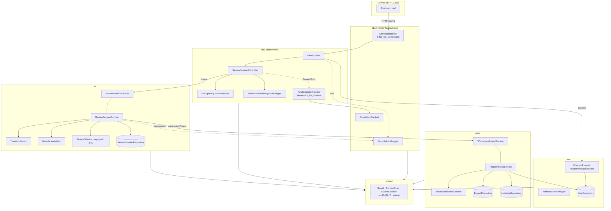
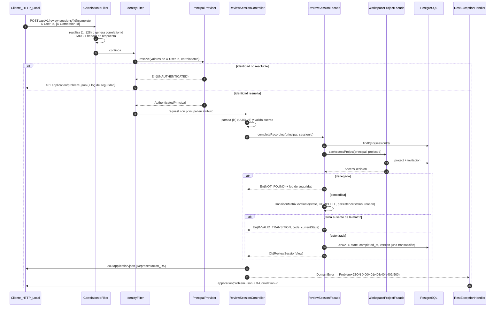
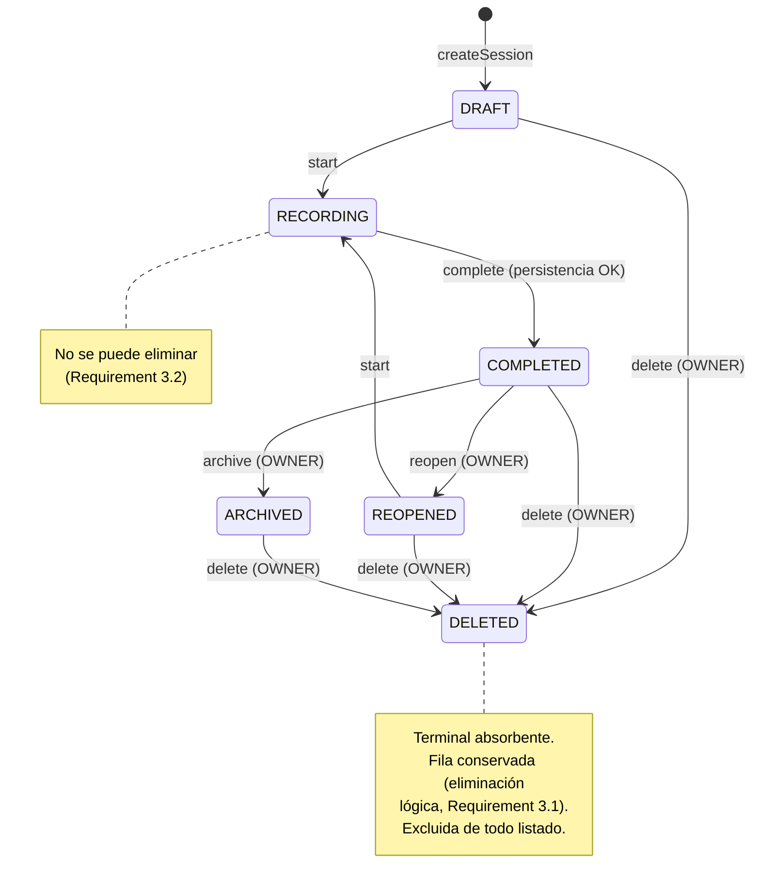

# Design Document: Review Session Core API

## Overview

Este documento diseña el corte vertical que hace ejercitable el `Componente 3` (paquete de dominio `rs`) a través del `Componente 7` (paquete transversal `rest`). El resultado es un backend en el que un Desarrollador, con la Coleccion_Postman y el Entorno_Local ya existentes, recorre el ciclo de vida completo de una Review Session (`crear → actualizar metadatos → start → complete → reopen → start → complete → archive → delete`) y observa los rechazos esperados (401, 404, 403, 409) con cuerpos `Problem+JSON` correlacionados.

El diseño se apoya en tres decisiones que gobiernan todo lo demás:

1. **La Fachada_RS es la única puerta al dominio `rs`.** Se materializa como la interfaz `rs.ReviewSessionFacade`, con diez operaciones que reciben el Principal_Autenticado de forma explícita y devuelven `Result<ReviewSessionView, DomainError>`. La Capa_REST nunca ve la entidad JPA ni el repositorio: el tipo público de salida es un `record` inmutable (`rs.ReviewSessionView`).
2. **La autorización es una consulta a la Fachada_WSPR, no una regla replicada en `rs`.** `wspr.WorkspaceProjectFacade.canAccessProject(...)` devuelve una `AccessDecision` (concedida/denegada + razón), se invoca una vez por operación y su denegación se traduce siempre a la categoría *no encontrado*. El dominio `rs` no conoce propietarios, invitaciones ni bloqueos: sólo interpreta la razón (`OWNER` habilita `reopen`/`archive`/`delete`).
3. **La máquina de estados es una función pura y cerrada.** `rs.TransitionMatrix` decide, para cada terna (estado vigente, comando, precondiciones), si la transición está autorizada. Todo lo ausente de la matriz se rechaza con categoría *transición inválida* sin tocar la fila persistida. Esto cierra la OPEN QUESTION de la fundación: la eliminación es una **transición de estado a `DELETED`** (eliminación lógica, fila conservada) admitida desde `DRAFT`, `COMPLETED`, `REOPENED` y `ARCHIVED`, y denegada desde `RECORDING` y desde `DELETED`.

**Punto de partida verificado en el repositorio.** Existen: `rs.ReviewSession` (agregado con transiciones permisivas: `archive` admite `DRAFT`/`REOPENED`, `delete` admite cualquier estado no `DELETED`), `rs.ReviewSessionRepository`, `rs.ReviewSessionService` (create/get/list con autorización directa por `Project.isOwnedBy`), `rest.ReviewSessionController` (3 endpoints, `ErrorResponse` propio), `wspr.Project`/`Workspace` sin indicador de bloqueo ni Invitaciones, `iam.User`/`UserRepository`, el paquete `shared` (`Result`, `AccessError`, `AccessReason`, `UserRole`, `ReviewSessionState`, `PersistenceStatus`, identificadores UUID v7), las migraciones `V1`–`V4` con semilla de un `PROJECT_ADMIN`, un Workspace y un Proyecto, la Coleccion_Postman de `docs/postman/` con la única petición `GET /actuator/health`, y `infra/docker/docker-compose.yml` con el healthcheck del backend **comentado**.

**Consecuencia**: este feature no es sólo aditivo. Corrige la máquina de estados del agregado, sustituye el contrato de errores, reemplaza las rutas del controlador (el listado pasa a estar anidado bajo `projects/{projectId}`), introduce la Fachada_RS y la superficie mínima de la Fachada_WSPR, y habilita el healthcheck del Entorno_Local.

## Architecture

### Principios que este feature materializa

1. **Fachadas como única frontera entre paquetes.** `rest → rs.ReviewSessionFacade`, `rs → wspr.WorkspaceProjectFacade`, `rest → iam.PrincipalProvider`. Ningún paquete importa repositorios ni entidades de otro paquete. La verificación es estructural (ArchUnit), no convencional.
2. **Errores como valores, no como excepciones.** El dominio devuelve `Result<T, DomainError>`; la Capa_REST traduce `DomainError` a `Problem+JSON`. Las excepciones no controladas se capturan en el borde de la fachada (categoría *error no controlado*) y en el `@RestControllerAdvice` (500).
3. **Fail-closed.** Toda ausencia de señal (identidad no resoluble, `AccessDecision` no computable, timeout, excepción en la evaluación de acceso) produce denegación, nunca concesión.
4. **La identidad se resuelve antes de todo lo demás.** El orden del pipeline es: correlación → identidad → deserialización/validación del cuerpo → autorización → matriz de transiciones → persistencia. Por eso la resolución de identidad es un **filtro servlet** y no un argumento de controlador: la validación de `@RequestBody` ocurre después de la cadena de filtros.
5. **El esquema lo gobierna Flyway.** `ddl-auto: validate` sigue activo: cualquier discrepancia entidad/esquema aborta el arranque.

### Vista de paquetes y dependencias



Reglas del grafo verificadas por tests de arquitectura:

- Ninguna clase de `rest` referencia `rs.ReviewSession`, `rs.ReviewSessionRepository`, `rs.ReviewSessionService`, `wspr.Project`, `wspr.Invitation` ni sus repositorios (Requirements 1.5, 1.6, 1.10).
- Ninguna clase fuera de `rs` invoca métodos mutadores del agregado: los `startRecording()`, `completeRecording()`, … del entidad pasan a **package-private** (Requirement 1.7).
- `rs` no importa `wspr.Project` ni `wspr.InvitationRepository`: sólo `wspr.WorkspaceProjectFacade` y `shared.AccessDecision`.
- `wspr` no importa nada de `rs` (el grafo de fachadas es acíclico).

### Pipeline de una petición



Notas de orden que el diseño garantiza:

- El `IdentityFilter` sólo se registra para el patrón `/api/v1/*`; `/actuator/health` queda fuera (Requirement 12.2 sigue funcionando sin cabeceras).
- La resolución de identidad ocurre en la cadena de filtros, es decir **antes** de la deserialización del cuerpo y de cualquier consulta de recursos (Requirements 6.3, 6.6, 10.5).
- La `AccessDecision` se obtiene antes de evaluar la matriz, antes de validar metadatos y antes de revelar existencia (Requirement 5.1). Una sesión inexistente y una sesión inaccesible producen la misma respuesta 404.

### Decisiones de diseño y sus razones

| Decisión | Alternativa descartada | Razón |
|---|---|---|
| Identidad resuelta en un filtro servlet | Argumento de controlador con `HandlerMethodArgumentResolver` únicamente | La validación de `@RequestBody @Valid` ocurre en el `HandlerAdapter`, después de los argumentos; el Requirement 6.6 exige 401 antes de validar el cuerpo. El resolver se mantiene, pero sólo **lee** el atributo que dejó el filtro (Requirement 6.5: no se re-resuelve). |
| `Result<T, DomainError>` con categoría explícita | Excepciones de dominio + `@ExceptionHandler` | Las seis categorías del Requirement 1.4 son parte de la firma pública de la fachada; con excepciones el contrato queda implícito y es fácil dejar una ruta sin handler (Requirement 10.15). |
| Salida de la fachada como `ReviewSessionView` (record) | Devolver la entidad JPA | Requirements 1.6 y 1.10: `rest` sólo puede referenciar tipos de las firmas públicas. Además evita sesiones JPA abiertas fuera del dominio y hace triviales los property tests. |
| `AccessDecision` computada por operación, con presupuesto de 2000 ms | Caché por sesión HTTP o por usuario | Requirement 5.1 prohíbe reutilizar decisiones; el Requirement 5.6 exige `DENIED_UNKNOWN` al agotar el presupuesto. Se implementa con una tarea acotada por `orTimeout`, no con caché. |
| Bloqueo optimista (`@Version`) para concurrencia | Bloqueo pesimista `SELECT … FOR UPDATE` | Requirement 2.16 sólo exige que a lo sumo una solicitud concurrente se aplique y que las demás reciban *transición inválida* con el estado resultante. El bloqueo optimista consigue eso sin serializar todo el tráfico del Proyecto; el conflicto se traduce releyendo el estado ya persistido. |
| `FieldPatch<T>` de tres estados para `PATCH` | `Optional<String>` en el record de petición | Jackson no distingue de forma fiable «campo ausente» de «campo con `null` explícito» sobre records; los Requirements 9.8 y 9.9 exigen semánticas distintas. Se deserializa el cuerpo como `ObjectNode` y se construye el patch inspeccionando `has(campo)`. |
| Identificador de correlación como `String` en el borde HTTP | Reutilizar `shared.CorrelationId` (UUID v7) | El Requirement 10.13 obliga a reutilizar cualquier valor entrante de 1..128 caracteres, que no es necesariamente un UUID. Coaccionarlo a UUID sería lossy. Cuando el backend genera el valor usa `UuidV7Generator` (36 caracteres). |
| Listado como array JSON de Representacion_RS | Envoltorio `{ sessions, total }` del esqueleto | Requirements 7.3 y 8.6: la colección vacía debe tener la misma estructura que la no vacía y la Representacion_RS tiene exactamente catorce campos. Un array cumple ambos sin añadir un contrato extra. |
| Identificadores tipados en las firmas públicas (`ReviewSessionId`, `ProjectId`, `UserId`) con `AttributeConverter` en `shared` | `UUID` desnudo como en el esqueleto | El parseo tipado da la validación sintáctica que piden los Requirements 7.13 y 8.10 (UUID v7) en un único lugar, y mantiene opaco el valor interno: los conversores JPA viven en `shared`, donde el acceso a `Id.value()` es legítimo. |

## Components and Interfaces

Cada componente se describe con responsabilidad, superficie pública (pseudocódigo) y reglas. El pseudocódigo es normativo en cuanto a operaciones, parámetros y semántica; la sintaxis Java concreta se decide en implementación.

### Componente A: Fachada_RS (`rs.ReviewSessionFacade`)

**Responsabilidad**: única superficie pública del dominio `rs`. Autoriza, evalúa la matriz de transiciones, valida metadatos, persiste y devuelve vistas inmutables. Único componente del backend que modifica el Estado de Review Session persistido.

```pascal
FACADE rs

  // ---- Tipos públicos (los únicos referenciables desde otros paquetes) ----

  RECORD ReviewSessionView                    // 14 campos, orden canónico
    reviewSessionId: ReviewSessionId
    projectId: ProjectId
    createdByUserId: UserId
    state: ReviewSessionState                 // shared
    persistenceStatus: PersistenceStatus      // shared
    name: Optional<String>
    description: Optional<String>
    targetUrl: Optional<String>
    createdAt: Instant
    startedRecordingAt: Optional<Instant>
    completedAt: Optional<Instant>
    reopenedAt: Optional<Instant>
    archivedAt: Optional<Instant>
    deletedAt: Optional<Instant>
  END RECORD

  RECORD NewSessionData                       // metadatos de creación (todos opcionales)
    name: Optional<String>
    description: Optional<String>
    targetUrl: Optional<String>
  END RECORD

  RECORD MetadataPatch                        // semántica de PATCH (Requirements 9.8, 9.9)
    name: FieldPatch<String>                  // UNCHANGED | CLEAR | SET(value)
    description: FieldPatch<String>
    targetUrl: FieldPatch<String>
  END RECORD

  ENUM ListingScope = { ACTIVE, ALL }         // Listado Activo | Listado Histórico

  // ---- Consultas (Requirement 1.1) ----
  FUNCTION getReviewSession(principal: AuthenticatedPrincipal, id: ReviewSessionId)
             : Result<ReviewSessionView, DomainError>
  FUNCTION listSessions(principal: AuthenticatedPrincipal, projectId: ProjectId, scope: ListingScope)
             : Result<List<ReviewSessionView>, DomainError>
  FUNCTION currentState(principal: AuthenticatedPrincipal, id: ReviewSessionId)
             : Result<ReviewSessionState, DomainError>

  // ---- Ciclo de vida (Requirement 1.2) ----
  FUNCTION createSession(principal, projectId: ProjectId, data: NewSessionData)
             : Result<ReviewSessionView, DomainError>
  FUNCTION updateMetadata(principal, id: ReviewSessionId, patch: MetadataPatch)
             : Result<ReviewSessionView, DomainError>
  FUNCTION startRecording(principal, id: ReviewSessionId)   : Result<ReviewSessionView, DomainError>
  FUNCTION completeRecording(principal, id: ReviewSessionId): Result<ReviewSessionView, DomainError>
  FUNCTION reopen(principal, id: ReviewSessionId)           : Result<ReviewSessionView, DomainError>
  FUNCTION archive(principal, id: ReviewSessionId)          : Result<ReviewSessionView, DomainError>
  FUNCTION delete(principal, id: ReviewSessionId)           : Result<ReviewSessionView, DomainError>

END FACADE
```

`delete` devuelve la vista resultante (estado `DELETED`, `deletedAt` poblado) en lugar de `Unit`: el Controlador_RS responde 204 sin cuerpo (Requirement 7.9), pero la vista es lo que permite verificar la postcondición en tests y auditar la operación.

**Algoritmo común de toda operación** (`rs.ReviewSessionService`, implementación de la fachada):

```pascal
FUNCTION execute(principal, target, command, payload): Result<View, DomainError>
BEGIN
  IF principal = NULL THEN
    RETURN Err(UNAUTHENTICATED, "PRINCIPAL_REQUIRED")            // Requirement 1.8: sin tocar la BD

  TRY WITHIN TRANSACTION                                          // una única transacción
    session ← repository.findById(target)                          // Optional
    projectId ← session.isPresent ? session.projectId : payload.projectId

    decision ← wspr.canAccessProject(principal, projectId)          // Requirement 5.1: siempre, primero
    IF NOT decision.granted THEN
      securityLog.denied(principal, target, decision.reason, principal.correlationId)
      RETURN Err(NOT_FOUND, "RESOURCE_NOT_FOUND")                  // Requirements 5.7, 5.8

    IF session.isEmpty AND command ≠ CREATE THEN
      RETURN Err(NOT_FOUND, "RESOURCE_NOT_FOUND")                  // indistinguible del caso anterior

    IF command ∈ { REOPEN, ARCHIVE, DELETE } AND decision.reason ≠ OWNER THEN
      securityLog.denied(principal, target, decision.reason, principal.correlationId)
      RETURN Err(UNAUTHORIZED, "OWNER_ONLY")                       // Requirements 5.9, 5.10, 3.9

    IF session.state = DELETED AND decision.reason ≠ OWNER THEN
      RETURN Err(NOT_FOUND, "RESOURCE_NOT_FOUND")                  // Requirements 3.6, 8.8

    IF command ∈ { CREATE, UPDATE_METADATA } THEN
      validation ← MetadataValidator.validate(payload)
      IF validation.hasErrors THEN
        RETURN Err(VALIDATION, "METADATA_INVALID", validation.fieldErrors)   // Requirement 9.1

    verdict ← TransitionMatrix.evaluate(session.state, command, session.persistenceStatus)
    IF NOT verdict.allowed THEN
      RETURN Err(INVALID_TRANSITION, verdict.code, currentState = session.state)  // Req. 2.7–2.13

    apply(session, command, payload, clock.instant())              // mutadores package-private
    repository.save(session)                                       // flush dentro de la transacción
    RETURN Ok(mapper.toView(session))

  CATCH OptimisticLockingFailure
    fresh ← repository.findById(target)
    RETURN Err(INVALID_TRANSITION, "CONCURRENT_TRANSITION", currentState = fresh.state)  // Req. 2.16
  CATCH ANY other exception
    log.error(exception, principal.correlationId)                  // rollback de la transacción
    RETURN Err(INTERNAL, "INTERNAL_ERROR")                         // Requirements 1.9, 2.14, 3.8, 4.8, 9.10
END FUNCTION
```

Consecuencias explícitas de este algoritmo:

- La transacción envuelve la lectura, la transición y la escritura, de modo que un fallo de commit deja la fila exactamente como estaba (Requirements 2.14, 3.7, 3.8, 4.8, 9.10).
- Ninguna excepción del dominio cruza hacia `rest`: el bloque `CATCH ANY` es el borde (Requirement 1.9).
- El fallo del registro en los Logs de Seguridad no altera el resultado: `SecurityAuditLogger` captura sus propias excepciones internamente (Requirement 5.14).

### Componente B: matriz de transiciones (`rs.TransitionMatrix`)

**Responsabilidad**: función pura que decide si una terna (estado, comando, Estado_De_Persistencia) está autorizada, y con qué código de clasificación se rechaza. No consulta la base de datos, no conoce el principal.

```pascal
ENUM Command = { CREATE, UPDATE_METADATA, START, COMPLETE, REOPEN, ARCHIVE, DELETE }

RECORD Verdict
  allowed: Boolean
  targetState: Optional<ReviewSessionState>   // ausente cuando el comando no cambia de estado
  code: Optional<String>                      // código de clasificación del rechazo
END RECORD

FUNCTION evaluate(state: ReviewSessionState, command: Command, persistence: PersistenceStatus): Verdict
BEGIN
  IF state = DELETED THEN
    RETURN denied("INVALID_TRANSITION")                    // absorbente (Requirements 2.9, 3.3)

  MATCH command WITH
  | UPDATE_METADATA →
      IF state = DRAFT THEN RETURN allowed(targetState = NONE)
      ELSE RETURN denied("METADATA_NOT_EDITABLE")           // Requirement 9.3
  | START →
      IF state ∈ { DRAFT, REOPENED } THEN RETURN allowed(RECORDING)
      ELSE RETURN denied("INVALID_TRANSITION")              // Requirement 2.11
  | COMPLETE →
      IF state ≠ RECORDING THEN RETURN denied("INVALID_TRANSITION")   // Requirement 2.12
      IF persistence ≠ OK   THEN RETURN denied("PERSISTENCE_PENDING") // Requirements 4.2, 4.3
      RETURN allowed(COMPLETED)
  | REOPEN →
      IF state = COMPLETED THEN RETURN allowed(REOPENED)
      ELSE RETURN denied("INVALID_TRANSITION")              // Requirement 2.13
  | ARCHIVE →
      IF state = COMPLETED THEN RETURN allowed(ARCHIVED)
      ELSE RETURN denied("INVALID_TRANSITION")              // Requirements 2.6, 2.13
  | DELETE →
      IF state ∈ { DRAFT, COMPLETED, REOPENED, ARCHIVED } THEN RETURN allowed(DELETED)
      ELSE RETURN denied("INVALID_TRANSITION")              // Requirement 3.2 (RECORDING)
END FUNCTION
```

El agregado `rs.ReviewSession` deja de decidir: sus mutadores pasan a ser package-private, sin condicionales de estado (`applyStart(now)`, `applyComplete(now)`, …). La decisión vive en un único sitio, comprobable exhaustivamente sobre las 42 combinaciones estado × comando.

**Corrección respecto del esqueleto**: `archive()` admitía `DRAFT` y `REOPENED`, y `delete()` admitía `RECORDING`. Ambas se retiran.

### Componente C: Fachada_WSPR mínima (`wspr.WorkspaceProjectFacade`)

**Responsabilidad**: única fuente de verdad de la relación usuario–Proyecto. En este feature se expone sólo la operación de autorización; la gestión de Workspaces, Proyectos e Invitaciones por API queda fuera de alcance.

```pascal
FACADE wspr

  FUNCTION canAccessProject(principal: AuthenticatedPrincipal, projectId: ProjectId): AccessDecision

END FACADE
```

```pascal
FUNCTION evaluateDecision(principal, projectId): AccessDecision      // ProjectAccessService
BEGIN
  project ← projectRepository.findById(projectId)
  IF project = NONE THEN RETURN denied(DENIED_UNKNOWN)                // Requirement 8.7: 404 indistinguible

  MATCH principal.role WITH
  | PROJECT_ADMIN →
      IF project.ownerAdminId = principal.userId
        THEN RETURN granted(OWNER)                                    // Requirements 5.2, 5.4
        ELSE RETURN denied(DENIED_NO_RELATION)                        // Requirement 5.5
  | CLIENT →
      invitations ← invitationRepository.findByProjectIdAndInviteeUserId(projectId, principal.userId)
      IF invitations = ∅                       THEN RETURN denied(DENIED_NO_RELATION)
      IF ∃ i ∈ invitations : i.status = ACCEPTED THEN
        IF project.blocked THEN RETURN denied(DENIED_PROJECT_BLOCKED)  // Requirement 5.13
        ELSE                RETURN granted(ACCEPTED_INVITATION)        // Requirement 5.3
      IF ∀ i ∈ invitations : i.status = PENDING THEN
        RETURN denied(DENIED_PENDING_INVITATION)                       // Requirement 5.11
      RETURN denied(DENIED_REVOKED)                                    // Requirement 5.12
  | PLATFORM_ADMIN →
      RETURN denied(DENIED_NO_RELATION)                                // Requirement 5.5
END FUNCTION
```

**Presupuesto de tiempo y fail-closed** (`wspr.AccessDecisionEvaluator`, Requirement 5.6):

```pascal
FUNCTION canAccessProject(principal, projectId): AccessDecision
BEGIN
  IF principal = NULL OR projectId = NULL THEN RETURN denied(DENIED_UNKNOWN)
  task ← runAsync(() → evaluateDecision(principal, projectId), accessDecisionExecutor)
  TRY
    RETURN task.get(ACCESS_DECISION_BUDGET_MS = 2000)
  CATCH TimeoutException | ANY exception
    log.warn("access decision unresolved", principal.correlationId)
    task.cancel()
    RETURN denied(DENIED_UNKNOWN)                                     // Requirement 5.6
END FUNCTION
```

`accessDecisionExecutor` es un pool acotado con nombre propio; la tarea abre su propia transacción de sólo lectura. Se descarta resolver el timeout con `javax.persistence.query.timeout` porque cubriría sólo la latencia del `SELECT`, no la del cómputo completo (Requirement 5.6 habla de la evaluación de `canAccessProject`, no de una consulta).

`AccessDecision` reside en `shared` (record `granted: boolean`, `reason: AccessReason`), tal como anticipó la fundación. Las razones ya existen todas en `shared.AccessReason`.

### Componente D: Proveedor_De_Principal (`iam.PrincipalProvider`)

**Responsabilidad**: único componente que construye instancias de Principal_Autenticado (Requirement 6.7). Sustituible: la fuente actual es la Cabecera_De_Identidad, documentada explícitamente como mecanismo de desarrollo y **no** de autenticación (Requirement 6.8).

```pascal
FACADE iam

  RECORD AuthenticatedPrincipal
    userId: UserId
    role: UserRole                 // PROJECT_ADMIN | CLIENT | PLATFORM_ADMIN
    correlationId: String
  END RECORD

  INTERFACE PrincipalProvider
    // headerValues: todas las ocurrencias recibidas de la Cabecera_De_Identidad
    FUNCTION resolve(headerValues: List<String>, correlationId: String)
               : Result<AuthenticatedPrincipal, DomainError>
  END INTERFACE

END FACADE
```

```pascal
FUNCTION resolve(headerValues, correlationId): Result             // HeaderPrincipalProvider
BEGIN
  IF headerValues.size ≠ 1            THEN RETURN Err(UNAUTHENTICATED)  // Req. 6.3 (0), 6.9 (>1)
  raw ← headerValues[0]
  trimmed ← trim(raw)
  IF trimmed.isEmpty                  THEN RETURN Err(UNAUTHENTICATED)  // Requirement 6.3
  IF trimmed.length > 64              THEN RETURN Err(UNAUTHENTICATED)  // Requirement 6.4
  userId ← TRY UserId.parse(trimmed) CATCH → RETURN Err(UNAUTHENTICATED)
  user   ← userRepository.findById(userId)
  IF user = NONE                      THEN RETURN Err(UNAUTHENTICATED)  // Requirement 6.4
  RETURN Ok(AuthenticatedPrincipal(userId, user.role, correlationId))    // Requirement 6.2
END FUNCTION
```

Todos los caminos de fallo producen el mismo `type`/`title` en el cuerpo Problem+JSON y no revelan si el identificador existe (Requirements 6.4, 6.11). Si la fuente configurada no está disponible (por ejemplo, `UserRepository` inaccesible), la excepción se traduce a `UNAUTHENTICATED` (Requirement 6.10).

### Componente E: Filtro_De_Correlacion (`observability`)

**Responsabilidad**: asignar un Identificador de Correlación a cada petición, publicarlo en el MDC para los logs y devolverlo en la respuesta.

```pascal
COMPONENT observability.CorrelationIdFilter          // OncePerRequestFilter, orden 0 (el primero)
  CONSTANT HEADER = "X-Correlation-Id"
  CONSTANT MAX_LENGTH = 128

  FUNCTION doFilter(request, response, chain)
  BEGIN
    inbound ← request.header(HEADER)
    correlationId ←
      IF inbound ≠ NULL AND 1 ≤ inbound.length ≤ MAX_LENGTH
        THEN inbound                                  // Requirement 10.13
        ELSE UuidV7Generator.generate().toString()     // Requirements 10.14, 10.18
    response.setHeader(HEADER, correlationId)          // exactamente una ocurrencia (Req. 10.12)
    CorrelationContext.set(correlationId)              // MDC
    TRY chain.doFilter(request, response) FINALLY CorrelationContext.clear()
  END FUNCTION
END COMPONENT
```

`response.setHeader` (no `addHeader`) garantiza una única ocurrencia incluso si un componente posterior lo escribe de nuevo. El valor se fija **antes** de la cadena, de modo que también acompaña a las respuestas de error escritas por el `IdentityFilter` y por el `RestExceptionHandler` (Requirements 10.12, 10.17).

`observability.SecurityAuditLogger` es el segundo componente del paquete: expone `denied(userId, resourceId, reason, correlationId)` y `unauthenticated(rawHeaderPresent, correlationId)` sobre un logger dedicado (`security`), separado del log operativo, y no propaga excepciones a sus invocadores (Requirement 5.14).

### Componente F: Controlador_RS (`rest.ReviewSessionController`)

**Responsabilidad**: traducir HTTP a invocaciones de la Fachada_RS. No contiene reglas de dominio; su lógica es parseo de segmentos, parseo de `scope`, construcción del patch y mapeo de la vista a Representacion_RS.

| Método y ruta | Operación de la Fachada_RS | Éxito | Requirement |
|---|---|---|---|
| `POST /api/v1/projects/{projectId}/review-sessions` | `createSession` | 201 + `Location: /api/v1/review-sessions/{id}` | 7.1, 7.7 |
| `GET /api/v1/review-sessions/{sessionId}` | `getReviewSession` | 200 | 7.2, 7.8 |
| `GET /api/v1/projects/{projectId}/review-sessions?scope=` | `listSessions` | 200 (array) | 7.3, 8.1–8.3 |
| `PATCH /api/v1/review-sessions/{sessionId}` | `updateMetadata` | 200 | 7.4, 7.8 |
| `POST /api/v1/review-sessions/{sessionId}/start` | `startRecording` | 200 | 7.5, 7.8 |
| `POST /api/v1/review-sessions/{sessionId}/complete` | `completeRecording` | 200 | 7.5, 7.8 |
| `POST /api/v1/review-sessions/{sessionId}/reopen` | `reopen` | 200 | 7.5, 7.8 |
| `POST /api/v1/review-sessions/{sessionId}/archive` | `archive` | 200 | 7.5, 7.8 |
| `DELETE /api/v1/review-sessions/{sessionId}` | `delete` | 204 sin cuerpo | 7.6, 7.9 |

Reglas del controlador:

- Los segmentos de ruta se declaran como `String` y se parsean con `ProjectId.parse` / `ReviewSessionId.parse`; un valor que no sea un UUID v7 produce `VALIDATION` enumerando el segmento, **antes** de invocar la fachada y por tanto antes de evaluar la `AccessDecision` (Requirements 7.13, 8.10).
- Las cuatro rutas de transición no declaran `@RequestBody`: cualquier cuerpo recibido se ignora (Requirement 7.5).
- `scope` se lee como `List<String>`: `[]` o `[""]` → `ACTIVE`; `["active"]` → `ACTIVE`; `["all"]` → `ALL`; cualquier otro valor no vacío o más de una ocurrencia → `VALIDATION` sobre el parámetro `scope`, con comparación sensible a mayúsculas (Requirements 8.1–8.4).
- El principal se inyecta mediante `@AuthPrincipal AuthenticatedPrincipal`, resuelto por `PrincipalArgumentResolver` leyendo el atributo dejado por el `IdentityFilter`; el controlador nunca lee `X-User-Id` (Requirements 6.1, 6.5).

**Representacion_RS** (`rest.dto.ReviewSessionResponse`): record de catorce componentes en el orden del `ReviewSessionView`, serializado sin envoltorio y sin campos adicionales (Requirement 7.10). Los `Optional` se aplanan a `null` en JSON (`Jackson` con inclusión `ALWAYS` para que los campos nulos aparezcan explícitamente).

**Serialización de instantes** (`rest.JacksonConfig`): módulo con serializador/deserializador de `Instant` que usa `yyyy-MM-dd'T'HH:mm:ss.SSSXXX` en zona UTC (por ejemplo `2025-03-14T09:21:07.412Z`), garantizando precisión de milisegundos y desplazamiento UTC en ambos sentidos (Requirements 7.11, 7.12).

### Componente G: Manejador_De_Errores (`rest.RestExceptionHandler`)

**Responsabilidad**: emitir todo cuerpo de error como `Problem+JSON` con `correlationId`, y garantizar que ninguna ruta responda un error con 2xx.

```pascal
COMPONENT rest.ProblemFactory
  FUNCTION toProblem(error: DomainError, correlationId: String): ProblemDetail
  BEGIN
    status ← HTTP_STATUS[error.category]        // ver Data Models → Modelo 4
    problem ← ProblemDetail(status)
    problem.type   ← PROBLEM_TYPE[error.category]      // URI estable por categoría (Req. 10.1)
    problem.title  ← TITLE[error.category]
    problem.detail ← DETAIL[error.code]                 // genérico, nunca el mensaje de la excepción
    problem.property("correlationId", correlationId)    // Requirements 10.1, 10.17
    IF error.code ≠ NONE          THEN problem.property("code", error.code)
    IF error.currentState ≠ NONE  THEN problem.property("currentState", error.currentState)  // Req. 10.9
    IF error.fieldErrors ≠ ∅      THEN problem.property("errors", error.fieldErrors)         // Req. 10.2, 10.3
    RETURN problem                                       // Req. 10.4: `errors` ausente si no hay campos
  END FUNCTION
END COMPONENT
```

Handlers registrados en el `@RestControllerAdvice`:

| Situación | Respuesta | Requirement |
|---|---|---|
| `DomainError` devuelto por la fachada | mapeo por categoría | 10.6–10.9 |
| `MethodArgumentNotValidException` / violación de `@Valid` | 400 con una entrada en `errors` por campo | 10.2, 10.3, 9.4–9.6 |
| `HttpMessageNotReadableException` | 400, `detail` «cuerpo ilegible», sin `errors` | 10.16 |
| `MethodArgumentTypeMismatchException`, identificador o `scope` inválidos | 400 enumerando el segmento/parámetro | 7.13, 8.4, 8.10 |
| Cualquier `Exception` no controlada | 500, `detail` genérico, sin mensaje ni stack trace | 10.10 |

El `IdentityFilter` no puede usar el `@RestControllerAdvice` (aún no hay handler); reutiliza `ProblemFactory` y escribe el cuerpo con el `ObjectMapper` de la aplicación y `Content-Type: application/problem+json` (Requirements 10.11, 6.3).

### Componente H: Esquema y Migraciones_Flyway

Tres migraciones nuevas, todas con versión superior a `V4` y sin tocar las existentes (Requirement 11.1):

- **`V5__Extend_review_sessions.sql`**: columnas de metadatos (`name VARCHAR(200)`, `description VARCHAR(2000)`, `target_url VARCHAR(2048)`), columna `version BIGINT NOT NULL DEFAULT 0` para el bloqueo optimista, `CHECK` sobre `state` y `persistence_status`, conversión de los seis instantes a `TIMESTAMPTZ(3)`, índice de listado `(project_id, created_at DESC, review_session_id ASC)` y trigger de inmutabilidad de `project_id`.
- **`V6__Create_invitations_and_project_block.sql`**: tabla `invitations` con clave primaria, referencias obligatorias a `projects` y `users`, `CHECK` de estado, unicidad `(project_id, invitee_user_id)`; columna `projects.blocked BOOLEAN NOT NULL DEFAULT FALSE`.
- **`V7__Seed_authorization_actors.sql`**: usuario `CLIENT` con Invitación `ACCEPTED` sobre el Proyecto semilla, usuario `PROJECT_ADMIN` no propietario y usuario `PLATFORM_ADMIN`, todos con identificadores literales fijos e inserciones idempotentes (`ON CONFLICT DO NOTHING`, Requirement 11.16).

El detalle SQL está en *Data Models → Modelo 5*.

### Componente I: Entorno_Local

Cambio mínimo y acotado sobre `infra/docker/docker-compose.yml`: **descomentar y fijar** el healthcheck del servicio `backend`, hoy inactivo, con `test: wget --spider http://localhost:8080/actuator/health`, `interval: 10s`, `timeout: 5s`, `retries: 12`, `start_period: 60s` (Requirement 12.2). `wget` ya está instalado en `Dockerfile.dev`.

No se introducen dependencias nuevas en `docker-compose.yml` ni variables de entorno nuevas: los Puertos_Publicados y las variables de `local-dev-environment` se conservan (Requirement 12.8). Sí se añaden dependencias de test en `backend/pom.xml` (`net.jqwik:jqwik`, `com.tngtech.archunit:archunit-junit5`, `org.springframework.boot:spring-boot-testcontainers` opcional para los tests de esquema), lo que activa el Requirement 12.6: la guía de onboarding (`docs/local-dev-environment.md`) documenta el comando exacto de reconstrucción (`docker compose -f infra/docker/docker-compose.yml up -d --build backend`) y la condición que lo obliga (cambio en `pom.xml`).

### Componente J: Coleccion_Postman

Una única colección versionada en `docs/postman/` (se absorbe `infra/postman/reviews-mvp.postman_collection.json` y se elimina la copia, Requirement 13.11). Estructura:

- Carpeta `Smoke`: la petición `GET /actuator/health` existente, intacta (Requirement 13.3).
- Carpeta `Review Sessions`: nueve peticiones en el orden del ciclo de vida `crear → actualizar metadatos → start → complete → reopen → start → complete → archive → delete` (Requirement 13.10), cada una con test del código HTTP esperado y del campo `state` resultante (Requirement 13.8).
- Carpeta `Review Sessions / Rejections`: tres peticiones de rechazo (409 con `currentState`, 404 con el admin no propietario, 401 sin Cabecera_De_Identidad), cada una verificando `application/problem+json` y `correlationId` poblado (Requirement 13.9).

Fichero de entorno con siete variables: `base_url`, `backend_host_port`, `seed_project_id`, `seed_owner_admin_id`, `seed_client_id`, `seed_other_admin_id` y `current_review_session_id` (inicialmente vacía). El script de test de la creación guarda el identificador devuelto en `current_review_session_id`; un script `pre-request` compartido aborta la secuencia con `postman.setNextRequest(null)` y una prueba fallida si esa variable está vacía (Requirements 13.4–13.7, 13.15).

La segunda ejecución consecutiva vuelve a crear una Review Session nueva sobre el mismo Proyecto semilla y sobrescribe la variable, por lo que es idempotente sin restaurar la base de datos (Requirement 13.14).

## Data Models

### Modelo 1: Agregado Review Session (persistencia)

```pascal
ENTITY rs.ReviewSession                        // tabla review_sessions
  reviewSessionId : ReviewSessionId  PK        // uuid, convertido por shared.ReviewSessionIdConverter
  projectId       : ProjectId        NOT NULL  // inmutable (trigger, Requirement 11.5)
  createdByUserId : UserId           NOT NULL
  state           : ReviewSessionState NOT NULL DEFAULT DRAFT   // CHECK ∈ 6 valores
  persistenceStatus: PersistenceStatus NOT NULL DEFAULT OK      // CHECK ∈ 3 valores
  name            : String(200)      NULL
  description     : String(2000)     NULL
  targetUrl       : String(2048)     NULL
  createdAt       : Instant          NOT NULL                   // timestamptz(3)
  startedRecordingAt: Instant        NULL
  completedAt     : Instant          NULL
  reopenedAt      : Instant          NULL
  archivedAt      : Instant          NULL
  deletedAt       : Instant          NULL
  version         : Long             NOT NULL DEFAULT 0         // @Version, Requirement 2.16

  // Mutadores package-private, sin decisiones de estado
  PROCEDURE applyStart(now)     : state ← RECORDING; startedRecordingAt ← now
  PROCEDURE applyComplete(now)  : state ← COMPLETED; completedAt ← now
  PROCEDURE applyReopen(now)    : state ← REOPENED;  reopenedAt ← now
  PROCEDURE applyArchive(now)   : state ← ARCHIVED;  archivedAt ← now
  PROCEDURE applyDelete(now)    : state ← DELETED;   deletedAt ← now
  PROCEDURE applyMetadata(patch): name/description/targetUrl según FieldPatch
END ENTITY

INVARIANT instantes:  ∀ instante t registrado: t ≥ createdAt ∧ t truncado a milisegundos en UTC
INVARIANT monotonía:  completedAt ≥ startedRecordingAt; reopenedAt ≥ completedAt; archivedAt ≥ completedAt
INVARIANT estado:     state siempre exactamente uno de los seis valores (NOT NULL + CHECK)
```

Todos los instantes se obtienen de un bean `java.time.Clock` en UTC y se truncan con `truncatedTo(ChronoUnit.MILLIS)` (Requirement 2.15). La inyección del reloj hace deterministas los property tests de monotonía.

### Modelo 2: Invitación y bloqueo de Proyecto

```pascal
ENTITY wspr.Invitation                         // tabla invitations
  invitationId  : InvitationId  PK
  projectId     : ProjectId     NOT NULL REFERENCES projects(project_id)
  inviteeUserId : UserId        NOT NULL REFERENCES users(user_id)
  status        : InvitationStatus NOT NULL    // CHECK ∈ { PENDING, ACCEPTED, REVOKED, EXPIRED }
  issuedAt      : Instant       NOT NULL
  acceptedAt    : Instant       NULL
  revokedAt     : Instant       NULL
  UNIQUE (projectId, inviteeUserId)            // Requirement 11.15
END ENTITY

ENTITY wspr.Project                            // ampliación de la tabla existente
  ... campos actuales ...
  blocked : Boolean NOT NULL DEFAULT FALSE     // Requirement 11.7
END ENTITY
```

### Modelo 3: Matriz_De_Transiciones completa

Conjunto cerrado. Todo lo que no aparezca con ✓ está prohibido y devuelve *transición inválida* sin modificar la fila.

| Estado \ Comando | `updateMetadata` | `start` | `complete` | `reopen` | `archive` | `delete` |
|---|:---:|:---:|:---:|:---:|:---:|:---:|
| **DRAFT** | ✓ (sin cambio de estado) | ✓ → `RECORDING` | ✗ | ✗ | ✗ | ✓† → `DELETED` |
| **RECORDING** | ✗ | ✗ | ✓\* → `COMPLETED` | ✗ | ✗ | ✗ |
| **COMPLETED** | ✗ | ✗ | ✗ | ✓† → `REOPENED` | ✓† → `ARCHIVED` | ✓† → `DELETED` |
| **REOPENED** | ✗ | ✓ → `RECORDING` | ✗ | ✗ | ✗ | ✓† → `DELETED` |
| **ARCHIVED** | ✗ | ✗ | ✗ | ✗ | ✗ | ✓† → `DELETED` |
| **DELETED** | ✗ | ✗ | ✗ | ✗ | ✗ | ✗ |

- \* requiere `persistenceStatus = OK`; en otro caso se rechaza con código `PERSISTENCE_PENDING` (Requirements 4.2, 4.3).
- † requiere `AccessDecision.reason = OWNER`; un participante con `ACCEPTED_INVITATION` recibe *no autorizado* (403) en lugar de *transición inválida* (Requirements 5.9, 5.10, 3.9).
- `DELETED` es absorbente: incluida la propia eliminación (Requirements 2.9, 3.3). La eliminación repetida conserva el `deletedAt` de la primera.



**Visibilidad por estado**:

| Estado | Listado Activo | Listado Histórico | Consulta directa |
|---|:---:|:---:|---|
| `DRAFT`, `RECORDING`, `COMPLETED`, `REOPENED` | ✓ | ✓ | cualquier Participante Autorizado |
| `ARCHIVED` | ✗ | ✓ | cualquier Participante Autorizado |
| `DELETED` | ✗ | ✗ | sólo `OWNER` (Requirements 3.6, 3.10) |

### Modelo 4: Contrato de errores y mapeo HTTP

```pascal
ENUM shared.ErrorCategory = { UNAUTHENTICATED, UNAUTHORIZED, NOT_FOUND,
                              INVALID_TRANSITION, VALIDATION, INTERNAL }

RECORD shared.DomainError
  category     : ErrorCategory
  code         : String                        // identificador de clasificación
  currentState : Optional<ReviewSessionState>  // presente sólo en INVALID_TRANSITION
  fieldErrors  : List<FieldError>              // vacío cuando no hay campo concreto
END RECORD

RECORD shared.FieldError
  field : String        // nombre del campo o parámetro
  rule  : String        // regla de validación incumplida
END RECORD
```

`shared.AccessError` (tres valores) se conserva como primitiva de autorización de la fundación; `ErrorCategory` es el superconjunto que viaja por las fachadas. El mapeo es `UNAUTHENTICATED → UNAUTHENTICATED`, `FORBIDDEN → UNAUTHORIZED`, `NOT_FOUND → NOT_FOUND`.

| Categoría | HTTP | `type` | Campos extra | Requirement |
|---|:---:|---|---|---|
| `VALIDATION` | 400 | `…/problems/validation-error` | `errors` (una entrada por campo) | 10.2, 10.3 |
| `UNAUTHENTICATED` | 401 | `…/problems/unauthenticated` | — | 10.5, 10.6 |
| `UNAUTHORIZED` | 403 | `…/problems/forbidden` | — | 10.7 |
| `NOT_FOUND` | 404 | `…/problems/not-found` | — | 10.8 |
| `INVALID_TRANSITION` | 409 | `…/problems/invalid-transition` | `code`, `currentState` | 10.9 |
| `INTERNAL` | 500 | `…/problems/internal-error` | — | 10.10 |

Códigos de clasificación (`code`): `PRINCIPAL_REQUIRED`, `RESOURCE_NOT_FOUND`, `OWNER_ONLY`, `INVALID_TRANSITION`, `PERSISTENCE_PENDING`, `METADATA_NOT_EDITABLE`, `CONCURRENT_TRANSITION`, `METADATA_INVALID`, `MALFORMED_IDENTIFIER`, `INVALID_SCOPE`, `MALFORMED_BODY`, `INTERNAL_ERROR`.

Cuerpo canónico:

```json
{
  "type": "https://api.reviews.local/problems/invalid-transition",
  "title": "Invalid review session transition",
  "status": 409,
  "detail": "The requested transition is not allowed from the current state.",
  "code": "PERSISTENCE_PENDING",
  "currentState": "RECORDING",
  "correlationId": "0195b8c1-4a2e-7c31-8f00-6b2f9e0d1a34"
}
```

### Modelo 5: Esquema SQL de las migraciones nuevas

```sql
-- V5__Extend_review_sessions.sql
ALTER TABLE review_sessions
    ADD COLUMN name        VARCHAR(200),
    ADD COLUMN description VARCHAR(2000),
    ADD COLUMN target_url  VARCHAR(2048),
    ADD COLUMN version     BIGINT NOT NULL DEFAULT 0;

ALTER TABLE review_sessions
    ADD CONSTRAINT ck_review_sessions_state
        CHECK (state IN ('DRAFT','RECORDING','COMPLETED','REOPENED','ARCHIVED','DELETED')),
    ADD CONSTRAINT ck_review_sessions_persistence_status
        CHECK (persistence_status IN ('OK','IN_PROGRESS','FAILED'));

ALTER TABLE review_sessions
    ALTER COLUMN created_at           TYPE TIMESTAMPTZ(3) USING created_at           AT TIME ZONE 'UTC',
    ALTER COLUMN started_recording_at TYPE TIMESTAMPTZ(3) USING started_recording_at AT TIME ZONE 'UTC',
    ALTER COLUMN completed_at         TYPE TIMESTAMPTZ(3) USING completed_at         AT TIME ZONE 'UTC',
    ALTER COLUMN reopened_at          TYPE TIMESTAMPTZ(3) USING reopened_at          AT TIME ZONE 'UTC',
    ALTER COLUMN archived_at          TYPE TIMESTAMPTZ(3) USING archived_at          AT TIME ZONE 'UTC',
    ALTER COLUMN deleted_at           TYPE TIMESTAMPTZ(3) USING deleted_at           AT TIME ZONE 'UTC';

CREATE INDEX idx_review_sessions_project_listing
    ON review_sessions (project_id, created_at DESC, review_session_id ASC);

CREATE FUNCTION review_sessions_project_id_immutable() RETURNS trigger AS $$
BEGIN
    IF NEW.project_id IS DISTINCT FROM OLD.project_id THEN
        RAISE EXCEPTION 'review_sessions.project_id is immutable (session %)', OLD.review_session_id;
    END IF;
    RETURN NEW;
END;
$$ LANGUAGE plpgsql;

CREATE TRIGGER trg_review_sessions_project_id_immutable
    BEFORE UPDATE ON review_sessions
    FOR EACH ROW EXECUTE FUNCTION review_sessions_project_id_immutable();
```

```sql
-- V6__Create_invitations_and_project_block.sql
ALTER TABLE projects ADD COLUMN blocked BOOLEAN NOT NULL DEFAULT FALSE;

CREATE TABLE invitations (
    invitation_id   UUID PRIMARY KEY,
    project_id      UUID NOT NULL REFERENCES projects(project_id),
    invitee_user_id UUID NOT NULL REFERENCES users(user_id),
    status          VARCHAR(50) NOT NULL DEFAULT 'PENDING',
    issued_at       TIMESTAMPTZ(3) NOT NULL DEFAULT NOW(),
    accepted_at     TIMESTAMPTZ(3),
    revoked_at      TIMESTAMPTZ(3),
    CONSTRAINT ck_invitations_status
        CHECK (status IN ('PENDING','ACCEPTED','REVOKED','EXPIRED')),
    CONSTRAINT uq_invitations_project_invitee UNIQUE (project_id, invitee_user_id)
);

CREATE INDEX idx_invitations_project_invitee ON invitations (project_id, invitee_user_id);
```

```sql
-- V7__Seed_authorization_actors.sql   (identificadores literales fijos, Requirement 11.10)
INSERT INTO users (user_id, email, role, display_name, created_at) VALUES
    ('018e0c5a-7b3f-7000-8000-000000000002', 'client@example.com',       'CLIENT',         'Seed Client',        NOW()),
    ('018e0c5a-7b3f-7000-8000-000000000003', 'other-admin@example.com',  'PROJECT_ADMIN',  'Seed Other Admin',   NOW()),
    ('018e0c5a-7b3f-7000-8000-000000000004', 'platform@example.com',     'PLATFORM_ADMIN', 'Seed Platform Admin',NOW())
ON CONFLICT (user_id) DO NOTHING;

INSERT INTO invitations (invitation_id, project_id, invitee_user_id, status, issued_at, accepted_at) VALUES
    ('018e0c5d-3c4d-7000-8000-000000000001',
     '018e0c5c-2b3c-7000-8000-000000000001',
     '018e0c5a-7b3f-7000-8000-000000000002',
     'ACCEPTED', NOW(), NOW())
ON CONFLICT (project_id, invitee_user_id) DO NOTHING;
```

**Datos_Semilla de referencia** (documentados en la descripción de la Coleccion_Postman, Requirement 13.12):

| Rol en las pruebas | Identificador literal | Variable Postman |
|---|---|---|
| Proyecto semilla | `018e0c5c-2b3c-7000-8000-000000000001` | `seed_project_id` |
| Administrador de Proyecto Propietario | `018e0c5a-7b3f-7000-8000-000000000001` | `seed_owner_admin_id` |
| Cliente invitado (`ACCEPTED`) | `018e0c5a-7b3f-7000-8000-000000000002` | `seed_client_id` |
| Administrador de Proyecto no propietario | `018e0c5a-7b3f-7000-8000-000000000003` | `seed_other_admin_id` |
| Administrador de Plataforma | `018e0c5a-7b3f-7000-8000-000000000004` | — (no referenciado por la colección) |

Todos los identificadores son UUID v7 válidos, requisito para `UserId.parse` / `ProjectId.parse`.

### Modelo 6: Listado, orden y límite

```pascal
FUNCTION listSessions(principal, projectId, scope): Result<List<View>, DomainError>
BEGIN
  decision ← wspr.canAccessProject(principal, projectId)
  IF NOT decision.granted THEN
    securityLog.denied(...); RETURN Err(NOT_FOUND)                  // Requirements 8.7, 5.7

  excluded ← scope = ACTIVE ? { ARCHIVED, DELETED } : { DELETED }   // Requirements 8.1–8.3, 3.5
  rows ← repository.findForListing(projectId, excluded, limit = 200)
         // ORDER BY created_at DESC, review_session_id ASC          // Requirements 8.5, 8.11
  RETURN Ok(rows.map(toView))                                        // Requirements 8.6, 8.9
END FUNCTION
```

El orden y el límite se resuelven en SQL (`PageRequest.of(0, 200, Sort.by(desc("createdAt"), asc("reviewSessionId")))`), no en memoria, y quedan cubiertos por el índice `idx_review_sessions_project_listing`.

### Modelo 7: Semántica del patch de metadatos

```pascal
SEALED shared.FieldPatch<T> = Unchanged | Clear | Set(value: T)

FUNCTION applyPatch(current: Metadata, patch: MetadataPatch): Metadata
BEGIN
  RETURN Metadata(
    name        = resolve(current.name,        patch.name),
    description = resolve(current.description, patch.description),
    targetUrl   = resolve(current.targetUrl,   patch.targetUrl))
END FUNCTION

FUNCTION resolve(currentValue, fieldPatch)
BEGIN
  MATCH fieldPatch WITH
  | Unchanged → RETURN currentValue        // campo ausente del cuerpo (Requirement 9.8)
  | Clear     → RETURN NONE                // null explícito en el cuerpo (Requirement 9.9)
  | Set(v)    → RETURN trim(v)             // valor nuevo (Requirement 9.2)
END FUNCTION
```

**Reglas de validación de metadatos** (`rs.MetadataValidator`, Requirements 9.1, 9.4–9.6):

| Campo | Regla | `field` en `errors` |
|---|---|---|
| `name` | ausente, o longitud 1..200 tras `trim` | `name` |
| `description` | ausente, o longitud 1..2000 | `description` |
| `targetUrl` | ausente, o URL absoluta con esquema `http`/`https` y longitud ≤ 2048 | `targetUrl` |

La validación se declara en la Capa_REST con Bean Validation (respuesta 400 con una entrada por campo) y se repite en `MetadataValidator` como invariante de dominio: la fachada es invocable desde otros paquetes y no puede confiar en que la validación HTTP haya ocurrido.
## Correctness Properties

This section defines formal properties for the review session core API, verified through property-based testing using **jqwik**. Each property validates specific aspects of the state machine, authorization, concurrency, validation, and persistence.

### Property 1: State Transition Validity
**Validates: Requirements 2.1, 2.2**

```pascal
FOR ALL state ∈ { DRAFT, RECORDING, COMPLETED, REOPENED, ARCHIVED, DELETED }
FOR ALL command ∈ { UPDATE_METADATA, START, COMPLETE, REOPEN, ARCHIVE, DELETE }
FOR ALL status ∈ { OK, IN_PROGRESS, FAILED }
  verdict = TransitionMatrix.evaluate(state, command, status)
  
  // DELETED is absorbing
  IF state = DELETED THEN
    verdict.allowed = false
  END IF
  
  // UPDATE_METADATA only allowed from DRAFT
  IF command = UPDATE_METADATA AND state ≠ DRAFT THEN
    verdict.allowed = false
    verdict.code = "METADATA_NOT_EDITABLE"
  END IF
  
  // COMPLETE requires RECORDING state and OK persistence
  IF command = COMPLETE THEN
    IF state ≠ RECORDING THEN
      verdict.allowed = false
      verdict.code = "INVALID_TRANSITION"
    END IF
    IF status ≠ OK THEN
      verdict.allowed = false
      verdict.code = "PERSISTENCE_PENDING"
    END IF
  END IF
```

### Property 2: State Monotonicity
**Validates: Requirements 2.15, 2.2**

```pascal
FOR ALL session ∈ ReviewSession
  // Timestamps must be monotonically increasing
  IF session.completedAt ≠ NULL THEN
    session.createdAt ≤ session.completedAt
  END IF
  
  IF session.reopenedAt ≠ NULL THEN
    session.completedAt ≤ session.reopenedAt
  END IF
  
  IF session.archivedAt ≠ NULL THEN
    session.completedAt ≤ session.archivedAt
  END IF
  
  IF session.deletedAt ≠ NULL THEN
    session.createdAt ≤ session.deletedAt
    session.startedRecordingAt ≤ session.deletedAt
    session.completedAt ≤ session.deletedAt
    session.reopenedAt ≤ session.deletedAt
    session.archivedAt ≤ session.deletedAt
  END IF
```

### Property 3: DELETED State is Absorbing
**Validates: Requirements 2.9, 3.3**

```pascal
FOR ALL command ∈ { UPDATE_METADATA, START, COMPLETE, REOPEN, ARCHIVE, DELETE }
  verdict = TransitionMatrix.evaluate(DELETED, command, ANY_STATUS)
  verdict.allowed = false
  verdict.code = "INVALID_TRANSITION"
```

### Property 4: Access Decision Consistency
**Validates: Requirements 5.1, 5.2, 5.3**

```pascal
FOR ALL principal ∈ AuthenticatedPrincipal
FOR ALL projectId ∈ ProjectId
  decision = wspr.canAccessProject(principal, projectId)
  
  // When granted, principal must have proper authorization
  IF decision.granted = true THEN
    IF principal.role = PROJECT_ADMIN THEN
      decision.reason = OWNER
    END IF
    IF principal.role = CLIENT THEN
      decision.reason = ACCEPTED_INVITATION
    END IF
  END IF
  
  // When denied, reason must be from the defined set
  IF decision.granted = false THEN
    decision.reason ∈ { DENIED_UNKNOWN, DENIED_NO_RELATION,
                       DENIED_PROJECT_BLOCKED, DENIED_PENDING_INVITATION,
                       DENIED_REVOKED }
  END IF
```

### Property 5: Owner-Only Operations
**Validates: Requirements 5.9, 5.10, 3.9**

```pascal
FOR ALL session ∈ ReviewSession
FOR ALL principal ∈ AuthenticatedPrincipal
  IF principal.role = PROJECT_ADMIN AND principal.userId ≠ session.project.ownerAdminId THEN
    FOR ALL command ∈ { REOPEN, ARCHIVE, DELETE }
      result = Facade.execute(principal, session.id, command, payload)
      result.isError = true
      result.error.category = UNAUTHORIZED
      result.error.code = "OWNER_ONLY"
    END FOR
  END IF
```

### Property 6: Optimistic Locking Behavior
**Validates: Requirements 2.16**

```pascal
FOR ALL session ∈ ReviewSession WITH version = v
  WHEN two concurrent requests attempt state transition
  THEN exactly one of the following occurs:
    // First request succeeds, version incremented
    result1.isOk = true AND result1.session.version = v + 1
    
    // Second request fails with concurrent transition error
    result2.isError = true
    result2.error.category = INVALID_TRANSITION
    result2.error.code = "CONCURRENT_TRANSITION"
    result2.error.currentState = result1.session.state
```

### Property 7: Transaction Atomicity
**Validates: Requirements 2.14, 3.7, 3.8, 4.8, 9.10**

```pascal
FOR ALL operation ∈ { CREATE, UPDATE_METADATA, START, COMPLETE, REOPEN, ARCHIVE, DELETE }
  WHEN operation executes successfully THEN
    session.state has been updated
    AND all timestamp fields have been set appropriately
    AND version has been incremented
    AND all changes are persisted atomically
    
  WHEN operation fails during persistence THEN
    session.state remains unchanged
    AND all timestamp fields remain unchanged
    AND version remains unchanged
    AND operation returns INTERNAL error
```

### Property 8: Metadata Validation Coverage
**Validates: Requirements 9.1, 9.4, 9.5**

```pascal
FOR ALL field ∈ { name, description, targetUrl }
  // Empty values rejected
  IF field present AND field.length = 0 THEN
    validation fails
    error.field = field
    error.category = VALIDATION
  END IF
  
  // Over-length values rejected
  IF field present AND field.length > max(field) THEN
    validation fails
    error.field = field
    error.category = VALIDATION
  END IF
  
  // Invalid URLs rejected
  IF field = targetUrl AND field is invalid URL THEN
    validation fails
    error.field = field
    error.category = VALIDATION
  END IF
  
  // Valid values accepted
  IF field present AND 1 ≤ field.length ≤ max(field) AND (field ≠ targetUrl OR is_valid_url(field)) THEN
    validation passes
  END IF
```

### Property 9: FieldPatch Semantics
**Validates: Requirements 9.8, 9.9**

```pascal
FOR ALL patch ∈ MetadataPatch
  IF patch.name = UNCHANGED THEN  // field absent from body
    name remains unchanged
  END IF
  
  IF patch.name = CLEAR THEN      // null explicitly set
    name becomes NULL
  END IF
  
  IF patch.name = SET(value) THEN
    name = trim(value)            // validated and trimmed
  END IF
```

### Property 10: Error Category Completeness
**Validates: Requirements 1.4, 1.9**

```pascal
FOR ALL operation ∈ { createSession, updateMetadata, startRecording,
                      completeRecording, reopen, archive, delete,
                      getReviewSession, listSessions, currentState }
FOR ALL input ∈ valid domain
  result = operation(input)
  
  IF result.isError THEN
    result.error.category ∈ { UNAUTHENTICATED, UNAUTHORIZED, NOT_FOUND,
                             INVALID_TRANSITION, VALIDATION, INTERNAL }
  END IF
```

### Property 11: Error Information Completeness
**Validates: Requirements 10.1, 10.2, 10.3, 10.9**

```pascal
FOR ALL error ∈ DomainError
  // INVALID_TRANSITION must include currentState
  IF error.category = INVALID_TRANSITION THEN
    error.currentState ≠ NULL
    error.code ≠ NONE
  END IF
  
  // VALIDATION must include field errors
  IF error.category = VALIDATION THEN
    error.fieldErrors ≠ []
  END IF
  
  // correlationId always included in response headers
  correlationId = response.header("X-Correlation-Id")
  correlationId ≠ NULL
  correlationId = error.correlationId
```

### Property 12: Idempotent Deletion
**Validates: Requirements 3.3, 3.10**

```pascal
FOR ALL session ∈ ReviewSession WHERE session.state ≠ DELETED
  WHEN delete(session) executes successfully
  THEN session.state = DELETED
  AND session.deletedAt ≠ NULL
  
  WHEN delete(session) executes again
  THEN session.state = DELETED
  AND session.deletedAt unchanged
  AND result.error.code = "INVALID_TRANSITION"
```

### Property 13: Listing Scope Correctness
**Validates: Requirements 8.1, 8.2, 8.3**

```pascal
FOR ALL scope ∈ { ACTIVE, ALL }
  IF scope = ACTIVE THEN
    sessions = listSessions(principal, projectId, ACTIVE)
    FOR ALL session ∈ sessions
      session.state ∉ { ARCHIVED, DELETED }
    END FOR
  END IF
  
  IF scope = ALL THEN
    sessions = listSessions(principal, projectId, ALL)
    FOR ALL session ∈ sessions
      session.state ≠ DELETED
    END FOR
  END IF
  
  // Authorization constraints always apply
  FOR ALL session ∈ sessions
    session is accessible by principal
  END FOR
```

## Error Handling

This section defines the error handling strategy for the review session core API, including error categories, HTTP mappings, error codes, and response structure.

### Error Categories and HTTP Mappings

| Category | HTTP Status | Problem Type | Description |
|---|:---:|---|---|
| `UNAUTHENTICATED` | 401 | `https://api.reviews.local/problems/unauthenticated` | Missing or invalid identity |
| `UNAUTHORIZED` | 403 | `https://api.reviews.local/problems/forbidden` | Operation requires OWNER role |
| `NOT_FOUND` | 404 | `https://api.reviews.local/problems/not-found` | Resource doesn't exist or inaccessible |
| `INVALID_TRANSITION` | 409 | `https://api.reviews.local/problems/invalid-transition` | State machine violation |
| `VALIDATION` | 400 | `https://api.reviews.local/problems/validation-error` | Invalid metadata fields |
| `INTERNAL` | 500 | `https://api.reviews.local/problems/internal-error` | Unexpected system error |

### Error Codes and Meanings

| Code | Category | Condition |
|---|---|---|
| `PRINCIPAL_REQUIRED` | UNAUTHENTICATED | No identity header or cannot resolve |
| `RESOURCE_NOT_FOUND` | NOT_FOUND | Session ID doesn't exist or user lacks access |
| `OWNER_ONLY` | UNAUTHORIZED | Non-owner attempts REOPEN/ARCHIVE/DELETE |
| `INVALID_TRANSITION` | INVALID_TRANSITION | State machine transition not permitted |
| `PERSISTENCE_PENDING` | INVALID_TRANSITION | COMPLETE requested while persistenceStatus ≠ OK |
| `METADATA_NOT_EDITABLE` | INVALID_TRANSITION | UPDATE_METADATA attempted on non-DRAFT session |
| `CONCURRENT_TRANSITION` | INVALID_TRANSITION | Optimistic lock conflict detected |
| `METADATA_INVALID` | VALIDATION | Metadata validation failed for one or more fields |
| `MALFORMED_IDENTIFIER` | VALIDATION | UUID parsing failed for path parameter |
| `INVALID_SCOPE` | VALIDATION | Invalid scope parameter value |
| `MALFORMED_BODY` | VALIDATION | Request body cannot be parsed |
| `INTERNAL_ERROR` | INTERNAL | Unexpected exception during operation |

### Error Response Structure

All error responses use `Problem+JSON` format (RFC 7807) with the following structure:

```json
{
  "type": "https://api.reviews.local/problems/invalid-transition",
  "title": "Invalid review session transition",
  "status": 409,
  "detail": "The requested transition is not allowed from the current state.",
  "code": "PERSISTENCE_PENDING",
  "currentState": "RECORDING",
  "correlationId": "0195b8c1-4a2e-7c31-8f00-6b2f9e0d1a34"
}
```

Fields by error category:

- **VALIDATION (400)**: includes `errors` array with field-specific details
  ```json
  {
    "type": "https://api.reviews.local/problems/validation-error",
    "title": "Validation error",
    "status": 400,
    "detail": "The request contains invalid metadata.",
    "errors": [
      {
        "field": "name",
        "rule": "length must be between 1 and 200"
      }
    ],
    "correlationId": "0195b8c1-4a2e-7c31-8f00-6b2f9e0d1a34"
  }
  ```

- **UNAUTHENTICATED (401)**: no additional fields
  ```json
  {
    "type": "https://api.reviews.local/problems/unauthenticated",
    "title": "Unauthenticated",
    "status": 401,
    "detail": "Identity could not be resolved.",
    "correlationId": "0195b8c1-4a2e-7c31-8f00-6b2f9e0d1a34"
  }
  ```

- **UNAUTHORIZED (403)**: no additional fields
  ```json
  {
    "type": "https://api.reviews.local/problems/forbidden",
    "title": "Forbidden",
    "status": 403,
    "detail": "Operation requires OWNER role.",
    "correlationId": "0195b8c1-4a2e-7c31-8f00-6b2f9e0d1a34"
  }
  ```

### Error Response Headers

Every error response includes:
- `X-Correlation-Id`: Request correlation identifier (Requirement 10.12, 10.17)

### Error Handling Rules

1. **No stack traces**: Error responses never include stack traces or internal error details (Requirement 10.10)
2. **No information leakage**: Unauthorized access to resources reports `NOT_FOUND`, never `UNAUTHORIZED` (Requirement 5.7)
3. **Consistent format**: All errors use `Problem+JSON` with `Content-Type: application/problem+json` (Requirement 10.11)
4. **Idempotent failures**: Repeated invalid transitions return the same error without side effects (Requirements 2.7-2.13)

## Testing Strategy

This section defines the testing strategy for the review session core API, covering unit tests, integration tests, and property-based tests.

### Unit Tests

Unit tests validate individual components in isolation, focusing on business logic and edge cases.

**Test Categories**:

1. **TransitionMatrix Tests**
   - Exhaustive verification of all 42 state/command combinations
   - State transitions with different persistence statuses
   - DELETED state absorption
   - Invalid transition error codes

2. **MetadataValidator Tests**
   - Empty value rejection for name, description, targetUrl
   - Length validation (max 200, 2000, 2048 characters)
   - URL validation for targetUrl
   - Valid value acceptance

3. **FieldPatch Tests**
   - UNCHANGED semantics (field absent)
   - CLEAR semantics (null explicit)
   - SET semantics (value with trimming)
   - Combined patch applications

4. **DomainError Tests**
   - Error category classification
   - Code assignment
   - Field error construction
   - Serialization

**Test Library**: JUnit 5

**Example**:
```java
@Test
void stateTransitionMatrixIsComplete() {
    for (ReviewSessionState state : ReviewSessionState.values()) {
        for (Command command : Command.values()) {
            for (PersistenceStatus status : PersistenceStatus.values()) {
                Verdict verdict = transitionMatrix.evaluate(state, command, status);
                
                if (state == DELETED) {
                    assertFalse(verdict.allowed());
                    assertEquals("INVALID_TRANSITION", verdict.code());
                }
                
                if (command == UPDATE_METADATA && state != DRAFT) {
                    assertFalse(verdict.allowed());
                    assertEquals("METADATA_NOT_EDITABLE", verdict.code());
                }
            }
        }
    }
}
```

### Integration Tests

Integration tests verify component interactions and end-to-end workflows.

**Test Categories**:

1. **End-to-End Workflow Tests**
   - Full lifecycle: create → update → start → complete → reopen → archive
   - All state transitions through REST endpoints
   - Error responses for invalid transitions
   - Authorization enforcement

2. **Authorization Integration Tests**
   - PROJECT_ADMIN access to owned projects
   - CLIENT access with accepted invitations
   - Access denial for non-owners on owner-only operations
   - Access denial with indistinguishable 404

3. **Concurrency Integration Tests**
   - Concurrent state transitions on same session
   - Optimistic lock conflicts
   - Concurrent session updates
   - Transaction rollback on failure

4. **Metadata Integration Tests**
   - Partial updates with FieldPatch
   - Validation errors on invalid metadata
   - Null handling for optional fields

**Test Library**: Spring Boot Test, Testcontainers (optional for database)

**Example**:
```java
@Test
@WithMockPrincipal(role = "PROJECT_ADMIN", userId = "owner-id")
void fullLifecycleTest() {
    // Create session
    ReviewSessionDto created = createSession("test-session");
    assertEquals(DRAFT, created.state());
    
    // Update metadata
    ReviewSessionDto updated = updateMetadata(created.id(), "new-name");
    assertEquals("new-name", updated.name());
    
    // Start recording
    ReviewSessionDto started = startRecording(created.id());
    assertEquals(RECORDING, started.state());
    
    // Complete recording
    ReviewSessionDto completed = completeRecording(created.id());
    assertEquals(COMPLETED, completed.state());
    
    // Reopen
    ReviewSessionDto reopened = reopen(created.id());
    assertEquals(REOPENED, reopened.state());
    
    // Archive (owner only)
    ReviewSessionDto archived = archive(created.id());
    assertEquals(ARCHIVED, archived.state());
}
```

### Property-Based Tests

Property-based tests verify universal properties across a wide range of inputs using **jqwik**.

**Test Categories**:

1. **State Transition Properties**
   - **Validates: Requirements 2.1, 2.2, 2.9, 3.3**
   - All 42 state/command combinations produce correct verdict
   - DELETED state is absorbing
   - Transitions from RECORDING only allow COMPLETE or START (on REOPENED)

2. **Authorization Properties**
   - **Validates: Requirements 5.1, 5.2, 5.3, 5.9, 5.10**
   - Non-owner cannot perform owner-only operations
   - Access decisions are consistent
   - 404 returned for unauthorized access (no info leakage)

3. **Concurrency Properties**
   - **Validates: Requirements 2.14, 2.15, 2.16**
   - Concurrent updates produce exactly one success
   - Optimistic locking conflicts detected
   - Transaction atomicity preserved

4. **Validation Properties**
   - **Validates: Requirements 9.1, 9.4, 9.5, 9.8, 9.9**
   - Invalid metadata rejected with field-specific errors
   - FieldPatch semantics correct for all combinations
   - Empty values rejected, over-length values rejected

5. **Persistence Properties**
   - **Validates: Requirements 3.3, 8.1, 8.2, 8.3**
   - Idempotent deletion
   - Listing scope correctness (ACTIVE vs ALL)
   - Timestamp monotonicity preserved

**Test Library**: `net.jqwik:jqwik`

**Example Property Test**:
```java
@Property
@Label("State transition matrix is complete")
@Source(ExhaustiveSource.class)
void stateTransitionMatrixIsComplete(
    @From(ReviewSessionState Arbitraries.class) ReviewSessionState state,
    @From(Command Arbitraries.class) Command command,
    @From(PersistenceStatus Arbitraries.class) PersistenceStatus status
) {
    // Validating: Requirements 2.1, 2.2, 2.9, 3.3
    Verdict verdict = transitionMatrix.evaluate(state, command, status);
    
    // DELETED is absorbing
    if (state == DELETED) {
        assertFalse(verdict.allowed());
        assertEquals("INVALID_TRANSITION", verdict.code());
    }
    
    // UPDATE_METADATA only from DRAFT
    if (command == UPDATE_METADATA && state != DRAFT) {
        assertFalse(verdict.allowed());
        assertEquals("METADATA_NOT_EDITABLE", verdict.code());
    }
    
    // COMPLETE requires RECORDING and OK persistence
    if (command == COMPLETE) {
        if (state != RECORDING) {
            assertFalse(verdict.allowed());
            assertEquals("INVALID_TRANSITION", verdict.code());
        }
        if (status != OK) {
            assertFalse(verdict.allowed());
            assertEquals("PERSISTENCE_PENDING", verdict.code());
        }
    }
}
```

**Example Concurrency Property Test**:
```java
@Property
@Label("Concurrent updates produce exactly one success")
@Throughput(100)
void concurrentUpdatesProduceExactlyOneSuccess(
    @ForAll("reviewSessionId") ReviewSessionId sessionId
) {
    // Validating: Requirements 2.14, 2.16
    ExecutorService executor = Executors.newFixedThreadPool(2);
    CountDownLatch latch = new CountDownLatch(2);
    AtomicReference<AsyncResult> result1 = new AtomicReference<>();
    AtomicReference<AsyncResult> result2 = new AtomicReference<>();
    
    executor.submit(() -> {
        result1.set(facade.completeRecording(principal, sessionId));
        latch.countDown();
    });
    
    executor.submit(() -> {
        result2.set(facade.completeRecording(principal, sessionId));
        latch.countDown();
    });
    
    latch.await(5, SECONDS);
    executor.shutdown();
    
    // Exactly one success
    long successCount = Stream.of(result1, result2)
        .filter(AsyncResult::isOk)
        .count();
    assertEquals(1, successCount);
    
    // Other fails with concurrent transition
    long failureCount = Stream.of(result1, result2)
        .filter(r -> r.isError() && r.error().code().equals("CONCURRENT_TRANSITION"))
        .count();
    assertEquals(1, failureCount);
}
```

**Example Validation Property Test**:
```java
@Property
@Label("Invalid metadata rejected with field-specific errors")
void invalidMetadataRejectedWithFieldSpecificErrors(
    @ForAll("invalidMetadata") MetadataPatch invalidPatch,
    @From("reviewSessionId") ReviewSessionId sessionId
) {
    // Validating: Requirements 9.1, 9.4, 9.5
    Result<ReviewSessionView, DomainError> result = facade.updateMetadata(principal, sessionId, invalidPatch);
    
    assertTrue(result.isError());
    assertEquals(VALIDATION, result.error().category());
    assertFalse(result.error().fieldErrors().isEmpty());
    
    // Each error corresponds to a field in the patch
    for (FieldError error : result.error().fieldErrors()) {
        assertTrue(invalidPatch.fields().contains(error.field()));
    }
}
```

**Test Generators**:

- **ReviewSessionState**: All six states (DRAFT, RECORDING, COMPLETED, REOPENED, ARCHIVED, DELETED)
- **Command**: All seven commands (CREATE, UPDATE_METADATA, START, COMPLETE, REOPEN, ARCHIVE, DELETE)
- **PersistenceStatus**: All three statuses (OK, IN_PROGRESS, FAILED)
- **MetadataPatch**: Valid and invalid combinations of name, description, targetUrl
- **FieldPatch**: UNCHANGED, CLEAR, and SET with various values

**Running Property Tests**:

```bash
./mvnw test -Dtest="*Property*"
```

Property tests run with the JUnit Platform and can be executed alongside unit tests.

## Error Handling

### Error Categories and HTTP Mappings

| Category | HTTP Status | Problem Type | Description |
|---|:---:|---|---|
| `UNAUTHENTICATED` | 401 | `…/problems/unauthenticated` | Missing or invalid identity |
| `UNAUTHORIZED` | 403 | `…/problems/forbidden` | Operation requires OWNER role |
| `NOT_FOUND` | 404 | `…/problems/not-found` | Resource doesn't exist or inaccessible |
| `INVALID_TRANSITION` | 409 | `…/problems/invalid-transition` | State machine violation |
| `VALIDATION` | 400 | `…/problems/validation-error` | Invalid metadata fields |
| `INTERNAL` | 500 | `…/problems/internal-error` | Unexpected system error |

### Error Codes and Meanings

| Code | Category | Condition |
|---|---|---|
| `PRINCIPAL_REQUIRED` | UNAUTHENTICATED | No identity header or cannot resolve |
| `RESOURCE_NOT_FOUND` | NOT_FOUND | Session ID doesn't exist or user lacks access |
| `OWNER_ONLY` | UNAUTHORIZED | Non-owner attempts REOPEN/ARCHIVE/DELETE |
| `INVALID_TRANSITION` | INVALID_TRANSITION | State machine transition not permitted |
| `PERSISTENCE_PENDING` | INVALID_TRANSITION | COMPLETE requested while persistenceStatus ≠ OK |
| `METADATA_NOT_EDITABLE` | INVALID_TRANSITION | UPDATE_METADATA attempted on non-DRAFT session |
| `CONCURRENT_TRANSITION` | INVALID_TRANSITION | Optimistic lock conflict detected |
| `METADATA_INVALID` | VALIDATION | Metadata validation failed for one or more fields |
| `MALFORMED_IDENTIFIER` | VALIDATION | UUID parsing failed for path parameter |
| `INVALID_SCOPE` | VALIDATION | Listing scope parameter not ACTIVE or ALL |
| `MALFORMED_BODY` | VALIDATION | Request body cannot be parsed |
| `INTERNAL_ERROR` | INTERNAL | Unexpected exception caught at boundary |

### Error Response Structure

All errors follow the Problem+JSON specification (RFC 7807):

```json
{
  "type": "https://api.reviews.local/problems/invalid-transition",
  "title": "Invalid review session transition",
  "status": 409,
  "detail": "The requested transition is not allowed from the current state.",
  "code": "PERSISTENCE_PENDING",
  "currentState": "RECORDING",
  "correlationId": "0195b8c1-4a2e-7c31-8f00-6b2f9e0d1a34"
}
```

**Optional Fields**:
- `code`: Present for `INVALID_TRANSITION` and `VALIDATION`
- `currentState`: Present only for `INVALID_TRANSITION` errors
- `errors`: Array of field errors for `VALIDATION` errors

```json
{
  "type": "https://api.reviews.local/problems/validation-error",
  "title": "Validation error",
  "status": 400,
  "detail": "The request body contains invalid metadata.",
  "errors": [
    {
      "field": "name",
      "rule": "Length must be between 1 and 200 characters"
    },
    {
      "field": "targetUrl",
      "rule": "Must be a valid HTTP or HTTPS URL"
    }
  ],
  "correlationId": "0195b8c1-4a2e-7c31-8f00-6b2f9e0d1a34"
}
```

### Error Handling Scenarios

#### Scenario 1: Unauthenticated Request

**Condition**: No `X-User-Id` header present or cannot parse identity
**Response**: 401 `application/problem+json`
**Behavior**: 
- IdentityFilter catches error before controller
- Response written directly with Problem+JSON
- Security audit log entry created
- No domain logic executed

#### Scenario 2: Resource Not Found (Access Denied)

**Condition**: User lacks access to requested resource
**Response**: 404 `application/problem+json`
**Behavior**:
- AccessDecision evaluates to denied
- Same response as non-existent resource (Requirement 5.1)
- Security audit log entry created
- Never reveals existence of resource

#### Scenario 3: Invalid State Transition

**Condition**: Requested operation not permitted from current state
**Response**: 409 `application/problem+json`
**Behavior**:
- TransitionMatrix.evaluate returns not allowed
- Error includes currentState for debugging
- May include code for specific rejection reason
- Example: Attempting COMPLETE on RECORDING state

#### Scenario 4: Concurrent Update

**Condition**: Optimistic lock version mismatch on update
**Response**: 409 `application/problem+json`
**Behavior**:
- OptimisticLockingFailure caught at boundary
- Fresh state loaded from database
- Response includes current state after conflict
- Client can decide whether to retry with new state

#### Scenario 5: Metadata Validation Failure

**Condition**: Request body contains invalid field values
**Response**: 400 `application/problem+json` with `errors` array
**Behavior**:
- Bean Validation (`@Valid`) catches before controller
- One error entry per invalid field
- Field name and violation rule included
- Example: name length 0, invalid URL format

#### Scenario 6: Owner-Only Operation by Non-Owner

**Condition**: CLIENT or PLATFORM_ADMIN attempts owner operation
**Response**: 403 `application/problem+json`
**Behavior**:
- AccessDecision.reason ≠ OWNER
- Same category as UNAUTHORIZED
- Clear distinction from state machine errors
- Security audit log entry created

#### Scenario 7: Internal System Error

**Condition**: Unexpected exception during processing
**Response**: 500 `application/problem+json`
**Behavior**:
- Exception caught at fachada boundary
- Logged with correlationId
- Generic error message (no stack trace)
- Transaction rolled back

### Error Handling Flow

```
┌─────────────────────────────────────────────────────────────┐
│                    Client Request                           │
└───────────────────┬─────────────────────────────────────────┘
                    │
                    ▼
┌─────────────────────────────────────────────────────────────┐
│              IdentityFilter / CorrelationIdFilter          │
│  ┌─────────────────────────────────────────────────────┐   │
│  │ If authentication fails → 401 Problem+JSON          │   │
│  │ Log security event                                  │   │
│  └─────────────────────────────────────────────────────┘   │
└───────────────────┬─────────────────────────────────────────┘
                    │
                    ▼
┌─────────────────────────────────────────────────────────────┐
│               ReviewSessionController                       │
│  ┌─────────────────────────────────────────────────────┐   │
│  │ Parse path parameters (UUID validation)             │   │
│  │ If parse fails → 400 Problem+JSON                   │   │
│  │ Call Facade method                                  │   │
│  └─────────────────────────────────────────────────────┘   │
└───────────────────┬─────────────────────────────────────────┘
                    │
                    ▼
┌─────────────────────────────────────────────────────────────┐
│               ReviewSessionFacade                           │
│  ┌─────────────────────────────────────────────────────┐   │
│  │ Try-with-transaction                                │   │
���  │ 1. Load session from database                       │   │
│  │ 2. Evaluate access decision                         │   │
│  │ 3. Validate if necessary                            │   │
│  │ 4. Evaluate transition matrix                       │   │
│  │ 5. Apply state changes                              │   │
│  │ 6. Save to database                                 │   │
│  └─────────────────────────────────────────────────────┘   │
│  ┌─────────────────────────────────────────────────────┐   │
│  │ Catch OptimisticLockingFailure → 409 with current   │   │
│  │ Catch any other exception → 500                     │   │
│  └───────────────────────��─────────────────────────────┘   │
└───────────────────┬─────────────────────────────────────────┘
                    │
                    ▼
┌─────────────────────────────────────────────────────────────┐
│            RestExceptionHandler (ControllerAdvice)         │
│  ┌─────────────────────────────────────────────────────┐   │
│  │ Map DomainError to Problem+JSON                     │   │
│  │ Add correlationId to response headers               │   │
│  │ Return correct HTTP status                          │   │
│  └─────────────────────────────────────────────────────┘   │
└───────────────────┬─────────────────────────────────────────┘
                    │
                    ▼
┌─────────────────────────────────────────────────────────────┐
│                    Client Response                          │
│  - HTTP status code                                        │
│  - Content-Type: application/problem+json                  │
│  - X-Correlation-Id header                                 │
│  - Body: Problem+JSON structure                            │
└─────────────────────────────────────────────────────────────┘
```

### Security Audit Logging

**Events Logged**:
- Unauthenticated requests (IdentityFilter)
- Access denials (all facade methods)
- Unauthorized operations (owner-only operations by non-owners)

**Log Format**:
```
security audit: user_id={userId} resource_id={sessionId} 
  reason={DENIED_NO_RELATION|DENIED_PROJECT_BLOCKED|...} 
  correlation_id={correlationId}
```

**Non-Interference**: Logging failures never affect operation result; exceptions caught internally.

## Testing Strategy

### Unit Testing Approach

**Test Framework**: JUnit 5 with `net.jqwik:jqwik` for property-based tests

**Test Categories**:

1. **TransitionMatrixTest**
   ```java
   @Property
   void stateTransitionMatrixIsExhaustive(
     @From(ReviewSessionState.class) ReviewSessionState state,
     @From(Command.class) Command command,
     @From(PersistenceStatus.class) PersistenceStatus status
   ) {
     Verdict verdict = TransitionMatrix.evaluate(state, command, status);
     
     if (state == DELETED) {
       assertThat(verdict.allowed()).isFalse();
     }
     
     if (command == UPDATE_METADATA && state != DRAFT) {
       assertThat(verdict.allowed()).isFalse();
       assertThat(verdict.code()).isEqualTo("METADATA_NOT_EDITABLE");
     }
   }
   ```

2. **ReviewSessionServiceTest**
   ```java
   @Test
   void createSession_returnsSuccess_withValidInput() {
     // given
     AuthenticatedPrincipal principal = testPrincipal();
     NewSessionData data = testNewSessionData();
     
     // when
     Result<ReviewSessionView, DomainError> result = facade.createSession(principal, projectId, data);
     
     // then
     assertThat(result.isOk()).isTrue();
     ReviewSessionView session = result.get();
     assertThat(session.state()).isEqualTo(DRAFT);
     assertThat(session.projectId()).isEqualTo(projectId);
   }
   
   @Test
   void completeRecording_fails_whenPersistenceStatusNotOK() {
     // given
     Session RECORDING with persistenceStatus = IN_PROGRESS
     
     // when
     Result<ReviewSessionView, DomainError> result = facade.completeRecording(principal, sessionId);
     
     // then
     assertThat(result.isError()).isTrue();
     assertThat(result.getError().category()).isEqualTo(INVALID_TRANSITION);
     assertThat(result.getError().code()).isEqualTo("PERSISTENCE_PENDING");
   }
   ```

3. **MetadataValidatorTest**
   ```java
   @Property
   void validatesNameLength(@From(String.class) String name) {
     NewSessionData data = new NewSessionData(
       Optional.of(name), Optional.empty(), Optional.empty()
     );
     
     ValidationResult result = MetadataValidator.validate(data);
     
     if (name.length() == 0 || name.length() > 200) {
       assertThat(result.hasErrors()).isTrue();
       assertThat(result.fieldErrors()).containsKey("name");
     } else {
       assertThat(result.hasErrors()).isFalse();
     }
   }
   ```

4. **FieldPatchTest**
   ```java
   @Test
   void applyPatch_respectsUnchangedSemantics() {
     Metadata current = new Metadata("old name", "old desc", "https://old.url");
     MetadataPatch patch = new MetadataPatch(UNCHANGED, UNCHANGED, UNCHANGED);
     
     Metadata result = applyPatch(current, patch);
     
     assertThat(result.name()).isEqualTo("old name");
     assertThat(result.description()).isEqualTo("old desc");
     assertThat(result.targetUrl()).isEqualTo("https://old.url");
   }
   
   @Test
   void applyPatch_respectsClearSemantics() {
     Metadata current = new Metadata("name", "desc", "https://url");
     MetadataPatch patch = new MetadataPatch(CLEAR, CLEAR, CLEAR);
     
     Metadata result = applyPatch(current, patch);
     
     assertThat(result.name()).isNull();
     assertThat(result.description()).isNull();
     assertThat(result.targetUrl()).isNull();
   }
   ```

### Integration Testing Approach

**Integration Test Framework**: Spring Boot Test with `@SpringBootTest`

**Test Scenarios**:

1. **Full Lifecycle Test**
   ```java
   @Test
   void completeLifecycle_successiveStates() throws Exception {
     // create
     MvcResult createResult = mockMvc.perform(post("/api/v1/projects/{id}/review-sessions", projectId)
       .header("X-User-Id", ownerId)
       .contentType(APPLICATION_JSON)
       .content(jsonBody("Session name", "Description", "https://target.url")))
       .andExpect(status().isCreated())
       .andExpect(header().string("Location", containsString("/api/v1/review-sessions/")))
       .andReturn();
     
     ReviewSessionId sessionId = extractSessionId(createResult);
     
     // start
     mockMvc.perform(post("/api/v1/review-sessions/{id}/start", sessionId)
       .header("X-User-Id", ownerId))
       .andExpect(status().isOk())
       .andExpect(jsonPath("$.state").value("RECORDING"));
     
     // complete
     mockMvc.perform(post("/api/v1/review-sessions/{id}/complete", sessionId)
       .header("X-User-Id", ownerId))
       .andExpect(status().isOk())
       .andExpect(jsonPath("$.state").value("COMPLETED"));
     
     // reopen
     mockMvc.perform(post("/api/v1/review-sessions/{id}/reopen", sessionId)
       .header("X-User-Id", ownerId))
       .andExpect(status().isOk())
       .andExpect(jsonPath("$.state").value("REOPENED"));
     
     // archive
     mockMvc.perform(post("/api/v1/review-sessions/{id}/archive", sessionId)
       .header("X-User-Id", ownerId))
       .andExpect(status().isOk())
       .andExpect(jsonPath("$.state").value("ARCHIVED"));
   }
   ```

2. **Authorization Integration Test**
   ```java
   @Test
   void ownerOnlyOperations_rejectNonOwners() throws Exception {
     // given: session created by owner
     ReviewSessionId sessionId = createSessionBy(ownerId);
     
     // when: client attempts archive
     mockMvc.perform(post("/api/v1/review-sessions/{id}/archive", sessionId)
       .header("X-User-Id", clientId))
       .andExpect(status().isForbidden())
       .andExpect(jsonPath("$.type").value("/problems/forbidden"))
       .andExpect(jsonPath("$.correlationId").exists());
   }
   
   @Test
   void cannotAccessResource_returns404_not403() throws Exception {
     // when: accessing non-existent session
     ReviewSessionId nonExistentId = newReviewSessionId();
     
     mockMvc.perform(get("/api/v1/review-sessions/{id}", nonExistentId)
       .header("X-User-Id", ownerId))
       .andExpect(status().isNotFound())
       .andExpect(jsonPath("$.type").value("/problems/not-found"));
     
     // when: accessing session in different project
     ReviewSessionId otherSessionId = createSessionInOtherProject();
     
     mockMvc.perform(get("/api/v1/review-sessions/{id}", otherSessionId)
       .header("X-User-Id", ownerId))
       .andExpect(status().isNotFound());
   }
   ```

3. **Concurrency Integration Test**
   ```java
   @Test
   void concurrentTransitions_produceExactlyOneSuccess() throws Exception {
     // given: session in DRAFT state
     ReviewSessionId sessionId = createSessionBy(ownerId);
     CountDownLatch latch = new CountDownLatch(2);
     AtomicReference<MvcResult> result1 = new AtomicReference<>();
     AtomicReference<MvcResult> result2 = new AtomicReference<>();
     
     // when: two threads attempt complete simultaneously
     executor.submit(() -> {
       try {
         result1.set(mockMvc.perform(post("/api/v1/review-sessions/{id}/complete", sessionId)
           .header("X-User-Id", ownerId))
           .andReturn());
       } finally {
         latch.countDown();
       }
     });
     
     executor.submit(() -> {
       try {
         result2.set(mockMvc.perform(post("/api/v1/review-sessions/{id}/complete", sessionId)
           .header("X-User-Id", ownerId))
           .andReturn());
       } finally {
         latch.countDown();
       }
     });
     
     latch.await(5, TimeUnit.SECONDS);
     
     // then: exactly one success, one conflict
     long successCount = Stream.of(result1, result2)
       .map(AtomicReference::get)
       .filter(r -> r.getResponse().getStatus() == 200)
       .count();
     
     long conflictCount = Stream.of(result1, result2)
       .map(AtomicReference::get)
       .filter(r -> r.getResponse().getStatus() == 409)
       .count();
     
     assertThat(successCount).isEqualTo(1);
     assertThat(conflictCount).isEqualTo(1);
   }
   ```

4. **Metadata Patch Integration Test**
   ```java
   @Test
   void patchMetadata_respectsUnchangedClearSetSemantics() throws Exception {
     // given: session with metadata
     ReviewSessionId sessionId = createSessionBy(ownerId, "Old name", "Old desc", "https://old.url");
     
     // when: patch with mixed semantics
     ObjectNode patch = jsonNodeFactory.objectNode();
     // name field absent (UNCHANGED)
     patch.putNull("description");  // CLEAR
     patch.put("targetUrl", "https://new.url");  // SET
     
     mockMvc.perform(patch("/api/v1/review-sessions/{id}", sessionId)
       .header("X-User-Id", ownerId)
       .contentType(APPLICATION_JSON)
       .content(patch.toString()))
       .andExpect(status().isOk())
       .andExpect(jsonPath("$.name").value("Old name"))      // unchanged
       .andExpect(jsonPath("$.description").isEmpty())       // cleared
       .andExpect(jsonPath("$.targetUrl").value("https://new.url"));  // updated
   }
   ```

### Property-Based Testing Approach

**Library**: `net.jqwik:jqwik`

**Properties to Test**:

1. **State Transition Exhaustiveness**
   ```java
   @Property
   void all42CombinationsProducedCorrectly(
     @From(ReviewSessionState.class) ReviewSessionState state,
     @From(Command.class) Command command,
     @From(PersistenceStatus.class) PersistenceStatus status
   ) {
     Verdict verdict = TransitionMatrix.evaluate(state, command, status);
     boolean expectedAllowed = computeExpectedAllowance(state, command, status);
     String expectedCode = computeExpectedCode(state, command, status);
     
     assertThat(verdict.allowed()).isEqualTo(expectedAllowed);
     if (!verdict.allowed()) {
       assertThat(verdict.code()).contains(expectedCode);
     }
   }
   ```

2. **Authorization Indistinguishability**
   ```java
   @Property
   void nonExistentAndInaccessibleSessionsProduceSameError(
     @From(ReviewSessionId.class) ReviewSessionId sessionId,
     @From(UserId.class) UserId otherUser
   ) {
     // Test that accessing non-existent session vs. inaccessible session
     // produces identical response (404, no correlationId in error details)
     Result<View, DomainError> result1 = facade.getReviewSession(otherUser, sessionId);
     // result1 should be NOT_FOUND
   }
   ```

3. **Transaction Atomicity**
   ```java
   @Property
   void transactionRollbackPreservesOriginalState(
     @From(ReviewSessionId.class) ReviewSessionId sessionId,
     @Arbitrary("invalid_commands") Command invalidCommand
   ) {
     // Load initial state
     ReviewSession initial = repository.findById(sessionId);
     
     try {
       // Attempt invalid transition within transaction
       facade.execute(initial, invalidCommand, payload);
       fail("Should have thrown error");
     } catch (Exception e) {
       // Transaction should be rolled back
       ReviewSession after = repository.findById(sessionId);
       assertThat(after).usingRecursiveComparison().isEqualTo(initial);
     }
   }
   ```

4. **Optimistic Locking Behavior**
   ```java
   @Property
   void optimisticLockingPreventsLostUpdates(
     @From(ReviewSessionId.class) ReviewSessionId sessionId
   ) {
     ReviewSession original = repository.findById(sessionId);
     long initialVersion = original.getVersion();
     
     // Simulate concurrent update
     original.setVersion(initialVersion);
     repository.save(original);  // version remains N
   
     ReviewSession fresh = repository.findById(sessionId);
     fresh.setVersion(initialVersion);
     // Attempt update with stale version
     OptimisticLockingFailure exception = expectThrows(
       OptimisticLockingFailure.class,
       () -> repository.save(fresh)
     );
   
     assertThat(exception).isNotNull();
     assertThat(fresh.getVersion()).isEqualTo(initialVersion + 2);  // Original already updated
   }
   ```

5. **Idempotent Delete**
   ```java
   @Property
   void deleteOperationIsIdempotent(
     @From(ReviewSessionId.class) ReviewSessionId sessionId
   ) {
     // First delete
     Result<View, DomainError> firstResult = facade.delete(principal, sessionId);
     assertThat(firstResult.isOk()).isTrue();
     assertThat(firstResult.get().state()).isEqualTo(DELETED);
   
     // Second delete
     Result<View, DomainError> secondResult = facade.delete(principal, sessionId);
     assertThat(secondResult.isError()).isTrue();
     assertThat(secondResult.getError().category()).isEqualTo(INVALID_TRANSITION);
   }
   ```

6. **Metadata Validation Completeness**
   ```java
   @Property
   void allInvalidMetadataFieldsAreCaught(
     @From(MetadataPatch.class) MetadataPatch patch
   ) {
     ValidationResult result = MetadataValidator.validate(patch);
     
     boolean hasErrors = hasAnyInvalidField(patch);
     assertThat(result.hasErrors()).isEqualTo(hasErrors);
     
     if (hasErrors) {
       Set<String> errorFields = result.fieldErrors().keySet();
       Set<String> invalidFields = getInvalidFieldNames(patch);
       assertThat(errorFields).isEqualTo(invalidFields);
     }
   }
   ```

### Test Coverage Goals

**Unit Tests**:
- 100% coverage of `TransitionMatrix` (all 42 combinations)
- 100% coverage of `MetadataValidator`
- 100% coverage of `FieldPatch` logic
- 100% coverage of `ReviewSessionService` facade methods

**Integration Tests**:
- Complete lifecycle path tested
- All error scenarios covered (401, 403, 404, 409, 500)
- Concurrent access scenarios verified
- Authorization scenarios tested (owner, client, platform admin)

**Property-Based Tests**:
- State transition matrix exhaustiveness
- Authorization properties
- Concurrency invariants
- Validation properties
- Idempotency properties

### Test Data Seeding

**Test Database**: Use H2 for unit tests, PostgreSQL for integration tests

**Seeded Data**:
- One workspace with owner admin
- One project owned by admin
- One client user with accepted invitation
- One non-owner admin user
- One platform admin user

**Test Utilities**:
```java
class TestPrincipal {
  static AuthenticatedPrincipal owner() {
    return new AuthenticatedPrincipal(ownerId, PROJECT_ADMIN, correlationId);
  }
  
  static AuthenticatedPrincipal client() {
    return new AuthenticatedPrincipal(clientId, CLIENT, correlationId);
  }
  
  static AuthenticatedPrincipal nonOwnerAdmin() {
    return new AuthenticatedPrincipal(otherAdminId, PROJECT_ADMIN, correlationId);
  }
}

class TestSessions {
  static ReviewSessionId createSessionBy(UserId userId) {
    // Create session and return ID
  }
  
  static ReviewSessionId createSessionInOtherProject() {
    // Create session in different project
  }
}
```

### Regression Test Suite

**Critical Test Cases**:
1. Create → Start → Complete → Archive → Delete (full lifecycle)
2. Create → Start → Complete → Reopen → Start → Complete (reopening cycle)
3. Non-owner attempts archive (403)
4. Non-owner attempts delete (403)
5. Client attempts archive (403)
6. Complete on RECORDING with IN_PROGRESS status (409)
7. Update metadata on non-DRAFT (409)
8. Delete on RECORDING (409)
9. Delete on DELETED (409)
10. Concurrent complete on same session (one 200, one 409)
