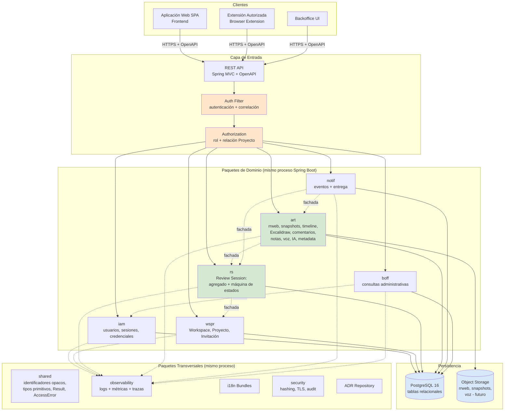
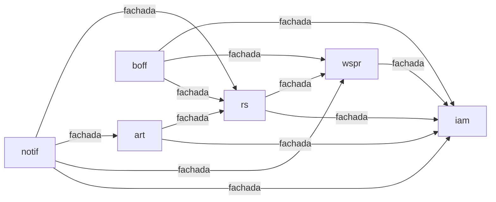
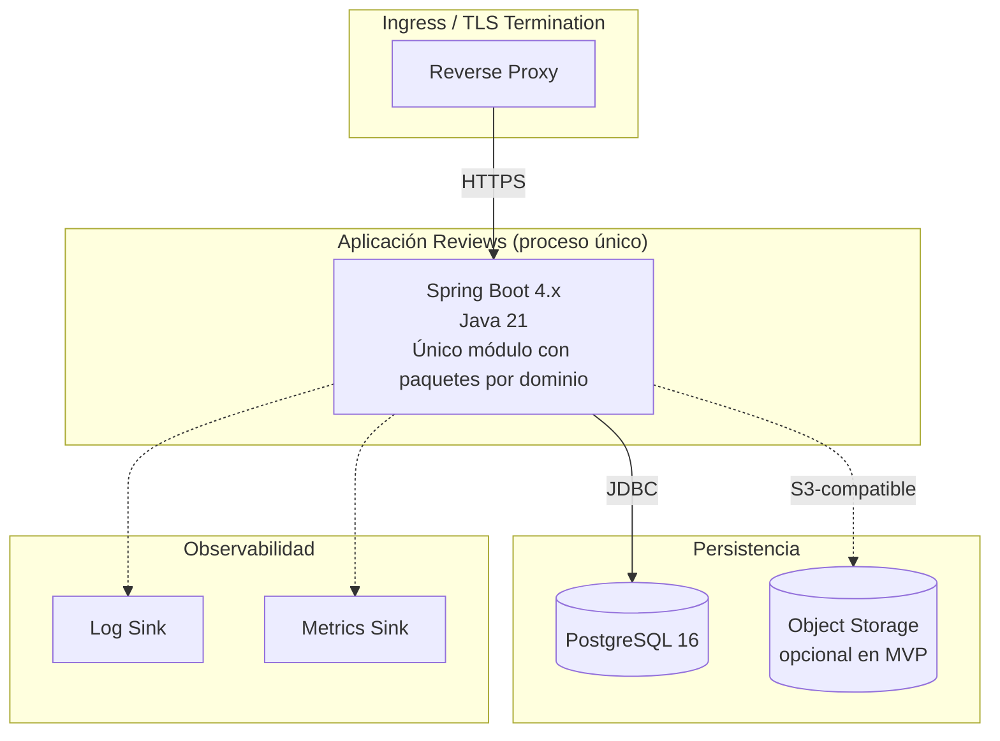
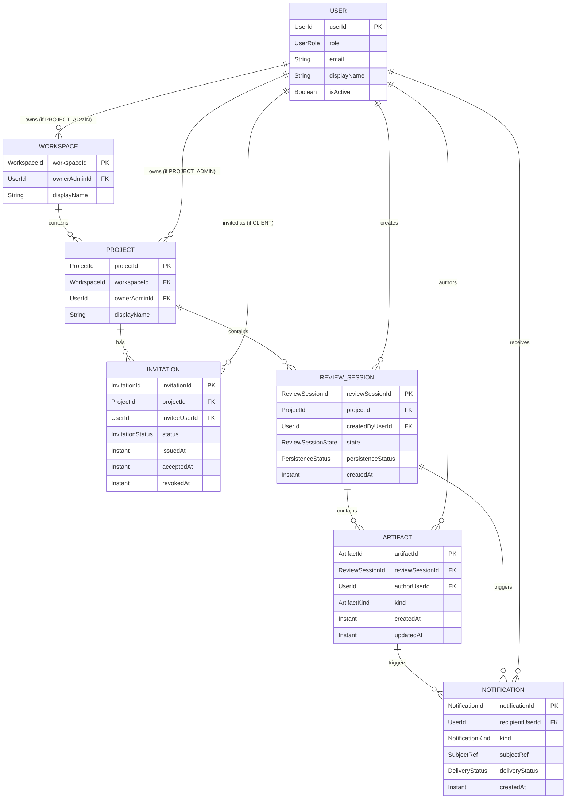
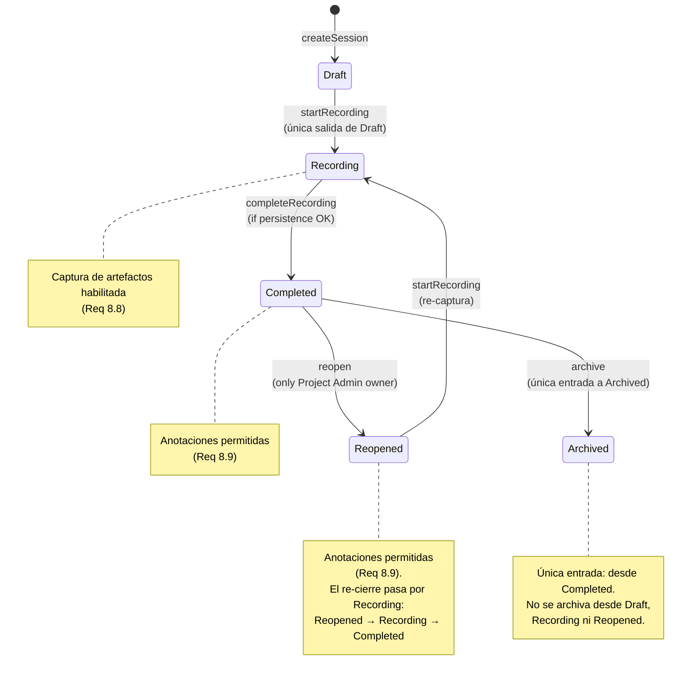
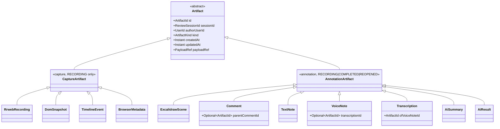
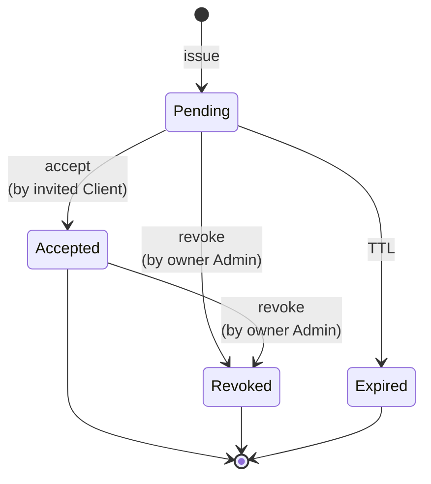
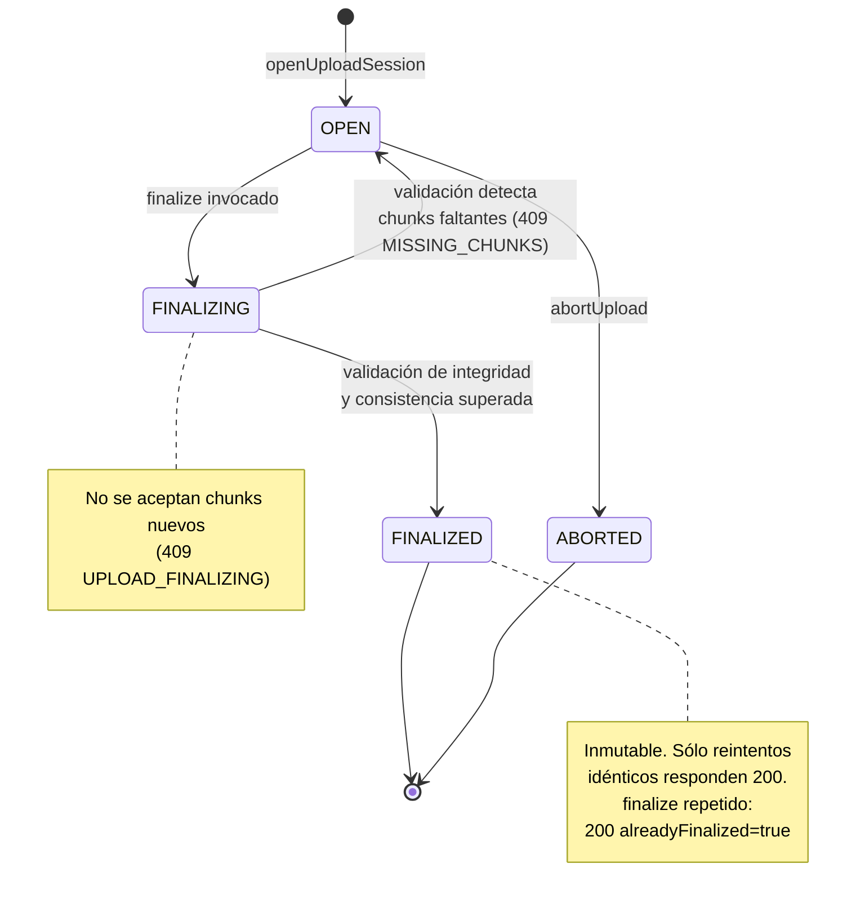
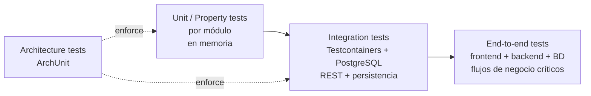

# Design Document: Reviews Platform Foundation

## Overview

Este documento constituye el **diseño de fundación** de la plataforma Reviews. Su alcance es transversal: define la arquitectura de referencia, el modelo de dominio compartido, los actores, las invariantes, el ciclo de vida de la Review Session y los mecanismos transversales (autenticación, autorización, observabilidad, i18n, notificaciones, contratos de API). No cubre los detalles internos de cada módulo (endpoints concretos, DTOs, pantallas, migraciones), que se desarrollarán en specs posteriores tomando este documento como marco de referencia.

La plataforma se construye como un **monolito Spring Boot 4.x sobre Java 21**, organizado internamente por **paquetes de dominio**, más un **frontend SPA** y una **Extensión Autorizada** de navegador. El backend es un único módulo Maven que se despliega como un proceso; su estructura interna agrupa los dominios en paquetes Java bajo la raíz `io.github.bsidedevs.api_review` (`iam`, `wspr`, `rs`, `art`, `notif`, `boff`, más los transversales `shared`, `rest`, `observability`, `security`). Los dominios se comunican entre sí mediante **fachadas** —interfaces o clases de servicio expuestas como beans Spring por el dominio proveedor—, sin importar clases internas de otros dominios. Todos los servicios de dominio se exponen hacia el exterior mediante una API REST documentada con OpenAPI (Requirement 13), publican logs estructurados con identificador de correlación (Requirement 17) y aplican controles de autenticación y autorización sobre cada operación (Requirement 18).

La unidad principal del dominio es la **Review Session**, un agregado con ciclo de vida propio y **estrictamente acotado** (`Draft → Recording → Completed → Reopened → Recording → Completed`, con `Archived` alcanzable únicamente desde `Completed`) que agrupa todos los artefactos capturados durante una revisión. Los artefactos de gran volumen (grabación rrweb, escena Excalidraw) se ingestan mediante un **protocolo de subida por chunks** idempotente descrito en el `Modelo 8`. La Review Session se enmarca en la jerarquía `Workspace → Proyecto → Review Session`, y su acceso se rige por dos coordenadas: **rol** del usuario (Administrador de Proyecto, Cliente, Administrador de Plataforma) y **relación** con el Proyecto asociado (propiedad para Administrador de Proyecto, Invitación aceptada para Cliente). Esta doble llave —rol más relación— es la piedra angular del modelo de autorización y aparece de forma consistente en todos los módulos.

Este spec se alinea con el spec previo `local-dev-environment` (Docker Compose para backend, PostgreSQL, frontend) en cuanto a infraestructura de desarrollo, y sirve como marco para los specs por módulo que lo sucedan (por ejemplo, `iam`, `workspaces-projects`, `review-session-core`, `artifacts-rrweb`, `notifications`, `backoffice`).

## Architecture

### Principios Arquitectónicos

1. **Monolito organizado por dominios**. La aplicación es un único módulo Maven Spring Boot que se despliega como un proceso. Internamente se organiza en paquetes por dominio (`iam`, `wspr`, `rs`, `art`, `notif`, `boff`, más transversales `shared`, `rest`, `observability`, `security`) bajo la raíz `io.github.bsidedevs.api_review`. Los dominios se comunican mediante **fachadas** —interfaces Spring bean— expuestas por el dominio proveedor; las estructuras internas de cada dominio no son visibles fuera de él, y los paquetes internos no se importan desde otros dominios. La separación en módulos Maven independientes o en servicios queda **fuera del alcance MVP**: el objetivo de Requirement 19 se relaja a preservar fronteras entre dominios dentro del mismo módulo, no a habilitar extracción a servicios independientes.
2. **Doble llave de autorización (rol + relación con Proyecto)**. Ningún módulo confía únicamente en el rol del usuario ni únicamente en su relación con el recurso. Cada operación sobre contenido de Proyecto o Review Session valida las dos coordenadas antes de servirse (Requirements 7.3, 11, 18.2).
3. **Fail-closed en autorización**. En ausencia de una decisión afirmativa de autorización, la operación se deniega. Cualquier señal de denegación tiene precedencia sobre cualquier señal de autorización concurrente (Requirements 9.6, 11.4, 18.7).
4. **Review Session como agregado**. La Review Session encapsula su estado y sus transiciones. Los artefactos son entidades hijas del agregado; su asociación con la sesión es inmutable durante la vida del artefacto (Requirements 1.2, 10.5).
5. **Autoría inmutable de artefactos**. La identidad del autor de un artefacto se fija en el momento de creación y no cambia con posterioridad (Requirements 9.1, 9.2). Sólo el autor puede modificar o eliminar sus propios comentarios y notas (Requirements 9.3, 9.4).
6. **Correlation ID transversal**. Toda operación transporta un identificador de correlación desde el punto de entrada (HTTP, extensión, worker) hasta los sinks de observabilidad (logs, métricas, trazas), habilitando la reconstrucción de trazabilidad extremo a extremo (Requirement 17.5).
7. **Idempotencia y resiliencia en efectos secundarios**. Las notificaciones, la persistencia de artefactos y el registro de errores contemplan mecanismos de reintento y de degradación controlada (Requirements 10.2, 12.6, 17.3, 17.4).
8. **Contratos API como fuente de verdad**. La especificación OpenAPI se mantiene sincronizada con el código y se publica por un endpoint HTTP consumible por herramientas cliente (Requirement 13). Ninguna publicación de API queda sin intento de sincronización de la especificación, y la API continúa operativa aunque la sincronización falle (Requirements 13.4, 13.5, 13.6).
9. **ADR para toda decisión arquitectónica**. Cada decisión arquitectónica relevante queda documentada en `docs/adr/` con contexto, alternativas, decisión y consecuencias (Requirement 20).

### Vista de Alto Nivel



> **Nota**: todos los paquetes de dominio y transversales residen en el **mismo proceso Spring Boot** y comparten un único classpath. Las cajas del diagrama representan fronteras de diseño (paquetes Java bajo `io.github.bsidedevs.api_review`), no unidades de despliegue independientes ni módulos Maven separados. Las flechas punteadas etiquetadas `fachada` denotan invocaciones directas entre beans Spring, mediadas por las interfaces públicas del dominio proveedor.

### Vista de Dominios y Fachadas



Regla de dependencias entre paquetes de dominio:

- Los dominios se comunican **únicamente** mediante fachadas públicas, materializadas como interfaces o clases de servicio expuestas por el dominio proveedor como beans Spring (`@Component` / `@Service`). Un dominio consumidor invoca la fachada del dominio proveedor por inyección de dependencias, sin conocer sus implementaciones internas.
- Las clases internas de un dominio (repositorios, mappers, entidades, DTOs internos, servicios auxiliares) **no** se importan desde otros dominios. La subestructura interna de cada paquete de dominio (por ejemplo `controllers/`, `services/`, `repositories/`) queda a discreción del spec por módulo correspondiente y no es objeto de este documento.
- El grafo de dependencias entre fachadas de dominio es un **DAG (sin ciclos)**. Las relaciones concretas son:
  - `iam` no depende de ningún otro dominio.
  - `wspr` depende de `iam`.
  - `rs` depende de `wspr`, `iam`.
  - `art` depende de `rs`, `iam`.
  - `notif` depende de `rs`, `art`, `wspr`, `iam`.
  - `boff` depende de `iam`, `wspr`, `rs`.
- El paquete transversal `shared` (identificadores opacos, tipos primitivos, `Result`, `AccessError`, enums compartidos) puede ser importado por cualquier dominio; no depende de ningún dominio.
- La verificación estructural de este grafo se realiza mediante tests de arquitectura sobre reglas de paquete (ver *Testing Strategy*), no mediante fronteras de módulos Maven.

### Vista de Despliegue (MVP)



Notas de despliegue:
- El TLS se termina en el proxy (Requirement 18.3). El backend acepta HTTP en la red interna del despliegue.
- El object storage es opcional en la primera iteración del MVP: los blobs de rrweb, snapshots y notas de voz pueden persistirse en columnas `bytea`/`jsonb` de PostgreSQL con `TOAST` para acelerar el arranque, con la decisión de externalizar a S3-compatible documentada en ADR.
- Los sinks de logs y métricas son intercambiables (stdout + agente, OpenTelemetry Collector, etc.). El backend no depende de un vendor específico (Requirement 19.5).

## Components and Interfaces

Cada componente se describe con su **responsabilidad**, su **fachada pública** (pseudocódigo, no Java concreto) y sus **dependencias** hacia otros dominios. La subestructura interna de cada paquete de dominio (subpaquetes `controllers/`, `services/`, `repositories/`, entidades JPA, tablas Flyway, controladores) se difiere a los specs por módulo. Aquí sólo se define la frontera pública de cada dominio y la topología de sus dependencias.

### Componente 1: `iam` (Identity & Access Management)

**Responsabilidad**: gestionar identidades de usuario (Administrador de Proyecto, Cliente, Administrador de Plataforma), credenciales, sesiones, tokens de invitación y decisiones de autorización de bajo nivel (rol + propiedad/afiliación).

**Fachada pública del dominio `iam`**:

```pascal
FACADE iam

  ENUM UserRole = { PROJECT_ADMIN, CLIENT, PLATFORM_ADMIN }

  STRUCTURE UserIdentity
    userId: UserId               // opaque, estable
    role: UserRole
    displayName: String
    email: EmailAddress
    isActive: Boolean
  END STRUCTURE

  STRUCTURE AuthenticatedPrincipal
    identity: UserIdentity
    sessionId: SessionId
    correlationId: CorrelationId
  END STRUCTURE

  // Autenticación
  FUNCTION authenticate(credentials): Result<AuthenticatedPrincipal, AuthFailure>
  FUNCTION resolveSession(token: SessionToken): Result<AuthenticatedPrincipal, AuthFailure>
  FUNCTION revokeSession(sessionId: SessionId): Result<Unit, Error>

  // Autorización de bajo nivel (rol)
  FUNCTION hasRole(user: UserId, role: UserRole): Boolean

  // Consultas para módulos consumidores
  FUNCTION getUser(userId: UserId): Optional<UserIdentity>
  FUNCTION listUsersByRole(role: UserRole, page: PageRequest): Page<UserIdentity>

END FACADE
```

**Dependencias**: ninguna hacia otros dominios. Es la raíz del grafo de fachadas.

**Reglas invariantes**:
- Un usuario tiene exactamente un rol durante toda su existencia. Cambios de rol no son parte del alcance MVP.
- Las credenciales se almacenan hasheadas con un algoritmo resistente a fuerza bruta (bcrypt/argon2; decisión concreta en ADR del módulo `iam`) — Requirement 18.4.
- Todo intento fallido de autenticación y toda autenticación exitosa se registran en el log de seguridad con `correlationId` (Requirements 18.5, 18.6).

### Componente 2: `wspr` (workspaces, proyectos, invitaciones)

**Responsabilidad**: gestionar Workspaces, Proyectos e Invitaciones. Es el único dominio que conoce la relación de propiedad `owner(Project) → ProjectAdmin` y la relación de afiliación `invitations(Project) → Client`.

**Fachada pública del dominio `wspr`**:

```pascal
FACADE wspr

  ENUM InvitationStatus = { PENDING, ACCEPTED, REVOKED, EXPIRED }

  STRUCTURE Workspace
    workspaceId: WorkspaceId
    ownerAdminId: UserId          // Requirement 3.1 (propiedad de Proyectos anida en Workspace)
    displayName: String
    createdAt: Instant
  END STRUCTURE

  STRUCTURE Project
    projectId: ProjectId
    workspaceId: WorkspaceId       // Requirement 2.2
    ownerAdminId: UserId           // Requirement 3.1
    displayName: String
    createdAt: Instant
  END STRUCTURE

  STRUCTURE Invitation
    invitationId: InvitationId
    projectId: ProjectId
    inviteeUserId: UserId          // Cliente invitado (o email pendiente de vinculación)
    status: InvitationStatus
    issuedAt: Instant
    acceptedAt: Optional<Instant>
    revokedAt: Optional<Instant>
  END STRUCTURE

  // Consultas de autorización usadas por otros módulos
  FUNCTION isProjectOwner(userId: UserId, projectId: ProjectId): Boolean
  FUNCTION hasAcceptedInvitation(userId: UserId, projectId: ProjectId): Boolean
  FUNCTION canAccessProject(user: AuthenticatedPrincipal, projectId: ProjectId): AccessDecision

  // Consultas de dominio
  FUNCTION getProject(projectId: ProjectId): Optional<Project>
  FUNCTION listProjectsOwnedBy(userId: UserId): List<Project>
  FUNCTION listProjectsAccessibleTo(userId: UserId): List<Project>

  // Comandos (invocados desde el módulo REST correspondiente)
  FUNCTION createProject(admin: AuthenticatedPrincipal, dto: NewProjectData): Result<Project, Error>
  FUNCTION deleteProject(admin: AuthenticatedPrincipal, projectId: ProjectId): Result<Unit, Error>
  FUNCTION inviteClient(admin: AuthenticatedPrincipal, projectId: ProjectId, target: InviteeRef): Result<Invitation, Error>
  FUNCTION acceptInvitation(client: AuthenticatedPrincipal, invitationId: InvitationId): Result<Invitation, Error>
  FUNCTION revokeInvitation(admin: AuthenticatedPrincipal, invitationId: InvitationId): Result<Unit, Error>

END FACADE
```

**Estructura `AccessDecision`** (compartida por todos los dominios que aplican la doble llave rol + relación; reside en el paquete transversal `shared`):

```pascal
STRUCTURE AccessDecision
  granted: Boolean
  reason: AccessReason              // OWNER | ACCEPTED_INVITATION | ROLE_ADMIN | DENIED_NO_RELATION |
                                     // DENIED_NO_ROLE | DENIED_PENDING_INVITATION | DENIED_REVOKED |
                                     // DENIED_PROJECT_BLOCKED | DENIED_UNKNOWN
END STRUCTURE

INVARIANT: canAccessProject(user, project).granted =
  ( user.role = PROJECT_ADMIN AND isProjectOwner(user.userId, project) )
  OR
  ( user.role = CLIENT AND hasAcceptedInvitation(user.userId, project) AND NOT isProjectBlocked(project) )
```

**Dependencias**: paquete `wspr` → fachada del paquete `iam` (para resolver `UserRole` del principal).

**Reglas invariantes**:
- `Project.workspaceId` es no nulo y apunta a un `Workspace` existente (Requirement 2.2).
- `Project.ownerAdminId` es no nulo y apunta a un `UserIdentity` con `role = PROJECT_ADMIN` (Requirement 3.1).
- Una invitación transita `PENDING → ACCEPTED | REVOKED | EXPIRED` y nunca vuelve atrás.
- `canAccessProject` es la única fuente de verdad para «este usuario tiene relación con este Proyecto». Todos los dominios aguas abajo llaman a esta fachada y respetan su decisión (Requirement 11).

### Componente 3: `rs` (Review Session, núcleo del dominio)

**Responsabilidad**: gestionar el agregado Review Session, su ciclo de vida y las transiciones válidas. Es el único dominio autorizado a modificar el `state` de una Review Session.

**Fachada pública del dominio `rs`**:

```pascal
FACADE rs

  ENUM ReviewSessionState = { DRAFT, RECORDING, COMPLETED, REOPENED, ARCHIVED, DELETED }

  STRUCTURE ReviewSession
    reviewSessionId: ReviewSessionId
    projectId: ProjectId              // Requirement 7.1 (asociación inmutable)
    createdByUserId: UserId
    state: ReviewSessionState
    createdAt: Instant
    startedRecordingAt: Optional<Instant>
    completedAt: Optional<Instant>
    reopenedAt: Optional<Instant>
    archivedAt: Optional<Instant>
    deletedAt: Optional<Instant>
    persistenceStatus: PersistenceStatus  // OK | FAILED | IN_PROGRESS (Requirement 10.2)
  END STRUCTURE

  // Consultas
  FUNCTION getReviewSession(user: AuthenticatedPrincipal, id: ReviewSessionId): Result<ReviewSession, AccessError>
  FUNCTION listActiveSessions(user: AuthenticatedPrincipal, projectId: ProjectId): Result<List<ReviewSession>, AccessError>
  FUNCTION listAllSessions(admin: AuthenticatedPrincipal, projectId: ProjectId): Result<List<ReviewSession>, AccessError>

  // Comandos de ciclo de vida (Requirement 8)
  FUNCTION createSession(user: AuthenticatedPrincipal, projectId: ProjectId): Result<ReviewSession, Error>
  FUNCTION startRecording(user: AuthenticatedPrincipal, id: ReviewSessionId): Result<ReviewSession, Error>
  FUNCTION completeRecording(user: AuthenticatedPrincipal, id: ReviewSessionId): Result<ReviewSession, Error>
  FUNCTION reopen(admin: AuthenticatedPrincipal, id: ReviewSessionId): Result<ReviewSession, Error>   // sólo desde COMPLETED → REOPENED
  FUNCTION archive(admin: AuthenticatedPrincipal, id: ReviewSessionId): Result<ReviewSession, Error>  // sólo desde COMPLETED → ARCHIVED
  FUNCTION delete(admin: AuthenticatedPrincipal, id: ReviewSessionId): Result<Unit, Error>            // ⚠ OPEN QUESTION: ver Modelo 2, «Transiciones hacia DELETED»

  // Consulta atómica del estado (usada por otros dominios, ej. art para decidir si aceptar captura)
  FUNCTION currentState(id: ReviewSessionId): Optional<ReviewSessionState>

END FACADE
```

**Dependencias**: paquete `rs` → fachada del paquete `wspr` (para `canAccessProject`) y fachada del paquete `iam`.

**Reglas invariantes**:
- Toda Review Session tiene exactamente uno de los seis estados en cualquier instante (Requirement 8.1).
- Toda transición de estado se valida contra la matriz de transiciones (ver `Data Models`, Modelo 2). Transiciones no válidas devuelven error sin modificar estado.
- `DRAFT` es el único estado inicial (Requirement 8.2), y `DRAFT → RECORDING` es la **única** transición que sale de `DRAFT`.
- `ARCHIVED` tiene exactamente **una** arista de entrada: `COMPLETED → ARCHIVED`. No se archiva desde `DRAFT`, ni desde `RECORDING`, ni desde `REOPENED`.
- `REOPENED` no vuelve directamente a `COMPLETED`: el camino de re-cierre es `REOPENED → RECORDING → COMPLETED`.
- `DELETED` es un estado terminal absorbente: ninguna transición sale de `DELETED`. Las aristas de **entrada** a `DELETED` están pendientes de confirmación (ver Modelo 2, «Transiciones hacia DELETED — OPEN QUESTION»).
- Sólo el Administrador de Proyecto propietario del `Project` asociado puede cerrar, reabrir, archivar o eliminar una Review Session (Requirements 7.5, 7.6, 8.5, 8.7).
- Cuando la persistencia de artefactos falla al finalizar la captura, la transición `RECORDING → COMPLETED` se bloquea sobre esa sesión concreta, sin afectar a otras sesiones (Requirement 10.2).

### Componente 4: `art` (artefactos)

**Responsabilidad**: gestionar todos los artefactos producidos dentro de una Review Session: grabación rrweb, snapshots del DOM, timeline de eventos, metadatos del navegador, escenas Excalidraw, comentarios, notas de texto, notas de voz, transcripciones y artefactos generados por IA.

**Taxonomía de artefactos**:

```pascal
ENUM ArtifactKind =
  { RRWEB_RECORDING
  , DOM_SNAPSHOT
  , TIMELINE_EVENT
  , BROWSER_METADATA
  , EXCALIDRAW_SCENE
  , COMMENT
  , TEXT_NOTE
  , VOICE_NOTE
  , TRANSCRIPTION
  , AI_SUMMARY
  , AI_RESULT
  }

STRUCTURE Artifact
  artifactId: ArtifactId
  reviewSessionId: ReviewSessionId       // Requirement 1.2, 10.5 (asociación inmutable)
  authorUserId: UserId                    // Requirement 9.1 (inmutable)
  kind: ArtifactKind
  createdAt: Instant                       // Requirement 9.2 (inmutable)
  updatedAt: Instant
  payloadRef: PayloadRef                   // referencia a blob o inline
  metadata: Map<String, Any>
END STRUCTURE
```

**Fachada pública del dominio `art`**:

```pascal
FACADE art

  // Consulta
  FUNCTION listArtifacts(user: AuthenticatedPrincipal, sessionId: ReviewSessionId, filter: ArtifactFilter): Result<List<Artifact>, AccessError>
  FUNCTION getArtifact(user: AuthenticatedPrincipal, artifactId: ArtifactId): Result<Artifact, AccessError>

  // Captura (sólo cuando la sesión está en estado RECORDING) — Requirement 8.8
  FUNCTION captureArtifact(user: AuthenticatedPrincipal, sessionId: ReviewSessionId, kind: ArtifactKind, payload: Payload): Result<Artifact, Error>

  // Anotación (permitido en COMPLETED, REOPENED, RECORDING) — Requirement 8.9
  FUNCTION addComment(user: AuthenticatedPrincipal, sessionId: ReviewSessionId, body: CommentBody): Result<Artifact, Error>
  FUNCTION replyToComment(user: AuthenticatedPrincipal, parentCommentId: ArtifactId, body: CommentBody): Result<Artifact, Error>
  FUNCTION addTextNote(user: AuthenticatedPrincipal, sessionId: ReviewSessionId, body: TextNoteBody): Result<Artifact, Error>
  FUNCTION addVoiceNote(user: AuthenticatedPrincipal, sessionId: ReviewSessionId, audio: AudioBlob): Result<Artifact, Error>

  // Modificación / eliminación (sólo autor) — Requirements 9.3, 9.4
  FUNCTION updateOwnAnnotation(user: AuthenticatedPrincipal, artifactId: ArtifactId, patch: AnnotationPatch): Result<Artifact, Error>
  FUNCTION deleteOwnAnnotation(user: AuthenticatedPrincipal, artifactId: ArtifactId): Result<Unit, Error>

  // ---- Ingesta por chunks de artefactos de gran volumen (ver Modelo 8) ----

  FUNCTION openUploadSession(
      user: AuthenticatedPrincipal,
      sessionId: ReviewSessionId,
      artifactId: ArtifactId,          // identidad del artefacto destino: espacio de secuencias propio
      kind: ArtifactKind
  ): Result<UploadSession, Error>       // estado inicial OPEN

  FUNCTION putChunk(
      user: AuthenticatedPrincipal,
      sessionId: ReviewSessionId,
      artifactId: ArtifactId,
      sequence: ChunkSequence,          // clave de idempotencia = (reviewSessionId, artifactId, sequence)
      checksum: Checksum,               // REQUERIDO: es el discriminador de idempotencia
      payload: Bytes
  ): Result<ChunkAck, ChunkError>       // ChunkError ∈ { CHUNK_CONTENT_MISMATCH, UPLOAD_FINALIZING, UPLOAD_SESSION_FINALIZED }

  FUNCTION finalizeUpload(
      user: AuthenticatedPrincipal,
      sessionId: ReviewSessionId,
      artifactId: ArtifactId,
      expected: ExpectedUploadSummary   // { totalChunks, finalChecksum }
  ): Result<UploadSession, FinalizeError>  // FinalizeError ∈ { MISSING_CHUNKS, FINAL_CHECKSUM_MISMATCH }

  FUNCTION abortUpload(user: AuthenticatedPrincipal, sessionId: ReviewSessionId, artifactId: ArtifactId): Result<Unit, Error>

  FUNCTION getUploadStatus(user: AuthenticatedPrincipal, sessionId: ReviewSessionId, artifactId: ArtifactId): Result<UploadSessionStatus, AccessError>

END FACADE
```

**Estructuras de la ingesta por chunks** (detalle completo en `Modelo 8`):

```pascal
ENUM UploadSessionState = { OPEN, FINALIZING, FINALIZED, ABORTED }

STRUCTURE ExpectedUploadSummary
  totalChunks: Integer          // p.ej. 312
  finalChecksum: Checksum       // checksum global del contenido completo
END STRUCTURE

STRUCTURE ChunkAck
  sequence: ChunkSequence
  duplicate: Boolean            // true ⇒ reintento idempotente, no se escribió nada
END STRUCTURE

STRUCTURE UploadSessionStatus
  state: UploadSessionState
  receivedChunks: Integer
  missingSequences: List<ChunkSequence>   // no vacío ⇒ finalize devolvería MISSING_CHUNKS
  alreadyFinalized: Boolean
END STRUCTURE
```

**Dependencias**: paquete `art` → fachada del paquete `rs` (para consultar estado y validar acceso) y fachada del paquete `iam`.

**Reglas invariantes**:
- Cada `Artifact` se asocia a exactamente una `ReviewSession` durante toda su existencia; la asociación se establece atómicamente con la persistencia del artefacto y no puede reestablecerse si la persistencia falla (Requirement 10.5).
- `authorUserId` y `createdAt` son inmutables (Requirement 9.1, 9.2).
- Sólo el `authorUserId` puede modificar o eliminar los artefactos de tipo `COMMENT`, `TEXT_NOTE`, `VOICE_NOTE` cuya autoría le pertenece (Requirements 9.3, 9.4).
- Los artefactos de captura (`RRWEB_RECORDING`, `DOM_SNAPSHOT`, `TIMELINE_EVENT`, `BROWSER_METADATA`) sólo pueden crearse cuando la sesión está en estado `RECORDING` (Requirement 8.8).
- Los artefactos de anotación (`COMMENT`, `TEXT_NOTE`, `VOICE_NOTE`, `EXCALIDRAW_SCENE`) pueden crearse cuando la sesión está en estado `RECORDING`, `COMPLETED` o `REOPENED` (Requirements 8.8, 8.9). No pueden crearse cuando está en `DRAFT`, `ARCHIVED` o `DELETED`.
- Cada upload session pertenece a **un** `(reviewSessionId, artifactId)`. La clave de idempotencia de un chunk es la terna `(reviewSessionId, artifactId, sequence)`: cada artefacto de la Review Session dispone de su **propio espacio de secuencias independiente** (Modelo 8.5).
- Una upload session en estado `FINALIZED` es **inmutable**: no admite nuevos chunks ni modificación del contenido de los ya recibidos.

### Componente 5: `notif` (notificaciones)

**Responsabilidad**: generar notificaciones ante eventos relevantes del dominio y registrarlas en un historial consultable por el usuario destinatario.

**Fachada pública del dominio `notif`**:

```pascal
FACADE notif

  ENUM NotificationKind =
    { COMMENT_ADDED
    , COMMENT_REPLIED
    , SESSION_COMPLETED
    , AI_PROCESSING_COMPLETED
    }

  STRUCTURE Notification
    notificationId: NotificationId
    recipientUserId: UserId
    kind: NotificationKind
    subjectRef: SubjectRef              // ReviewSessionId | ArtifactId | ...
    createdAt: Instant
    consumedAt: Optional<Instant>
    deliveryStatus: DeliveryStatus       // PENDING_RECORD | RECORDED | FAILED
  END STRUCTURE

  // Puntos de entrada (invocados por otros dominios ante eventos de dominio)
  FUNCTION notifyCommentAdded(comment: Artifact): Result<List<Notification>, Error>
  FUNCTION notifyCommentReplied(reply: Artifact, parent: Artifact): Result<List<Notification>, Error>
  FUNCTION notifySessionCompleted(session: ReviewSession): Result<List<Notification>, Error>
  FUNCTION notifyAiProcessingCompleted(session: ReviewSession): Result<List<Notification>, Error>

  // Consulta de historial (por destinatario)
  FUNCTION listMyNotifications(user: AuthenticatedPrincipal, filter: NotifFilter): Result<List<Notification>, Error>
  FUNCTION markAsConsumed(user: AuthenticatedPrincipal, notificationId: NotificationId): Result<Unit, Error>

END FACADE
```

**Dependencias**: paquete `notif` → fachadas de los paquetes `rs`, `art`, `wspr`, `iam`.

**Reglas invariantes**:
- Ante una respuesta a comentario donde el autor del comentario original coincide con el Administrador de Proyecto propietario, se genera **una única** notificación consolidada (Requirement 12.2).
- El registro en el historial consultable es reintentado hasta 2 veces (3 intentos totales) en caso de fallo tras generación exitosa (Requirement 12.6).
- Todo destinatario de notificación es, en el momento de la generación, un usuario con relación válida con el Proyecto asociado.

### Componente 6: `boff` (backoffice)

**Responsabilidad**: exponer consultas administrativas al Administrador de Plataforma. **No** expone acceso al contenido de Review Sessions (Requirements 6.5, 6.6, 11.3).

**Fachada pública del dominio `boff`**:

```pascal
FACADE boff

  STRUCTURE PlatformMetrics
    totalProjectAdmins: Integer
    totalClients: Integer
    totalWorkspaces: Integer
    totalProjects: Integer
    totalReviewSessions: Integer
    sessionsByState: Map<ReviewSessionState, Integer>
    ... (métricas adicionales según spec por módulo)
  END STRUCTURE

  // Sólo invocable por AuthenticatedPrincipal con role = PLATFORM_ADMIN
  FUNCTION listProjectAdmins(admin: AuthenticatedPrincipal, page: PageRequest): Result<Page<UserIdentity>, AccessError>
  FUNCTION listClients(admin: AuthenticatedPrincipal, page: PageRequest): Result<Page<UserIdentity>, AccessError>
  FUNCTION getMetrics(admin: AuthenticatedPrincipal): Result<PlatformMetrics, AccessError>

END FACADE
```

**Dependencias**: paquete `boff` → fachadas de los paquetes `iam`, `wspr`, `rs` (sólo para contadores agregados, no para contenido).

**Reglas invariantes**:
- Las operaciones del Backoffice están cerradas al rol `PLATFORM_ADMIN`; cualquier otro rol se deniega en el filtro de autorización antes de llegar al dominio.
- Ninguna operación del Backoffice devuelve payload de contenido de Review Sessions (grabaciones, comentarios, notas, artefactos IA). Cuando el listado de contadores está vacío, se responde una colección vacía y no un error (Requirement 6.3).

### Componente 7: Capa REST (paquete `rest`)

**Responsabilidad**: exponer los servicios de dominio como una API REST sobre HTTP y publicar su especificación OpenAPI (Requirement 13). Reside en el paquete transversal `rest` bajo `io.github.bsidedevs.api_review.rest` y contiene controladores HTTP, filtros de correlación, autenticación, autorización y configuración OpenAPI.

**Interface** (contrato hacia consumidores externos):

```pascal
SERVICE reviews-rest-api
  PROTOCOL: HTTPS
  BASE_PATH: /api/v1
  AUTH: Bearer token / session cookie (según ADR del módulo iam)
  DOC_ENDPOINT: GET /api/v1/openapi.json
                GET /api/v1/openapi.yaml
                GET /api/v1/docs (Swagger UI, opcional)
  CORRELATION_HEADER: X-Correlation-Id (opcional en request; siempre presente en response)
END SERVICE
```

**Responsabilidades**:
- Traducir HTTP a invocaciones a las fachadas públicas de los dominios (`iam`, `wspr`, `rs`, `art`, `notif`, `boff`).
- Aplicar `AuthenticationFilter` y `AuthorizationFilter` antes de invocar cualquier handler de dominio (Requirements 18.1, 18.2).
- Emitir/propagar `correlationId` en cada request-response (Requirement 17.5).
- Serializar errores con el formato estándar `Problem+JSON` (RFC 7807), preservando el `correlationId` para diagnóstico.
- Publicar la especificación OpenAPI en un endpoint HTTP consumible por herramientas cliente (Requirement 13.7).
- Mantener la API operativa aunque la actualización de la especificación falle, sirviendo la especificación previa (Requirements 13.4, 13.5, 13.6). La especificación se materializa como recurso estático servido por el mismo proceso; el intento de regeneración es una tarea idempotente que no interrumpe el tráfico HTTP en curso.

**Convenciones REST** (a formalizar en spec del paquete `rest`):

- Rutas por recurso: `/workspaces`, `/projects/{projectId}`, `/projects/{projectId}/review-sessions`, `/review-sessions/{sessionId}/artifacts`, `/notifications`, `/admin/users`, `/admin/metrics`.
- Verbos HTTP semánticos: `GET`, `POST`, `PUT`, `PATCH`, `DELETE`. Transiciones de estado no idempotentes se modelan como `POST` a sub-recursos: `POST /review-sessions/{id}/start`, `.../complete`, `.../reopen`, `.../archive`. Con la máquina de estados del Modelo 2, `.../reopen` sólo es aceptable desde `COMPLETED` y `.../archive` sólo desde `COMPLETED`; el re-cierre tras una reapertura exige `.../start` (`REOPENED → RECORDING`) y después `.../complete`.
- Ingesta por chunks (Modelo 8), con `PUT` idempotente sobre el chunk:
  - `POST   /review-sessions/{sessionId}/artifacts/{artifactId}/upload` → abre la upload session (`OPEN`).
  - `PUT    /review-sessions/{sessionId}/artifacts/{artifactId}/chunks/{sequence}` → sube un chunk (header `X-Chunk-Checksum` **obligatorio**).
  - `POST   /review-sessions/{sessionId}/artifacts/{artifactId}/upload/finalize` → body `{ "totalChunks": n, "finalChecksum": "..." }`.
  - `POST   /review-sessions/{sessionId}/artifacts/{artifactId}/upload/abort` → `ABORTED`.
  - `GET    /review-sessions/{sessionId}/artifacts/{artifactId}/upload` → estado, chunks recibidos y secuencias faltantes.
- Códigos de estado: `200/201/204` en éxito; `400` validación; `401` autenticación; `403` autorización; `404` no existe / no accesible (evitando revelar existencia); `409` transición inválida o conflicto de protocolo de subida; `422` regla de dominio violada; `5xx` errores no controlados con `correlationId` en el body.
- Códigos de error canónicos del protocolo de subida (campo `code` del Problem+JSON):

  | `code`                     | HTTP  | Significado                                                                        |
  |----------------------------|:-----:|------------------------------------------------------------------------------------|
  | `CHUNK_CONTENT_MISMATCH`   | 409   | Ya existe un chunk con esa `sequence` pero su contenido (checksum) difiere          |
  | `MISSING_CHUNKS`           | 409   | No se puede finalizar porque falta uno o más chunks                                 |
  | `UPLOAD_FINALIZING`        | 409   | La upload session se está validando y no acepta nuevos chunks                        |
  | `UPLOAD_SESSION_FINALIZED` | 409   | La upload session ya está finalizada y es completamente inmutable                    |
  | `FINAL_CHECKSUM_MISMATCH`  | 422 ⚠ | El checksum global enviado en `finalize` no coincide con el contenido ensamblado     |

  ⚠ `FINAL_CHECKSUM_MISMATCH` es una **decisión pendiente de confirmación** (código, `409` vs `422`, y estado resultante). Ver Modelo 8.4.
- Paginación cursor-based en listados grandes; formato estable entre endpoints.

### Componente 8: Observability (paquete transversal `observability`)

**Responsabilidad**: garantizar que toda operación relevante genere logs estructurados con `correlationId`, exponer métricas y facilitar la reconstrucción de trazabilidad extremo a extremo (Requirement 17). Reside en el paquete transversal `observability` bajo `io.github.bsidedevs.api_review.observability` y contiene el logging estructurado, la propagación de correlación, el registro de errores con fallback y las métricas.

**Interface**:

```pascal
SERVICE observability
  LOG_FORMAT: JSON estructurado con { timestamp, level, message, correlationId, userId?, module, event, ... }
  METRICS_ENDPOINT: GET /actuator/prometheus  (o equivalente)
  LOG_SINKS:
    PRIMARY: stdout (agente externo lo recolecta)
    FALLBACK: local file (Requirement 17.3)
  ERROR_RECORD_POLICY:
    IF primary sink fails → try fallback in parallel
    IF fallback also fails → continue operation without recording (Requirement 17.4)
END SERVICE
```

**Reglas invariantes**:
- Toda entrada por REST recibe o genera un `correlationId` al inicio de la request; el header `X-Correlation-Id` se propaga a todos los logs, métricas etiquetadas y llamadas internas.
- El log de seguridad es un canal separado del log operativo, con retención independiente y sin datos sensibles.

### Componente 9: i18n (recursos transversales en el backend y frontend)

**Responsabilidad**: externalizar todos los textos visibles al usuario en recursos de internacionalización y permitir incorporar nuevos idiomas sin modificar el código (Requirement 14). En el backend los bundles residen bajo `src/main/resources/i18n/`; el frontend gestiona sus propios bundles.

**Interface**:

```pascal
SERVICE i18n
  BUNDLES: JSON o properties por locale (ej. es.json, en.json)
  BUNDLE_LOCATION_FRONTEND: frontend/src/i18n/{locale}.json
  BUNDLE_LOCATION_BACKEND:  backend/src/main/resources/i18n/messages_{locale}.properties
  SELECTION_POLICY:
    IF selectedLocale has complete translations → render fully in selectedLocale (Requirement 14.3)
    IF selectedLocale has ANY missing key → fall back to default locale for ALL keys (no mixing)
  DEFAULT_LOCALE: "es"    // decisión inicial; ajustable por ADR
END SERVICE
```

**Regla clave**: la política de fallback es **todo o nada por locale**, no clave por clave (Requirement 14.3). Esto exige que la resolución del locale efectivo se calcule una única vez por render y se aplique consistentemente.

### Componente 10: Frontend SPA + Extensión Autorizada

**Responsabilidad del Frontend SPA**: aplicación web responsive (Requirement 15) consumidora de la API REST. Renderiza dashboards del Administrador de Proyecto, del Cliente y del Backoffice; expone consultas y anotaciones sobre Review Sessions.

**Responsabilidad de la Extensión Autorizada**: extensión de navegador que permite al Cliente iniciar y participar en Review Sessions capturando artefactos de la aplicación web bajo revisión (rrweb, snapshots, timeline, metadatos, notas de voz) — Requirement 5.1.

**Interface común hacia el backend**: la misma API REST descrita en el Componente 7. La extensión y la SPA son consumidores homogéneos, autenticados con el mismo mecanismo. Las decisiones de qué operaciones expone cada superficie son responsabilidad de los specs de esos módulos.

**Regla de responsive**: el frontend web presenta las funcionalidades de consulta y comentario sobre Review Sessions en resoluciones móviles (Requirement 15.2). La captura interactiva (rrweb, Excalidraw) puede quedar limitada a resoluciones de escritorio en el MVP; esta restricción se documenta en un ADR del módulo frontend.

## Data Models

Esta sección presenta el **modelo conceptual/lógico** compartido por todos los módulos. Las tablas físicas, columnas, tipos SQL, índices y migraciones Flyway concretas se difieren a los specs por módulo.

### Modelo 1: Jerarquía del Dominio



**Invariantes estructurales**:

```pascal
INVARIANT hierarchyCardinality:
  FORALL project: Project.
    EXISTS! workspace: Workspace WITH workspace.workspaceId = project.workspaceId     // Req 2.2
  AND
  FORALL session: ReviewSession.
    EXISTS! project: Project WITH project.projectId = session.projectId               // Req 2.3, 7.1
  AND
  FORALL artifact: Artifact.
    EXISTS! session: ReviewSession WITH session.reviewSessionId = artifact.reviewSessionId   // Req 1.2, 10.5

INVARIANT ownershipCardinality:
  FORALL project: Project.
    EXISTS! admin: User WITH admin.userId = project.ownerAdminId AND admin.role = PROJECT_ADMIN   // Req 3.1

INVARIANT invitationUniqueness:
  FORALL (client, project): (User, Project).
    COUNT(inv IN Invitation | inv.projectId = project AND inv.inviteeUserId = client AND inv.status = ACCEPTED) <= 1
```

### Modelo 2: Ciclo de Vida de la Review Session

Máquina de estados formal (Requirement 8):



> **Estado `Deleted`**: el enum lo conserva (Requirement 8.1 lo exige), pero **sus aristas de entrada no están definidas en este diagrama** porque son una pregunta abierta. Ver «Transiciones hacia DELETED — OPEN QUESTION» más abajo. `Deleted` sigue siendo absorbente: ninguna transición sale de él, y al alcanzarlo las restricciones de modificación y de listado se aplican de inmediato (Requirement 8.11).

**Matriz de transiciones válidas** (conjunto completo y cerrado: todo lo que no aparece con ✓ está prohibido):

| Desde \ A     | Draft | Recording | Completed | Reopened | Archived | Deleted |
|---------------|:-----:|:---------:|:---------:|:--------:|:--------:|:-------:|
| **Draft**     |   —   |     ✓     |     ✗     |    ✗     |    ✗     |    ?    |
| **Recording** |   ✗   |     —     |    ✓*     |    ✗     |    ✗     |    ?    |
| **Completed** |   ✗   |     ✗     |     —     |    ✓†    |    ✓†    |    ?    |
| **Reopened**  |   ✗   |     ✓     |     ✗     |    —     |    ✗     |    ?    |
| **Archived**  |   ✗   |     ✗     |     ✗     |    ✗     |    —     |    ?    |
| **Deleted**   |   ✗   |     ✗     |     ✗     |    ✗     |    ✗     |    —    |

- ✓ = transición permitida.
- ✗ = transición rechazada; el comando retorna error de transición inválida (`409`) sin modificar estado.
- ? = **sin definir**: pendiente de confirmación (ver OPEN QUESTION más abajo). Hasta que se confirme, el diseño **no autoriza** ninguna transición hacia `Deleted`.
- \* = requiere que la persistencia de artefactos capturados en `Recording` haya completado con éxito (Requirement 10.2).
- † = requiere que el invocador sea el Administrador de Proyecto propietario del Proyecto asociado (Requirements 7.5, 7.6, 8.5, 8.7).

Consecuencias explícitas de esta matriz, respecto de versiones previas de este diseño:

- `DRAFT → RECORDING` es la **única** salida de `DRAFT`. `DRAFT → ARCHIVED` y `DRAFT → DELETED` **ya no** forman parte de la matriz.
- `REOPENED → COMPLETED` **ya no** existe. El re-cierre es `REOPENED → RECORDING → COMPLETED`, es decir: reabrir habilita una nueva fase de captura antes de volver a cerrar.
- `REOPENED → ARCHIVED` y `RECORDING → ARCHIVED` **ya no** existen. `ARCHIVED` tiene exactamente una arista de entrada: `COMPLETED → ARCHIVED`.
- El grafo resultante es un ciclo controlado `Completed → Reopened → Recording → Completed` con un único sumidero declarado (`Archived`).

**Transiciones hacia DELETED — OPEN QUESTION (pendiente de confirmación con el usuario)**

El estado `Deleted` permanece en el enum porque el Requirement 8.1 lo enumera y el Requirement 8.7 describe la eliminación por parte del Administrador de Proyecto propietario. Sin embargo, el conjunto de transiciones autorizado en este diseño **no incluye ninguna arista de entrada a `Deleted`**. Preguntas a resolver antes de implementar `rs.delete(...)`:

1. ¿Desde qué estados se puede eliminar una Review Session? (`Draft`? `Completed`? `Archived`? ¿únicamente `Archived`?)
2. ¿La eliminación es una **transición de estado** (soft delete a `Deleted`, con el registro conservado y excluido de listados activos) o una **operación de borrado físico** separada de la máquina de estados (hard delete, el registro desaparece)?
3. Si es soft delete, ¿se admite eliminar una sesión en `Recording` (con una upload session en curso) o hay que completar/abortar primero?

Mientras esta pregunta esté abierta, `rs.delete(...)` queda especificado como **no implementable** y las Properties 5 y 6 se evalúan sobre la matriz sin aristas hacia `Deleted`.

**Operaciones habilitadas por estado**:

| Estado      | Captura de artefactos | Anotaciones (comentarios/notas) | Aparece en listado activo | Modificable | Transiciones de salida            |
|-------------|:---------------------:|:-------------------------------:|:-------------------------:|:-----------:|-----------------------------------|
| Draft       |          ✗            |               ✗                 |             ✓             |      ✓      | `→ Recording` (única)             |
| Recording   |          ✓            |               ✓                 |             ✓             |      ✓      | `→ Completed`                     |
| Completed   |          ✗            |               ✓                 |             ✓             |      ✓      | `→ Reopened`, `→ Archived`        |
| Reopened    |          ✗            |               ✓                 |             ✓             |      ✓      | `→ Recording`                     |
| Archived    |          ✗            |               ✗                 |             ✗             |      ✗      | ninguna                           |
| Deleted     |          ✗            |               ✗                 |             ✗             |      ✗      | ninguna (absorbente)              |

### Modelo 3: Taxonomía de Artefactos



**Reglas por familia de artefactos**:

- **CaptureArtifact**: creables **sólo** cuando `session.state = RECORDING`. Autoría corresponde al usuario que ejecutó la captura (Requirement 9.1).
- **AnnotationArtifact**: creables cuando `session.state IN {RECORDING, COMPLETED, REOPENED}`. Modificables/eliminables sólo por el `authorUserId` para las subclases con contenido de usuario libre (`Comment`, `TextNote`, `VoiceNote`) — Requirements 9.3, 9.4.
- **AI artifacts** (`AiSummary`, `AiResult`, `Transcription` generada automáticamente): la autoría se atribuye al usuario que dispara el procesamiento; su modificación/eliminación queda fuera del alcance MVP (no hay UI de edición).
- **Payload**: pequeños (comentarios, notas de texto, metadata) inline en columna JSONB; grandes (rrweb, snapshots, voz) referenciados por `PayloadRef` que apunta a object storage (o `bytea` con TOAST en la primera iteración del MVP; decisión en ADR).

### Modelo 4: Estados de Invitación



**Reglas invariantes**:
- `Pending` no otorga acceso al Proyecto (Requirement 3.5).
- `Accepted` otorga acceso al contenido del Proyecto hasta que se revoque (Requirement 3.5).
- `Revoked` impide todo acceso subsiguiente (Requirement 11.5). No hay «re-aceptación» de una invitación revocada; el flujo correcto es emitir una nueva invitación.
- El TTL para `Pending → Expired` se difiere al spec del módulo `workspaces-projects`.

### Modelo 5: Modelo de Autorización Unificado

Toda decisión de autorización sobre contenido de Proyecto/Review Session se reduce a la evaluación de la función `canAccessProject` combinada con el rol del principal:

```pascal
FUNCTION canAccessProject(user: AuthenticatedPrincipal, projectId: ProjectId): AccessDecision
BEGIN
  project ← wspr.getProject(projectId)
  IF project = NONE THEN
    RETURN { granted: FALSE, reason: DENIED_UNKNOWN }        // 404 al REST layer

  IF NOT user.identity.isActive THEN
    RETURN { granted: FALSE, reason: DENIED_NO_ROLE }

  MATCH user.identity.role WITH
  | PROJECT_ADMIN →
      IF wspr.isProjectOwner(user.userId, projectId) THEN
        RETURN { granted: TRUE, reason: OWNER }
      ELSE
        RETURN { granted: FALSE, reason: DENIED_NO_RELATION }

  | CLIENT →
      IF isProjectBlocked(project) THEN                       // Requirement 5.7
        RETURN { granted: FALSE, reason: DENIED_PROJECT_BLOCKED }
      inv ← wspr.findInvitation(user.userId, projectId)
      MATCH inv WITH
      | NONE                → { granted: FALSE, reason: DENIED_NO_RELATION }
      | Pending              → { granted: FALSE, reason: DENIED_PENDING_INVITATION }
      | Revoked | Expired   → { granted: FALSE, reason: DENIED_REVOKED }
      | Accepted             → { granted: TRUE,  reason: ACCEPTED_INVITATION }

  | PLATFORM_ADMIN →
      RETURN { granted: FALSE, reason: DENIED_NO_RELATION }    // Requirements 6.5, 6.6, 11.3

END FUNCTION
```

**Invariante clave**:

```pascal
INVARIANT accessMonotonicity:
  FORALL user, project, operation.
    IF ANY control DENIES the operation
    THEN the final decision is DENY
                                                   // Requirements 9.6, 11.4, 18.7
```

Es decir: si múltiples controles concurrentes se pronuncian sobre una operación, la denegación siempre gana. Esta regla se implementa como **short-circuit en el filtro de autorización**: en cuanto un control retorna DENY, no se evalúan los siguientes.

### Modelo 6: Notificación por Evento

Mapping determinístico de eventos de dominio → notificaciones generadas (Requirement 12):

| Evento de dominio                                     | Destinatarios                                                                                                    | Consolidación                                                              |
|-------------------------------------------------------|------------------------------------------------------------------------------------------------------------------|----------------------------------------------------------------------------|
| Cliente agrega comentario                             | Administrador de Proyecto propietario                                                                            | —                                                                          |
| Cliente responde comentario                           | Autor del comentario original **y** Administrador de Proyecto propietario                                        | Si autor original = Administrador propietario → **1 sola** notificación    |
| **Administrador de Proyecto responde un comentario**  | **El Cliente**, con independencia de quién sea el autor del comentario padre (propio o del Cliente)               | Si además coincide con el autor del comentario padre → **1 sola** notificación al Cliente |
| ReviewSession → `Completed`                           | Todos los participantes autorizados del Proyecto (Administrador propietario + Clientes con invitación aceptada)  | —                                                                          |
| Procesamiento IA finaliza sobre sesión                | Administrador de Proyecto propietario                                                                            | —                                                                          |

**Regla de respuesta del Administrador de Proyecto (nueva)**: cuando un Administrador de Proyecto responde un comentario de una Review Session, el Cliente del Proyecto **siempre** es notificado. Esto se cumple en los dos casos:

- El comentario padre es del Cliente → el Cliente recibe notificación como autor del comentario original.
- El comentario padre es **del propio Administrador de Proyecto** → el Cliente recibe igualmente notificación. Este caso **no** se suprime como auto-notificación: la supresión de auto-notificación aplica al *emisor* (el Administrador no se notifica a sí mismo), nunca al Cliente.

**Coherencia con la regla de consolidación**: la consolidación del Requirement 12.2 opera únicamente sobre destinatarios *duplicados* — cuando el autor del comentario original y el Administrador de Proyecto propietario son el mismo usuario, se emite una sola notificación consolidada en lugar de dos. La consolidación **nunca reduce a cero** el conjunto de destinatarios ni elimina al Cliente de él:

```pascal
FUNCTION recipientsOfReply(reply: Artifact, parent: Artifact): Set<UserId>
BEGIN
  owner   ← wspr.getProject(session(reply).projectId).ownerAdminId
  clients ← wspr.clientsWithAcceptedInvitation(session(reply).projectId)

  recipients ← ∅
  recipients ← recipients ∪ { parent.authorUserId }        // autor del comentario padre
  recipients ← recipients ∪ { owner }                       // Administrador propietario

  IF reply.authorUserId = owner THEN
    recipients ← recipients ∪ clients                       // NUEVA REGLA: el Cliente siempre se notifica
  END IF

  recipients ← recipients \ { reply.authorUserId }           // nadie se auto-notifica...
  // ...salvo que la nueva regla lo haya incorporado como Cliente:
  // el emisor es el Administrador, luego los Clientes nunca quedan excluidos por esta línea.

  RETURN recipients        // conjunto ⇒ deduplicación = consolidación (Req 12.2)
END FUNCTION
```

Al modelarse como **conjunto**, la consolidación es una consecuencia estructural: un mismo usuario aparece una única vez, y por tanto recibe exactamente una notificación.

**Reintento**: si el registro en el historial consultable falla tras generación exitosa, se reintenta hasta 2 veces (3 intentos totales) — Requirement 12.6.

### Modelo 7: Identificadores y Tipos Primitivos Compartidos (`shared-kernel`)

```pascal
MODULE shared-kernel

  TYPE UserId          = OpaqueId          // UUID v7 recomendado (ordenable + único)
  TYPE WorkspaceId     = OpaqueId
  TYPE ProjectId       = OpaqueId
  TYPE ReviewSessionId = OpaqueId
  TYPE ArtifactId      = OpaqueId
  TYPE InvitationId    = OpaqueId
  TYPE NotificationId  = OpaqueId
  TYPE SessionId       = OpaqueId
  TYPE CorrelationId   = OpaqueId
  TYPE UploadId        = OpaqueId          // identificador de la upload session (informativo)

  TYPE Instant         = ISO-8601 UTC
  TYPE EmailAddress    = validated per RFC 5322
  TYPE PayloadRef      = InlineJson | BlobUrl

  TYPE ChunkSequence   = Integer >= 0      // espacio de secuencias propio por (reviewSessionId, artifactId)
  TYPE Checksum        = HexString         // algoritmo concreto en ADR (p.ej. SHA-256)
  TYPE Bytes           = octet stream

  ENUM UploadSessionState = { OPEN, FINALIZING, FINALIZED, ABORTED }

  TYPE AccessError     = { UNAUTHENTICATED, FORBIDDEN, NOT_FOUND }

  TYPE ChunkError      = { CHUNK_CONTENT_MISMATCH, UPLOAD_FINALIZING, UPLOAD_SESSION_FINALIZED }
  TYPE FinalizeError   = { MISSING_CHUNKS, FINAL_CHECKSUM_MISMATCH }

END MODULE
```

> **Nota sobre `UploadId`**: sigue existiendo como identificador legible de la upload session (útil para logs y diagnóstico), pero **no** forma parte de la clave de idempotencia de un chunk. La clave es `(reviewSessionId, artifactId, sequence)` — ver Modelo 8.5.

**Regla**: los identificadores son opacos. Ningún módulo asume estructura interna (ni longitud, ni codificación) más allá de la igualdad. La decisión concreta (`UUID v4`, `UUID v7`, o snowflake) queda en ADR del módulo `shared-kernel` y no afecta a los consumidores.

### Modelo 8: Ingesta por Chunks de Artefactos de Gran Volumen

Los artefactos de gran volumen (grabación rrweb, escena Excalidraw, notas de voz largas) no se suben en una única petición: el frontend los trocea en **chunks** numerados y los envía de forma incremental durante la fase `RECORDING`. El protocolo está diseñado para ser **idempotente frente a reintentos** (red inestable, reintentos del navegador, reenvíos de la extensión) y para no perder ni corromper contenido.

> **Nota de trazabilidad a requisitos**: la ingesta por chunks es un **mecanismo de diseño** que sirve a los Requirements 10.1 (persistencia duradera de todos los artefactos capturados), 10.2 (aislamiento del fallo de persistencia por sesión), 10.5 (asociación artefacto ↔ sesión sólo si la persistencia culmina) y 8.8 (captura habilitada sólo en `RECORDING`). **No existe hoy un requisito dedicado al protocolo de subida por chunks** en `requirements.md`; esta ausencia se registra como pregunta abierta para la fase de requisitos (ver «Preguntas abiertas» al final de esta sección).

#### Modelo 8.1: Resolución de idempotencia del `PUT` de chunk

`PUT /review-sessions/{sessionId}/artifacts/{artifactId}/chunks/{sequence}` con header `X-Chunk-Checksum` obligatorio. La resolución depende del estado de la upload session y de si la `sequence` ya existe con el mismo o distinto checksum:

| Estado del upload | Situación                                | Respuesta                       | Acción del backend                                                                                  |
|-------------------|------------------------------------------|---------------------------------|------------------------------------------------------------------------------------------------------|
| `OPEN`            | secuencia nueva                          | `201 Created`                   | Almacena el chunk y registra su checksum                                                              |
| `OPEN`            | misma secuencia + mismo checksum         | `200 OK` (`duplicate=true`)     | Nada. Reintento idempotente                                                                            |
| `OPEN`            | misma secuencia + checksum distinto      | `409 CHUNK_CONTENT_MISMATCH`    | Conserva el primer contenido. El cliente debe abortar el upload y crear una **nueva** upload session   |
| `FINALIZING`      | llega cualquier chunk                    | `409 UPLOAD_FINALIZING`         | Rechaza: no se aceptan chunks nuevos mientras se valida integridad/consistencia                        |
| `FINALIZED`       | misma secuencia + mismo checksum         | `200 OK` (`duplicate=true`)     | Nada. Reintento tardío inocuo                                                                          |
| `FINALIZED`       | secuencia nueva                          | `409 UPLOAD_SESSION_FINALIZED`  | Rechaza. Una sesión finalizada es inmutable                                                            |
| `FINALIZED`       | misma secuencia + checksum distinto      | `409 UPLOAD_SESSION_FINALIZED`  | Rechaza. El contenido de una sesión finalizada no se puede modificar                                   |

**El checksum es el discriminador del protocolo**: la resolución de idempotencia no depende del tamaño, ni del orden de llegada, ni de la marca temporal. En consecuencia:

- `X-Chunk-Checksum` es un header **obligatorio**. Si falta o está malformado, la respuesta es `400` (`code: CHUNK_CHECKSUM_REQUIRED`), y el chunk **no** se almacena.
- Queda **derogada** la degradación previa de este documento por la que un `PUT` sobre `OPEN` sin checksum previo y con el mismo tamaño respondía `200`. El tamaño ya no es criterio de equivalencia de contenido: dos chunks distintos del mismo tamaño son un `CHUNK_CONTENT_MISMATCH`, no un duplicado.
- ⚠ **Decisión a confirmar**: hacer el checksum obligatorio (en lugar de definir un *fallback* cuando el cliente no lo envía) es la opción elegida aquí por ser la única que hace el protocolo determinista. Si se prefiere admitir clientes sin checksum, hay que definir explícitamente qué respuesta se da en ese caso.

Una `sequence` cuyo contenido ya fue aceptado es **inmutable durante toda la vida de la upload session**, con independencia del estado (`OPEN`, `FINALIZING` o `FINALIZED`). No existe operación de sobre-escritura de chunk; la vía de recuperación ante contenido divergente es `abort` + nueva upload session.

#### Modelo 8.2: Manifiesto de chunks (modelo lógico)

| Campo             | Tipo                 | Notas                                                                     |
|-------------------|----------------------|---------------------------------------------------------------------------|
| `reviewSessionId` | `ReviewSessionId`    | **PK (1/3)** — parte de la clave de idempotencia                          |
| `artifactId`      | `ArtifactId`         | **PK (2/3)** — cada artefacto tiene su propio espacio de secuencias       |
| `sequence`        | `ChunkSequence`      | **PK (3/3)** — entero ≥ 0, denso (sin huecos) al finalizar                |
| `checksum`        | `Checksum`           | Checksum del contenido del chunk. Discriminador de idempotencia            |
| `sizeBytes`       | `Integer`            | Informativo/observabilidad. **No** participa en la decisión de idempotencia |
| `storageKey`      | `String`             | Clave derivada en object storage (Modelo 8.3)                              |
| `receivedAt`      | `Instant`            | Marca de recepción del **primer** almacenamiento del chunk                 |

```
PRIMARY KEY (reviewSessionId, artifactId, sequence)
```

Tabla hermana de la upload session (una fila por `(reviewSessionId, artifactId)`):

| Campo             | Tipo                  | Notas                                                                 |
|-------------------|-----------------------|-----------------------------------------------------------------------|
| `reviewSessionId` | `ReviewSessionId`     | **PK (1/2)**                                                          |
| `artifactId`      | `ArtifactId`          | **PK (2/2)**                                                          |
| `uploadId`        | `UploadId`            | Identificador legible para logs/diagnóstico. No es clave funcional     |
| `state`           | `UploadSessionState`  | `OPEN` \| `FINALIZING` \| `FINALIZED` \| `ABORTED`                     |
| `kind`            | `ArtifactKind`        | Tipo de artefacto destino                                              |
| `expectedChunks`  | `Optional<Integer>`   | Se fija al invocar `finalize` (`totalChunks`)                          |
| `finalChecksum`   | `Optional<Checksum>`  | Se fija al invocar `finalize`                                          |
| `finalizedAt`     | `Optional<Instant>`   | Sólo en `FINALIZED`                                                    |

#### Modelo 8.3: Derivación de claves en object storage

La clave de almacenamiento se deriva **de la misma terna** que la clave de idempotencia, de modo que el espacio de nombres físico refleja el espacio de secuencias lógico:

```
chunks/{reviewSessionId}/{artifactId}/{sequence:0000000}
```

Y el objeto ensamblado tras `finalize`:

```
artifacts/{reviewSessionId}/{artifactId}/payload
```

Consecuencias:
- Escribir dos veces el mismo chunk apunta a la **misma** clave física, luego el reintento idempotente no genera basura.
- Dos artefactos de la misma Review Session **nunca** colisionan aunque usen la misma numeración de secuencias: el `artifactId` está en el prefijo.
- Abortar una upload session permite borrar todo su contenido con un único `delete by prefix`.

#### Modelo 8.4: Códigos de error canónicos

| `code`                     | HTTP  | Significado                                                                                   |
|----------------------------|:-----:|-----------------------------------------------------------------------------------------------|
| `CHUNK_CONTENT_MISMATCH`   | 409   | Ya existe un chunk con esa secuencia pero su contenido (checksum) difiere                      |
| `MISSING_CHUNKS`           | 409   | No se puede finalizar porque falta uno o más chunks                                            |
| `UPLOAD_FINALIZING`        | 409   | La sesión se está validando y no acepta nuevos chunks                                          |
| `UPLOAD_SESSION_FINALIZED` | 409   | La sesión ya está finalizada y es completamente inmutable                                       |
| `FINAL_CHECKSUM_MISMATCH`  | 422 ⚠ | El checksum global recibido en `finalize` no coincide con el contenido ensamblado               |
| `CHUNK_CHECKSUM_REQUIRED`  | 400   | El `PUT` de chunk no incluye `X-Chunk-Checksum` (obligatorio)                                    |

`MISSING_CHUNKS` es el nombre canónico y **sustituye por completo** al código `INCOMPLETE_CHUNK_SEQUENCE` empleado en versiones previas de este documento; ese identificador queda retirado del contrato.

Ejemplo de respuesta `Problem+JSON` para `MISSING_CHUNKS`:

```json
{
  "type": "https://reviews.example/problems/missing-chunks",
  "title": "No se puede finalizar la subida: faltan chunks",
  "status": 409,
  "code": "MISSING_CHUNKS",
  "reviewSessionId": "01J9Z…",
  "artifactId": "01J9Z…",
  "expectedChunks": 312,
  "receivedChunks": 309,
  "missingSequences": [17, 204, 311],
  "correlationId": "01J9Z…"
}
```

⚠ **`FINAL_CHECKSUM_MISMATCH` — decisión pendiente de confirmación.** Este caso (todos los chunks presentes pero el checksum global no coincide) **no está cubierto** por las tablas de protocolo aportadas. La propuesta de este diseño es:

- `code`: `FINAL_CHECKSUM_MISMATCH`.
- HTTP: `422` (el comando está bien formado y la secuencia está completa; lo que falla es una regla de integridad del contenido, no el estado del recurso). La alternativa es `409`, por coherencia visual con el resto de errores del protocolo.
- Estado resultante: la upload session **vuelve a `OPEN`** y **no** se finaliza, pero como los chunks ya recibidos son inmutables, la única vía real de recuperación es `abort` + nueva upload session. La alternativa es forzar directamente `ABORTED` para no dejar al cliente en un estado del que no puede salir.

Ambas decisiones (código HTTP y estado resultante) requieren confirmación antes de implementarse.

#### Modelo 8.5: Clave de idempotencia por artefacto

La clave única/de idempotencia de un chunk es:

```
(reviewSessionId, artifactId, sequence)
```

**No** es `(uploadId, sequence)`, y **no** es `sequence` por sí sola. Justificación: una misma Review Session alberga varios artefactos de gran volumen a la vez —grabación rrweb, escena Excalidraw y otros por venir—. Si la clave fuera la secuencia sola (o estuviera ligada a un `uploadId` efímero), dos artefactos de la misma sesión colisionarían en el chunk `#7`, o bien un reintento tras reabrir una upload session perdería la propiedad de idempotencia. Con `artifactId` en la clave, **cada artefacto obtiene un espacio de secuencias independiente** y el protocolo sigue funcionando sin cambios al añadir nuevos tipos de artefacto.

Detección de huecos (la secuencia debe ser densa de `0` a `totalChunks - 1`):

```sql
-- Secuencias esperadas que no llegaron, para un artefacto concreto
SELECT s.seq AS missing_sequence
FROM generate_series(0, :expectedChunks - 1) AS s(seq)
WHERE NOT EXISTS (
    SELECT 1
    FROM artifact_chunk c
    WHERE c.review_session_id = :reviewSessionId
      AND c.artifact_id       = :artifactId
      AND c.sequence          = s.seq
)
ORDER BY s.seq;
```

Pseudocódigo de resolución del `PUT` de chunk:

```pascal
FUNCTION putChunk(sessionId, artifactId, sequence, checksum, payload): Result<ChunkAck, ChunkError>
BEGIN
  IF checksum = NONE THEN
    RETURN Error(CHUNK_CHECKSUM_REQUIRED)                      // 400
  END IF

  upload ← findUploadSession(sessionId, artifactId)
  existing ← findChunk(sessionId, artifactId, sequence)          // PK (reviewSessionId, artifactId, sequence)

  MATCH upload.state WITH
  | OPEN →
      IF existing = NONE THEN
        store(storageKeyOf(sessionId, artifactId, sequence), payload)
        insertChunk(sessionId, artifactId, sequence, checksum, sizeOf(payload))
        RETURN Ok({ sequence, duplicate: FALSE })                // 201
      ELSE IF existing.checksum = checksum THEN
        RETURN Ok({ sequence, duplicate: TRUE })                 // 200, no se escribe nada
      ELSE
        RETURN Error(CHUNK_CONTENT_MISMATCH)                     // 409, se conserva el primer contenido
      END IF

  | FINALIZING →
      RETURN Error(UPLOAD_FINALIZING)                            // 409, sin excepciones

  | FINALIZED →
      IF existing ≠ NONE AND existing.checksum = checksum THEN
        RETURN Ok({ sequence, duplicate: TRUE })                 // 200, reintento tardío inocuo
      ELSE
        RETURN Error(UPLOAD_SESSION_FINALIZED)                   // 409, inmutable
      END IF

  | ABORTED →
      RETURN Error(UPLOAD_SESSION_FINALIZED)                     // ⚠ ver pregunta abierta sobre ABORTED
END FUNCTION
```

#### Modelo 8.6: Ciclo de vida de la upload session y protocolo de `finalize`



**`finalize` transporta un resumen esperado.** `finalize` no es un simple «he terminado»: el frontend declara qué debería haber recibido el backend.

```
POST /review-sessions/{sessionId}/artifacts/{artifactId}/upload/finalize
```

```json
{ "totalChunks": 312, "finalChecksum": "..." }
```

El backend valida **tres** cosas, en este orden, y cada una tiene su propia respuesta de fallo:

1. **¿Llegaron 312 chunks?** — se compara el conteo de filas del manifiesto contra `totalChunks`.
2. **¿Falta alguno?** — se comprueba densidad de la secuencia `0 … totalChunks - 1` con la consulta de detección de huecos del Modelo 8.5. Un conteo correcto no implica secuencia densa (p.ej. 312 filas con el `#0` duplicado lógicamente imposible por PK, pero sí con secuencias fuera de rango), por lo que esta comprobación es independiente de la anterior.
3. **¿Coincide el checksum global?** — se recalcula el checksum del contenido ensamblado en orden de secuencia y se compara contra `finalChecksum`.

**Tabla del protocolo de `finalize`**:

| Situación                                              | Respuesta                            | Acción del backend                                                                              |
|--------------------------------------------------------|--------------------------------------|-------------------------------------------------------------------------------------------------|
| Todos los chunks presentes y válidos                   | `200 OK`                             | Transiciona a `FINALIZED` y registra la metadata final (nº de chunks, tamaño, checksum global, etc.) |
| Faltan chunks                                          | `409 MISSING_CHUNKS`                 | **No** finaliza; devuelve la lista de secuencias faltantes                                       |
| `finalize` invocado de nuevo sobre una sesión ya finalizada | `200 OK` (`alreadyFinalized=true`) | Sin acción. Respuesta idempotente                                                                |
| Checksum global no coincide ⚠                          | `422 FINAL_CHECKSUM_MISMATCH` ⚠      | **No** finaliza; propuesta: la sesión vuelve a `OPEN`. Ver decisión pendiente en Modelo 8.4      |

Pseudocódigo:

```pascal
FUNCTION finalizeUpload(sessionId, artifactId, expected): Result<UploadSession, FinalizeError>
BEGIN
  upload ← findUploadSession(sessionId, artifactId)

  IF upload.state = FINALIZED THEN
    RETURN Ok(upload WITH { alreadyFinalized: TRUE })            // 200, idempotente
  END IF

  transition(upload, OPEN → FINALIZING)                          // desde aquí, todo chunk → 409 UPLOAD_FINALIZING

  received ← countChunks(sessionId, artifactId)
  missing  ← findMissingSequences(sessionId, artifactId, expected.totalChunks)   // SQL Modelo 8.5

  IF received ≠ expected.totalChunks OR missing ≠ ∅ THEN
    transition(upload, FINALIZING → OPEN)
    RETURN Error(MISSING_CHUNKS WITH { expected: expected.totalChunks, received, missing })   // 409
  END IF

  actualChecksum ← computeGlobalChecksum(sessionId, artifactId)   // ensamblado en orden de secuencia
  IF actualChecksum ≠ expected.finalChecksum THEN
    transition(upload, FINALIZING → OPEN)                         // ⚠ decisión pendiente: OPEN vs ABORTED
    RETURN Error(FINAL_CHECKSUM_MISMATCH)                          // ⚠ decisión pendiente: 422 vs 409
  END IF

  assemble(sessionId, artifactId)                                  // artifacts/{sessionId}/{artifactId}/payload
  recordFinalMetadata(upload, expected.totalChunks, totalSize, expected.finalChecksum)
  transition(upload, FINALIZING → FINALIZED)
  RETURN Ok(upload)                                                // 200
END FUNCTION
```

**Relación con el ciclo de vida de la Review Session**: la apertura de una upload session y el `PUT` de chunks exigen `session.state = RECORDING` (Requirement 8.8). Si la persistencia del artefacto no culmina —`MISSING_CHUNKS` o `FINAL_CHECKSUM_MISMATCH` pendientes—, la transición `RECORDING → COMPLETED` se bloquea sobre esa sesión concreta con `persistenceStatus = FAILED`, sin afectar a otras sesiones (Requirements 10.2, 10.5).

#### Preguntas abiertas del Modelo 8

1. **`FINAL_CHECKSUM_MISMATCH`**: código, HTTP (`409` vs `422`) y estado resultante (`OPEN` vs `ABORTED`). Pendiente de confirmación.
2. **Checksum obligatorio**: se ha decidido `X-Chunk-Checksum` como header obligatorio (`400 CHUNK_CHECKSUM_REQUIRED` si falta), en lugar de definir un *fallback* por tamaño. Pendiente de confirmación.
3. **Estado `ABORTED`**: las tablas aportadas no especifican la respuesta a un `PUT` de chunk ni a un `finalize` sobre una sesión `ABORTED`. El diseño responde `409 UPLOAD_SESSION_FINALIZED` de forma provisional; convendría un código propio (p.ej. `UPLOAD_SESSION_ABORTED`).
4. **Requisito de respaldo**: no existe un requisito en `requirements.md` que cubra el protocolo de subida por chunks. Debería añadirse un requisito específico para que las Properties 21–23 tengan trazabilidad directa.

## Correctness Properties

*Una propiedad es una característica o comportamiento que debe cumplirse en todas las ejecuciones válidas del sistema — esencialmente, un enunciado formal de qué se supone que hace el software. Las propiedades sirven de puente entre las especificaciones legibles por humanos y las garantías de corrección verificables por máquina.*

Las siguientes propiedades son las **invariantes de fundación** de la plataforma Reviews. Se derivan del prework sobre los criterios de aceptación de los 21 requisitos, tras un paso de consolidación que eliminó redundancias (por ejemplo, todas las reglas de acceso de los Requisitos 3, 4, 5, 7 y 11 colapsan en una única propiedad unificada de autorización; todas las reglas del ciclo de vida del Requisito 8 se agrupan en cuatro propiedades ortogonales sobre la máquina de estados). Cada spec por módulo tomará este conjunto como marco y añadirá sus propias propiedades más finas.

Las Properties 21, 22 y 23 cubren el protocolo de ingesta por chunks del `Modelo 8`. Su trazabilidad es **indirecta** (Requirements 10.1–10.5, 8.8) porque `requirements.md` no contiene todavía un requisito dedicado a ese protocolo; ver «Preguntas abiertas del Modelo 8».

Las propiedades están escritas de forma neutral respecto de la implementación: hablan del dominio de Reviews y no de un framework de testing concreto. Cada spec por módulo elige la biblioteca de PBT del ecosistema correspondiente (por ejemplo, jqwik en Java, fast-check en TypeScript) y las traduce a tests con al menos 100 iteraciones cada uno.

### Property 1: Invariante estructural de la jerarquía

*Para toda* entidad del dominio, la asociación con su contenedor jerárquico es única e inmutable durante la existencia de la entidad: todo `Project` referencia exactamente un `Workspace` existente, toda `ReviewSession` referencia exactamente un `Project` existente, y todo `Artifact` referencia exactamente una `ReviewSession` existente, sin que estas asociaciones puedan modificarse tras la creación.

**Validates: Requirements 1.2, 2.2, 2.3, 7.1, 10.5**

### Property 2: Unicidad de propietario del Proyecto

*Para todo* `Project` existente en el sistema, existe exactamente un `UserIdentity` con `role = PROJECT_ADMIN` referenciado como `ownerAdminId`, y esta relación de propiedad se mantiene durante toda la vida del Proyecto.

**Validates: Requirements 3.1**

### Property 3: Buena-formación del estado de la Review Session

*Para toda* `ReviewSession` existente y en cualquier instante, su campo `state` toma exactamente uno de los seis valores `{DRAFT, RECORDING, COMPLETED, REOPENED, ARCHIVED, DELETED}` — nunca `NULL`, nunca un valor fuera del conjunto, y nunca dos valores simultáneos.

**Validates: Requirements 8.1**

### Property 4: Estado inicial DRAFT

*Para toda* `ReviewSession` creada por cualquier usuario autorizado en cualquier Proyecto, inmediatamente tras el retorno exitoso del comando de creación, el estado de la sesión es `DRAFT`.

**Validates: Requirements 8.2**

### Property 5: Validez de las transiciones de estado

*Para toda* `ReviewSession` en estado `S`, todo comando de transición `C` y todo actor `A`, la operación se aplica y modifica el estado a `S'` si y sólo si la terna `(S, C, A.role, ownership(A, session.project))` pertenece al conjunto de transiciones válidas definido en la matriz del `Modelo 2`; en cualquier otro caso el estado permanece igual a `S` y el comando retorna un error de transición inválida. Ese conjunto es exactamente:

```
  DRAFT      --startRecording-->    RECORDING     (única salida de DRAFT)
  RECORDING  --completeRecording--> COMPLETED     (requiere persistencia OK)
  COMPLETED  --reopen-->            REOPENED      (sólo Project Admin propietario)
  REOPENED   --startRecording-->    RECORDING
  COMPLETED  --archive-->           ARCHIVED      (única entrada a ARCHIVED; sólo Project Admin propietario)
```

En particular, y de forma verificable como parte de la misma propiedad:
- Ninguna terna con `S = DELETED` ni con `S = ARCHIVED` pertenece al conjunto: ambos son estados sin transiciones de salida, y `DELETED` es absorbente.
- `archive` sobre `DRAFT`, `RECORDING` o `REOPENED` es rechazado: `ARCHIVED` tiene exactamente una arista de entrada.
- `completeRecording` sobre `REOPENED` es rechazado: el re-cierre exige pasar por `RECORDING`.
- No se evalúa ninguna transición hacia `DELETED`: sus aristas de entrada están pendientes de confirmación (ver «Transiciones hacia DELETED — OPEN QUESTION» en el Modelo 2), y hasta entonces el conjunto válido no contiene ninguna.

**Validates: Requirements 4.5, 4.6, 7.4, 7.5, 7.6, 8.3, 8.4, 8.5, 8.6, 8.11**

### Property 6: Operaciones habilitadas por estado

*Para toda* `ReviewSession` en estado `S` y toda categoría de operación `Op` (captura de artefacto, creación de anotación, aparición en listados activos, modificación general, transiciones de salida disponibles), la operación se acepta si y sólo si el par `(S, Op)` está marcado como habilitado en la tabla de operaciones-por-estado del `Modelo 2`; en cualquier otro caso la operación es rechazada. En particular, tras una reapertura la captura de artefactos vuelve a estar habilitada únicamente cuando la sesión ha transicionado `REOPENED → RECORDING`, nunca mientras permanece en `REOPENED`.

**Validates: Requirements 8.8, 8.9, 8.10, 8.11**

### Property 7: Decisión de autorización unificada (doble llave)

*Para todo* `AuthenticatedPrincipal` `U` y todo `Project` `P`, el acceso al contenido de `P` (Proyecto, Review Sessions o artefactos) se otorga si y sólo si:

```
  ( U.role = PROJECT_ADMIN  ∧  isProjectOwner(U.userId, P) )
  ∨
  ( U.role = CLIENT         ∧  hasAcceptedInvitation(U.userId, P)  ∧  ¬isProjectBlocked(P) )
```

Ninguna otra combinación de rol y relación otorga acceso, y ningún acceso se otorga sin evaluar esta expresión.

**Validates: Requirements 3.4, 3.5, 4.2, 4.3, 4.4, 4.7, 4.8, 4.9, 5.2, 5.3, 5.4, 5.5, 5.6, 5.7, 7.3, 11.1, 11.2, 11.5**

### Property 8: Exclusión del Administrador de Plataforma respecto del contenido

*Para todo* `AuthenticatedPrincipal` `U` con `U.role = PLATFORM_ADMIN` y toda operación sobre contenido de Review Sessions (leer artefactos, participar en sesiones, modificar contenido), la operación es denegada.

**Validates: Requirements 6.5, 6.6, 11.3**

### Property 9: Autorización fail-closed (la denegación siempre gana)

*Para toda* operación de dominio y todo conjunto de controles de autorización aplicables sobre ella, si **al menos uno** de los controles retorna `DENY`, entonces la decisión final sobre la operación es `DENY`, con independencia de otras señales concurrentes de autorización y con independencia del éxito o fracaso del registro auxiliar del intento.

**Validates: Requirements 9.6, 11.4, 18.7**

### Property 10: Inmutabilidad de la autoría

*Para todo* `Artifact` creado en el sistema, tanto `authorUserId` como `createdAt` se fijan atómicamente en el momento de creación y permanecen sin cambios durante toda la existencia del artefacto, independientemente de cualquier operación de modificación posterior aplicada sobre otros campos del artefacto.

**Validates: Requirements 9.1, 9.2**

### Property 11: Sólo el autor modifica sus anotaciones

*Para todo* `Artifact` de tipo `COMMENT`, `TEXT_NOTE` o `VOICE_NOTE`, y todo `AuthenticatedPrincipal` `U`, las operaciones de modificación y de eliminación sobre el artefacto se aceptan si y sólo si `U.userId = artifact.authorUserId`; en cualquier otro caso las operaciones son rechazadas.

**Validates: Requirements 9.3, 9.4, 9.5**

### Property 12: Visibilidad completa a los participantes autorizados

*Para toda* `ReviewSession` `S` de un `Project` `P`, y todo `AuthenticatedPrincipal` `U` cuya autorización sobre `P` según la Property 7 resulte `granted = true`, el listado de artefactos que `U` obtiene al consultar `S` contiene exactamente el conjunto de artefactos asociados a `S` (sin filtrar por autoría, sin ocultar artefactos ajenos, y sin incluir artefactos de otras sesiones).

**Validates: Requirements 9.7, 9.8, 1.4**

### Property 13: Round-trip de persistencia de artefactos

*Para toda* `ReviewSession` que ha transicionado exitosamente a `COMPLETED` con un conjunto de artefactos `A₁ ... Aₙ` capturados durante su fase `RECORDING`, cualquier consulta posterior de sus artefactos (incluyendo tras una reapertura o tras un reinicio del sistema) devuelve exactamente ese mismo conjunto `A₁ ... Aₙ`, con la misma autoría, contenido y asociación, mientras la sesión no esté en estado `DELETED`.

**Validates: Requirements 10.1, 10.3, 10.4**

### Property 14: Atomicidad y aislamiento de la persistencia

*Para toda* `ReviewSession` cuya persistencia de artefactos falla durante la transición `RECORDING → COMPLETED`, se cumplen simultáneamente:
1. El estado de esa sesión permanece en `RECORDING` (o se marca con `persistenceStatus = FAILED`) y las operaciones subsiguientes sobre esa sesión son bloqueadas hasta que la persistencia se complete satisfactoriamente.
2. Los artefactos cuya persistencia falló no establecen asociación con la sesión.
3. Ninguna otra `ReviewSession` del sistema resulta afectada: sus estados, sus artefactos y sus operaciones permanecen inalterados.

**Validates: Requirements 10.2, 10.5**

### Property 15: Universalidad de la autenticación

*Para toda* petición HTTP dirigida a un endpoint del dominio Reviews que exponga o modifique contenido de Proyecto o de Review Session, la petición es servida si y sólo si el filtro de autenticación resuelve exitosamente un `AuthenticatedPrincipal`; en cualquier otro caso la petición es rechazada antes de alcanzar el handler de dominio.

**Validates: Requirements 18.1**

### Property 16: Universalidad de la autorización

*Para toda* petición autenticada dirigida a una operación de dominio (lectura, escritura, consulta o cualquier otro tipo), se computa y se aplica una decisión de autorización antes de servir la operación. Si por cualquier razón (error, ruta olvidada, configuración) la decisión no se computa, la petición es denegada (fail-closed).

**Validates: Requirements 18.2, 18.7**

### Property 17: Universalidad del identificador de correlación

*Para toda* petición procesada por la plataforma, existe un identificador de correlación (`correlationId`) asignado o propagado en el punto de entrada, y todos los logs, métricas etiquetadas y trazas emitidos durante el procesamiento de esa petición transportan el mismo `correlationId`, permitiendo reconstruir la trazabilidad extremo a extremo.

**Validates: Requirements 17.5, 17.1**

### Property 18: Universalidad de la auditoría de seguridad

*Para todo* resultado de autenticación y de autorización sobre una petición (éxito o fallo, cualquiera de las dos etapas), se emite exactamente un evento de auditoría en el log de seguridad, con el `correlationId` de la petición, el `userId` (si conocido), el resultado y el motivo. Los eventos exitosos y fallidos se emiten con la misma disciplina.

**Validates: Requirements 18.5, 18.6**

### Property 19: Determinismo del mapeo evento → destinatarios de notificación

*Para todo* evento de dominio notificable `E` (comentario agregado, comentario respondido, sesión completada, procesamiento IA finalizado), el conjunto de notificaciones generadas es exactamente el conjunto determinístico definido por el `Modelo 6` de `Data Models`, cumpliéndose simultáneamente las tres reglas siguientes:

1. **Consolidación**: *para toda* respuesta a comentario donde el autor del comentario original coincide con el Administrador de Proyecto propietario del Proyecto, se genera **exactamente una** notificación consolidada dirigida a ese usuario (no dos).
2. **Respuesta del Administrador de Proyecto**: *para toda* respuesta a comentario cuyo autor es el Administrador de Proyecto propietario, el Cliente del Proyecto pertenece al conjunto de destinatarios, **con independencia de si el comentario padre es del propio Administrador o del Cliente**. En el caso de respuesta a un comentario propio, la notificación al Cliente **no** se suprime por la lógica de auto-notificación: la supresión aplica únicamente al emisor de la respuesta.
3. **Sin duplicados**: ningún usuario recibe más de una notificación por el mismo evento, y ningún usuario recibe notificación de un evento que él mismo originó.

**Validates: Requirements 12.1, 12.2, 12.3, 12.4**

### Property 20: Render de i18n todo-o-nada por locale

*Para todo* locale `L` seleccionado por un usuario y todo conjunto de claves de texto visibles requeridas para renderizar la interfaz, el render efectivo se realiza:
- **Enteramente** en `L` si y sólo si todas las claves requeridas están presentes en el bundle de `L`.
- **Enteramente** en el locale por defecto en cualquier otro caso.

Nunca se mezclan idiomas dentro del mismo render.

**Validates: Requirements 14.3**

### Property 21: Idempotencia del `PUT` de chunk por `(reviewSessionId, artifactId, sequence)`

*Para toda* upload session en estado `U ∈ {OPEN, FINALIZING, FINALIZED}`, toda terna `(reviewSessionId, artifactId, sequence)` y todo par de contenidos con checksums `c₁`, `c₂`, el resultado de un `PUT` de chunk es exactamente el determinado por la tabla del `Modelo 8.1` en función de `(U, existencia previa de la secuencia, c₁ = c₂)`, y además:

1. El contenido del **primer** chunk aceptado para una terna dada nunca es sobrescrito, con independencia del número de reintentos, del estado de la upload session y del orden de llegada.
2. Un reintento con checksum idéntico no produce ninguna escritura adicional y responde `duplicate = true`.
3. *Para todo* par de artefactos distintos `a₁ ≠ a₂` de la **misma** Review Session, y toda secuencia `s`, los chunks `(rs, a₁, s)` y `(rs, a₂, s)` son independientes: no colisionan, no se sobrescriben y cada artefacto ensambla exclusivamente su propio contenido. Los espacios de secuencias son independientes por artefacto.
4. Un `PUT` sin checksum es rechazado antes de cualquier escritura.

**Validates: Requirements 10.1, 10.5, 8.8**

### Property 22: Round-trip y detección exacta de huecos en `finalize`

*Para todo* contenido binario `P`, todo tamaño de chunk `k > 0` que produce `n = ⌈|P| / k⌉` chunks, y toda permutación del orden de envío de esos chunks:

1. Si se envían **los `n` chunks** y se invoca `finalize` con `{ totalChunks: n, finalChecksum: checksum(P) }`, la respuesta es `200 OK`, la upload session queda en `FINALIZED` y el payload ensamblado recuperado es **byte a byte igual a `P`** (round trip), con independencia del orden de envío y del número de reintentos idempotentes intercalados.
2. Si se omite cualquier subconjunto propio no vacío `M` de secuencias, `finalize` responde `409 MISSING_CHUNKS`, **no** finaliza la sesión, y la lista de secuencias faltantes devuelta es **exactamente `M`** (ni más, ni menos, ni desordenada respecto del criterio declarado).
3. Invocar `finalize` de nuevo sobre una sesión ya `FINALIZED` responde `200 OK` con `alreadyFinalized = true` y no produce ningún cambio de estado ni de contenido (idempotencia).
4. Si el conteo y la densidad de la secuencia son correctos pero el checksum global no coincide, la sesión **no** transiciona a `FINALIZED`.

**Validates: Requirements 10.1, 10.3, 10.4**

### Property 23: Inmutabilidad y monotonía del ciclo de vida de la upload session

*Para toda* upload session y toda secuencia de operaciones del protocolo (`openUploadSession`, `putChunk`, `finalize`, `abortUpload`) aplicada en cualquier orden:

1. El estado de la upload session recorre únicamente transiciones del conjunto `{OPEN → FINALIZING, FINALIZING → FINALIZED, FINALIZING → OPEN, OPEN → ABORTED}`; cualquier otra transición es rechazada sin modificar el estado.
2. Mientras el estado es `FINALIZING`, **todo** `PUT` de chunk es rechazado con `UPLOAD_FINALIZING`, sin excepciones y sin escritura.
3. Una vez alcanzado `FINALIZED`, el conjunto de chunks y el payload ensamblado son inmutables: ninguna operación posterior los modifica, y todo `PUT` que no sea un reintento con checksum idéntico es rechazado con `UPLOAD_SESSION_FINALIZED`.
4. `FINALIZED` y `ABORTED` son estados terminales: ninguna transición sale de ellos.

**Validates: Requirements 10.2, 10.5**

## Error Handling

### Categorías de Error

La plataforma distingue seis categorías de error, cada una con un tratamiento consistente a nivel de contrato REST y de logs:

| Categoría              | HTTP  | Cuándo                                                                                       | Body (Problem+JSON)                    | Log                     |
|------------------------|-------|-----------------------------------------------------------------------------------------------|----------------------------------------|-------------------------|
| Validación de entrada  | 400   | Payload malformado o campos inválidos                                                         | `type`, `title`, `errors[]`             | Operativo (INFO)        |
| No autenticado         | 401   | Falta credencial o es inválida                                                                | `type`, `title`, `correlationId`        | Seguridad (WARN)        |
| No autorizado          | 403   | Autenticado pero sin autorización sobre el recurso                                            | `type`, `title`, `correlationId`        | Seguridad (WARN)        |
| No encontrado          | 404   | Recurso inexistente **o** existente pero no accesible (evita revelar existencia)              | `type`, `title`, `correlationId`        | Operativo (INFO)        |
| Transición inválida    | 409   | Comando incompatible con el estado del recurso (p.ej. `archive` sobre sesión `DRAFT`, `complete` sobre `REOPENED`) o conflicto del protocolo de subida | `type`, `title`, `code`, `currentState` | Operativo (INFO)        |
| Regla de dominio       | 422   | Comando bien formado pero viola una regla de dominio (p.ej. modificar comentario ajeno, `FINAL_CHECKSUM_MISMATCH`) | `type`, `title`, `reason`, `correlationId` | Operativo (WARN)     |
| Error no controlado    | 500   | Excepción no capturada, fallo de dependencia interna                                          | `type: about:blank`, `correlationId`     | Operativo (ERROR) + auditoría |

**Regla común**: el `correlationId` de la petición siempre está presente en la respuesta (header `X-Correlation-Id` y body cuando aplique) y en los logs, garantizando trazabilidad (Requirement 17.5).

### Fail-Closed Denials

Toda operación cuya decisión de autorización no puede computarse (por error interno, ruta sin filtro, o configuración incorrecta) responde `403` (o `404` si se prefiere no revelar existencia), nunca `200`. Esta es la implementación operativa de la Property 9 y de la Property 16.

### Fallback de Registro de Errores (Requirement 17.3, 17.4)

```pascal
FUNCTION recordError(err: Error, correlationId: CorrelationId)
BEGIN
  primaryOk ← tryRecord(PRIMARY_SINK, err, correlationId)
  IF NOT primaryOk THEN
    // Ejecutar en paralelo, no bloquear la operación original
    fireAndForget(tryRecord(FALLBACK_SINK, err, correlationId))
    IF NOT tryRecord(FALLBACK_SINK, err, correlationId) THEN
      // Ambos fallaron: no bloqueamos la operación original
      RETURN     // Requirement 17.4
    END IF
  END IF
END FUNCTION
```

La operación de dominio original **no se interrumpe** por fallos del registro de errores. El registro es un efecto secundario best-effort.

### Reintento de Registro de Notificación (Requirement 12.6)

```pascal
FUNCTION recordNotification(notif: Notification)
BEGIN
  FOR attempt IN 1..3 DO
    IF tryPersistNotification(notif) THEN
      RETURN Success
    END IF
    IF attempt < 3 THEN
      wait(backoff(attempt))
    END IF
  END FOR
  markAsDeliveryFailed(notif)   // visible en Backoffice para diagnóstico
  RETURN FailureAfterRetry
END FUNCTION
```

3 intentos totales = 1 original + 2 reintentos, según Requirement 12.6.

### Errores del Protocolo de Subida por Chunks (Modelo 8)

Los conflictos del protocolo de subida se sirven como `409` (salvo `FINAL_CHECKSUM_MISMATCH`, propuesto como `422`, y `CHUNK_CHECKSUM_REQUIRED`, que es `400`), siempre con el campo `code` poblado con uno de los identificadores canónicos:

| `code`                     | HTTP  | Origen                                                                       |
|----------------------------|:-----:|------------------------------------------------------------------------------|
| `CHUNK_CHECKSUM_REQUIRED`  | 400   | `PUT` de chunk sin header `X-Chunk-Checksum`                                  |
| `CHUNK_CONTENT_MISMATCH`   | 409   | `PUT` sobre `OPEN`, misma secuencia, checksum distinto                        |
| `UPLOAD_FINALIZING`        | 409   | `PUT` mientras la upload session está en `FINALIZING`                         |
| `UPLOAD_SESSION_FINALIZED` | 409   | `PUT` sobre `FINALIZED` que no es un reintento con checksum idéntico          |
| `MISSING_CHUNKS`           | 409   | `finalize` con conteo insuficiente o secuencia no densa                       |
| `FINAL_CHECKSUM_MISMATCH`  | 422 ⚠ | `finalize` con secuencia completa pero checksum global divergente             |

`MISSING_CHUNKS` reemplaza al código previo `INCOMPLETE_CHUNK_SEQUENCE`, que queda retirado del contrato REST, de la especificación OpenAPI y de los tests.

Ante `CHUNK_CONTENT_MISMATCH` la vía de recuperación del cliente es **abortar** la upload session y abrir una nueva; el backend nunca sobrescribe el contenido del primer chunk aceptado.

### Bloqueo Aislado por Fallo de Persistencia (Requirement 10.2)

Cuando la persistencia de artefactos falla durante `RECORDING → COMPLETED`:
1. La sesión afectada se marca con `persistenceStatus = FAILED`.
2. Las operaciones subsiguientes sobre **esa** sesión responden `409` con `reason: PERSISTENCE_PENDING`.
3. Ninguna otra sesión del sistema resulta afectada: el bloqueo se implementa por identificador de sesión, no por semáforos globales ni por caídas del proceso.
4. Un job de reconciliación (definido en el spec de `review-session`) reintenta la persistencia y, si tiene éxito, marca `persistenceStatus = OK` y libera la sesión para completar la transición.

### Manejo de Errores en la Capa REST

Los handlers de excepciones globales (`@ControllerAdvice`) mapean las excepciones de dominio a la tabla anterior. **Prohibido**: cualquier handler que devuelva `200` con un cuerpo de error. Cualquier ruta que carezca de un handler explícito cae a `500` con `correlationId` — nunca a un mensaje de excepción crudo.

## Testing Strategy

### Enfoque Dual

La plataforma adopta un enfoque de testing **dual y complementario**:

- **Pruebas basadas en ejemplos** (unit + integration): verifican escenarios concretos, casos borde específicos, integraciones con dependencias externas (BD, extensión, object storage) y configuraciones. Son legibles y funcionan como documentación viva.
- **Pruebas basadas en propiedades** (property-based tests): verifican las 23 propiedades de corrección declaradas más arriba, generando entradas aleatorias en cada iteración. Descubren clases enteras de bugs que los tests por ejemplo no cubren (combinaciones de estado, secuencias no obvias, datos borde).

Ambos enfoques son necesarios: ningún test basado en propiedades sustituye a un test por ejemplo bien escrito, y viceversa. La regla operativa es: **si un requisito tiene una propiedad en la sección `Correctness Properties`, debe existir al menos un test basado en propiedades que la valide; si tiene un caso concreto en los criterios de aceptación, debe existir al menos un test por ejemplo que lo cubra**.

### Aplicabilidad de PBT a este Feature

**Se aplica PBT** al núcleo del dominio de Reviews:
- Máquina de estados de la Review Session (Properties 3, 4, 5, 6).
- Función de autorización unificada (Properties 7, 8, 9, 15, 16).
- Reglas de autoría e inmutabilidad (Properties 10, 11).
- Invariantes estructurales y de visibilidad (Properties 1, 2, 12).
- Round-trip de persistencia y atomicidad (Properties 13, 14).
- Propagación de correlationId y auditoría de seguridad (Properties 17, 18).
- Mapeo de eventos a notificaciones, incluida la regla de respuesta del Administrador de Proyecto (Property 19).
- Render i18n todo-o-nada (Property 20).
- Protocolo de ingesta por chunks: idempotencia del `PUT`, round trip de `finalize`, detección exacta de huecos (`MISSING_CHUNKS`) e inmutabilidad de la upload session (Properties 21, 22, 23). Se ejecuta contra un object storage en memoria o mockeado, de modo que 100+ iteraciones tienen coste bajo.

**No se aplica PBT** a:
- Configuración y wiring de Spring (integración / smoke).
- Serialización JSON de DTOs concretos (integración; caja negra de Jackson).
- Estilos CSS y layout responsive (visual regression).
- Publicación del endpoint de OpenAPI (smoke).
- Presencia de TLS en el proxy (smoke de infra).
- Fuerza del algoritmo de hashing de credenciales (verificación de configuración).

### Elección de Biblioteca de PBT

- **Backend (Java 21 / Spring Boot 4.x)**: `jqwik` como biblioteca de PBT idiomática para JVM (integración con JUnit 5, generadores compositables, shrinking). Justificación registrada en ADR del módulo `testing-infrastructure`.
- **Frontend (SPA + Extensión)**: `fast-check` para TypeScript/JavaScript (integración con Vitest/Jest, generadores estructurados). Justificación en ADR del módulo `frontend`.

Ninguna biblioteca se implementa desde cero (Requirement 19.5 sobre no incorporar dependencias innecesarias, y contrapeso: no reinventar herramientas maduras).

### Configuración de las Pruebas de Propiedad

**Cada** test de propiedad cumple:
1. **Mínimo 100 iteraciones**. La configuración base de jqwik/fast-check se ajusta a `tries = 100` o superior; propiedades críticas de la máquina de estados pueden requerir 1000+.
2. **Etiqueta identificatoria** referenciando la propiedad de este documento, en el formato:
   ```
   // Feature: reviews-platform-foundation, Property N: <título>
   @Property(tries = 100)
   void propertyN_<snake_case_title>() { ... }
   ```
3. **Un test = una propiedad**. Si una propiedad requiere combinar varios generadores, se combinan dentro del mismo test, no se dividen en tests independientes.
4. **Shrinking activo**. Se aprovecha el shrinking automático de la biblioteca para obtener contra-ejemplos mínimos.
5. **Determinismo con semilla reproducible**. Los failing examples se reportan con su semilla para reproducción local.

### Cobertura por Módulo

Cada spec por módulo debe:
- Implementar los tests basados en ejemplo que cubran sus criterios de aceptación específicos.
- Implementar los tests basados en propiedades **de este documento** que apliquen al módulo (por ejemplo, el módulo `review-session` implementa las Properties 3, 4, 5, 6, 13, 14; el módulo `artifacts` implementa las Properties 21, 22, 23; el módulo `notifications` implementa la Property 19; el módulo `wspr` implementa las Properties 2 y 7; el módulo `iam` implementa la Property 15 mediante filtros de Spring Security).
- Declarar **nuevas propiedades locales** al módulo que refinen o complementen las de fundación.
- Emitir tests de arquitectura (ArchUnit o equivalente) que validen las **reglas de paquete** del monolito: un paquete de dominio no importa clases marcadas como internas de otro dominio, sólo consume su fachada pública; el paquete `shared` es importable por cualquier dominio; el grafo de dependencias entre fachadas de dominio (declarado en la sección *Vista de Dominios y Fachadas*) es acíclico. Estas reglas sustituyen a la comprobación previa de dependencias entre módulos Maven `*-api` / `*-impl`.

### Fases de Testing por Nivel



- **Unit / Property**: cada módulo tiene su propia batería, ejecutable en aislamiento (sin BD, sin Spring context completo cuando sea posible).
- **Integration**: subsistema completo del módulo contra PostgreSQL en Testcontainers, incluyendo Flyway migrations.
- **E2E**: seleccionados con criterio (flujos críticos del MVP: crear proyecto → invitar cliente → aceptar invitación → iniciar sesión → capturar → completar → comentar → notificación).
- **Architecture**: aseguran que las dependencias entre paquetes de dominio cumplen el grafo declarado en *Vista de Dominios y Fachadas*, que ningún paquete de dominio importa clases internas de otro dominio (sólo su fachada pública), y que la capa `rest` no llama directamente a repositorios ni a clases internas de dominio.

### Fase MVP: Ejecución Manual (Requirement 16.2)

En la fase MVP, sin CI/CD:
- Los tests se **escriben siempre** como precondición a considerar terminada una funcionalidad (Requirement 16.2).
- Los tests se **ejecutan manualmente** antes de merge (comando único: `./mvnw test` para backend, `npm test -- --run` para frontend).
- La estructura de código y de tests se organiza de manera que la incorporación posterior de un pipeline CI **no requiera refactorización estructural** (Requirement 16.3): árbol estándar Maven/Vitest, sin acoplamiento a un runner específico, sin scripts frágiles.

### Fase POC / Prototipado (Requirement 16.4)

Las funcionalidades marcadas explícitamente como POC/prototipo (etiqueta en tasks + ADR breve) pueden entregarse sin tests asociados. Esta excepción **no** se extiende a nada dentro del alcance MVP.

### Test Data y Generadores

Los generadores comunes al dominio Reviews (usuarios, workspaces, proyectos, invitaciones, sesiones en estados arbitrarios, artefactos por tipo) viven en un módulo compartido de testing (`test-fixtures`) accesible por todos los módulos. Se implementan una única vez y se reutilizan. Ejemplos:
- `arbUser(role)` — usuario con rol arbitrario.
- `arbProject(ownerAdminId)` — proyecto asignado a un admin concreto.
- `arbReviewSessionInState(state)` — sesión en un estado válido concreto.
- `arbTransitionAttempt` — tupla `(estadoOrigen, comando, rol, propiedad)` que enumera el producto completo estado × comando, para contrastar contra la matriz del Modelo 2 (incluyendo los casos ahora prohibidos: `archive` desde `Draft`/`Recording`/`Reopened`, `complete` desde `Reopened`).
- `arbAccessScenario` — tupla `(user, project, invitationStatus)` que cubre todas las combinaciones del modelo de autorización.
- `arbArtifactKind` — enumerador de tipos de artefacto respetando las reglas de captura vs anotación.
- `arbReplyThread` — hilo de comentarios con autoría aleatoria de padre y respuesta (Cliente o Administrador propietario), para la Property 19 y la regla de notificación al Cliente.
- `arbChunkedPayload` — payload binario aleatorio más un tamaño de chunk aleatorio, produciendo `n` chunks con sus checksums.
- `arbChunkSendPlan` — permutación del orden de envío, subconjunto de reintentos idempotentes, subconjunto de omisiones (para `MISSING_CHUNKS`) y subconjunto de reenvíos con checksum divergente (para `CHUNK_CONTENT_MISMATCH`).
- `arbUploadSessionInState(state)` — upload session en `OPEN`, `FINALIZING`, `FINALIZED` o `ABORTED`, para contrastar contra la tabla del Modelo 8.1.
- `arbMultiArtifactUpload` — varios artefactos de la misma Review Session con espacios de secuencias solapados, para la parte de no-colisión de la Property 21.

Estos generadores son la contraparte concreta de las propiedades: si una propiedad universaliza sobre `AuthenticatedPrincipal × Project`, el test correspondiente compone `arbUser` × `arbProject` × `arbAccessScenario`.

